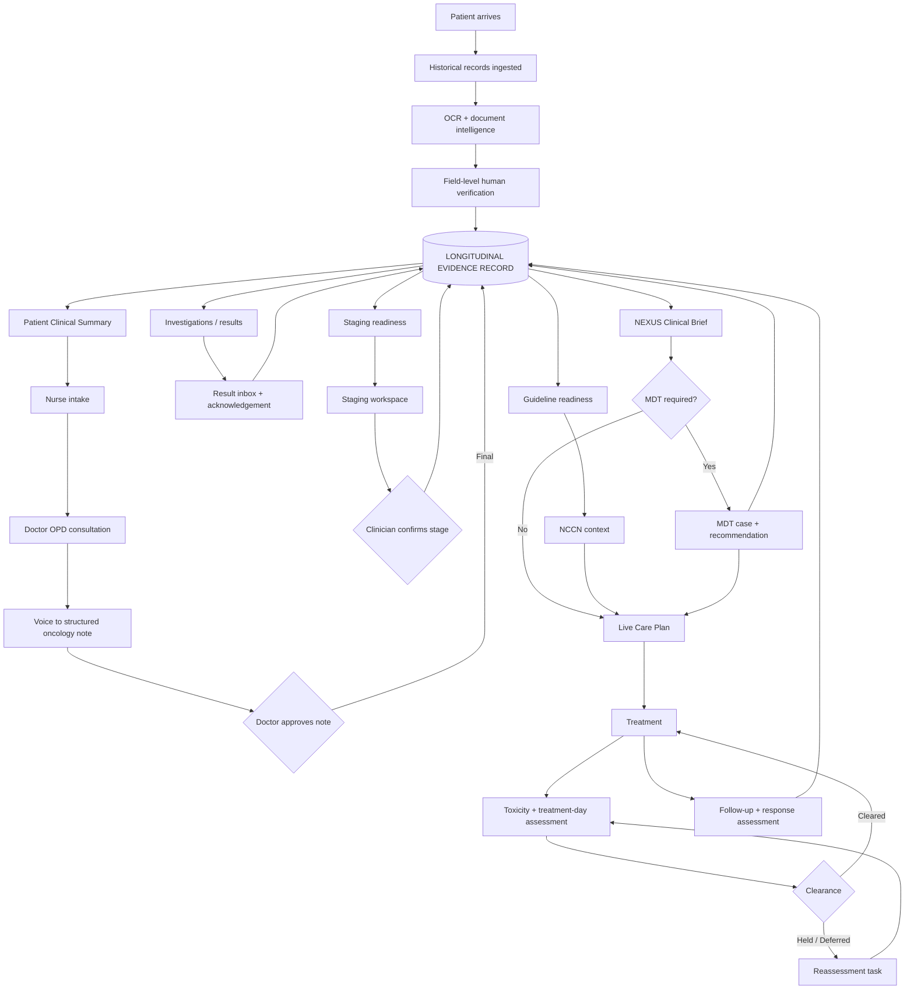
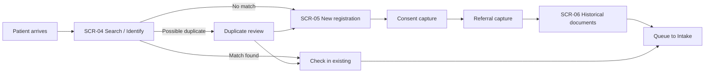
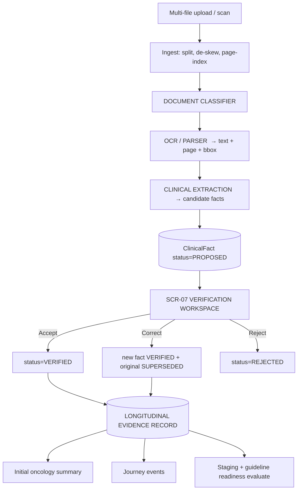
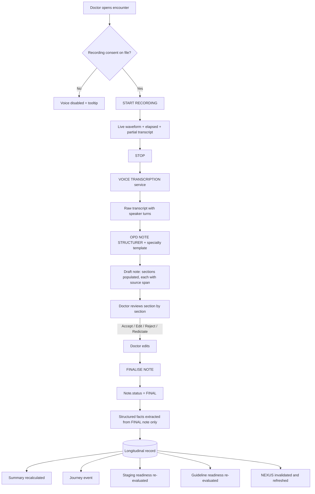
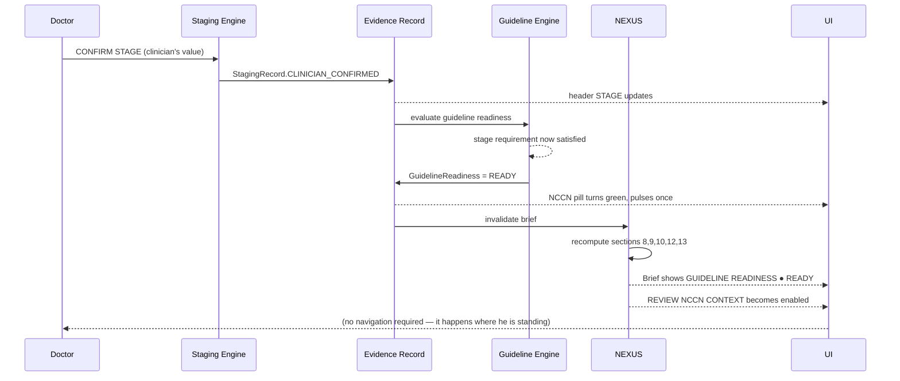

# CCA CANCER CARE AI OS
# LIVE DEMO PRODUCT + UX + DEVELOPER BUILD SPECIFICATION v1.0

**Status:** Build specification — demo-first
**Date:** 21 August 2026
**Authoritative prior state:** CCA Cancer Care AI OS — Requirements Baseline v1.0
(`CCA_Phase1_v0.1.md`, `CCA_Phase2_v0.2.md`, `CCA_Phase3_v0.3.md`, `CCA_Phases4to11_v0.4.md`,
`CCA_Phase12to14_v1.0.md`, `CCA_Registers_v1.0.xlsx`)
**Audience:** Product · Design · Frontend · Backend · AI · QA · Clinical reviewer

> **Reading order for engineers.** §38–40 (IA and screens), §43 (event matrix), §44–45 (data and
> states), §46–47 (APIs and AI services) are the build contract. §54 is the demo script the build
> must satisfy. §58 is the list of things you must never write code for.

---

# PART 1 — SECTIONS 1–15

---

# 1. EXECUTIVE DEMO OBJECTIVE

## 1.1 The commercial question we are answering

CCA is evaluating replacement of its current oncology software estate (HMIS + MOSAIQ + a local
instance + a large amount of paper). The demo must make a cancer-centre leadership team and at
least one practising oncologist say, in the room:

> *"This understands how our cancer centre actually works, and this is what we want to replace
> our existing software with."*

That is a different objective from "show our AI features". A cancer centre does not replace its
operating system because a model can read a PDF. It replaces it when it believes four things.

## 1.2 The four beliefs the demo must create

| # | Belief | How the demo earns it | Fails if |
|---|---|---|---|
| B1 | **We understand the actual oncology patient journey** | One patient walks the full arc — arrival with a bag of outside reports → intake → consultation → investigation → pathology → staging → guideline context → MDT → care plan → treatment day → follow-up — without the presenter ever changing patient | We demo modules in isolation, or jump between patients |
| B2 | **We can build a clinical operating system, not a feature demo** | Persistent patient context, a real timeline, a real worklist, real state transitions, real RBAC, real audit — visible throughout | The product looks like a chat window with a hospital theme |
| B3 | **AI removes manual work while the clinician stays in control** | Every AI output is a *draft* with a visible Accept / Correct / Reject and a link to its source. Nothing AI produces becomes a clinical fact without a human | AI output silently enters the record, or the clinician cannot see where a fact came from |
| B4 | **The architecture can replace or integrate with what they run today** | Mock HMIS/MOSAIQ/LIS/PACS/ABDM adapters are visible in the UI as named, labelled integration points with clear future-state behaviour | We pretend mocks are live, or we hide the integration story entirely |

## 1.3 The one sentence the demo is built around

**"You will never again have to reconstruct a cancer patient from a pile of paper — and the
software will always tell you what it does not know."**

That second half matters more than the first. Every oncologist in the room has been burned by
software that looked confident and was wrong. **The demo's differentiator is not that the system
knows things. It is that the system is explicit and unembarrassed about what it does not know,
and never fills a clinical gap with a guess.** Sections §26, §29, §31 and §60 are where that
belief is manufactured.

## 1.4 What this document is

A build contract detailed enough that:

- **Product** knows exactly what is in and out of the demo, and why.
- **Design** can produce high-fidelity screens without asking a clinical question.
- **Frontend** can implement every interaction, state and empty state listed.
- **Backend** can implement the entities, transitions, events and endpoints listed.
- **AI** knows the seven services, their inputs, outputs, and — critically — their limits.
- **QA** can execute §52 and §53 without interpretation.
- **A clinician** can read §9–§35 and say whether the software shows the right thing at the right
  moment.
- **Nobody** has to invent a clinical rule to finish their ticket.

---

# 2. PRODUCT VISION

## 2.1 The central concept: a continuous intelligence loop

The system is not a set of modules that happen to share a patient ID. It is a single loop in
which **every clinical act feeds a longitudinal evidence record, and that record continuously
re-derives what the clinician sees next.**



**The loop is the product.** Every screen in §40 is a window onto it. Every event in §43 is an
edge in it. If a feature does not read from or write to the evidence record, it does not belong
in the demo.

## 2.2 The five architectural layers, kept separate

Baseline v1.0 §42 requires these never collapse into "AI". The demo must make the separation
*visible*, because it is the safety argument:

| Layer | Answers | Never does |
|---|---|---|
| **EMR** | What happened, and who recorded it | Interpret |
| **Longitudinal Evidence Record** | What do we know, when did we learn it, where did it come from | Decide |
| **Patient Clinical Summary** | What matters to this user right now | Add facts not in the record |
| **Staging Engine** | Is there enough verified evidence to stage, and what stage follows from the validated system | Invent a stage |
| **Guideline Engine** | Is there enough structured context to review a validated pathway, and which context applies | Invent pathway logic |
| **NEXUS** | Is the evidence complete, coherent and reliable enough to act on | Choose treatment |
| **Clinician / MDT** | The clinical decision | — |
| **Live Care Plan** | How the decision becomes goals, tasks, treatment, monitoring | — |

In the UI this separation appears as **five distinct destinations off the persistent patient
header** (§14): SUMMARY · JOURNEY · STAGING · NCCN · NEXUS · CARE PLAN. A presenter can point at
the header and say "these are different engines, deliberately."

## 2.3 What makes this feel like an oncology system and not a generic EMR

| Generic EMR behaviour | CCA Cancer Care AI OS behaviour |
|---|---|
| Documents are attachments | Documents are *evidence*, decomposed into verified facts with provenance |
| A diagnosis is a code | A cancer diagnosis is site + histology + grade + morphology + confirmation source |
| Staging is a text field | Staging is an evidence-completeness state machine with a clinician confirmation gate |
| Guidelines are a PDF library | Guideline *readiness* is computed continuously from the patient's structured context |
| The summary is written by the doctor | The summary is derived from verified facts and re-derived on every clinical event |
| Results land in a folder | Results land in a worklist and require acknowledgement |
| Treatment day is an appointment | Treatment day is an assessment with an explicit clearance decision and five exits |
| "Not recorded" looks like "normal" | Absence is a first-class visual state (§41) |

---

# 3. DEMO SUCCESS CRITERIA

## 3.1 Observable criteria — what must be true in the room

| ID | Criterion | Measured by |
|---|---|---|
| DSC-01 | The entire demo uses **one patient**, from arrival to follow-up, with no patient switching | Demo script §54 |
| DSC-02 | From upload of historical PDFs to a populated Patient 360 takes **under 90 seconds of stage time** | Milestone 3 acceptance |
| DSC-03 | Every AI-derived fact on screen can be traced to its source document **in ≤2 clicks** | §42 provenance UX |
| DSC-04 | A voice-recorded consultation produces a structured, editable oncology note **before the presenter finishes talking about it** | Milestone 5 acceptance |
| DSC-05 | Finalising the note visibly changes **at least three other surfaces** (Summary, Journey, readiness) without navigation | §43 event matrix |
| DSC-06 | Staging shows **exactly what is missing**, by name, not as a generic "incomplete" | §26, §27 |
| DSC-07 | Adding the missing evidence flips staging readiness **live, on screen** | WOW 3 |
| DSC-08 | Confirming the stage flips guideline readiness to READY and NEXUS surfaces `REVIEW NCCN CONTEXT` **without the presenter navigating there** | WOW 4 |
| DSC-09 | `SEND TO MDT` compiles a complete case package in **one action** | WOW 6 |
| DSC-10 | Opening the Care Plan shows it **already populated** from diagnosis, stage, NCCN context, NEXUS and MDT | WOW 7 |
| DSC-11 | The Patient Journey contains **every** action the presenter performed, in order, with no manual entry | §15 |
| DSC-12 | At no point does the system display a clinical value that a clinician did not enter or confirm | §60, §58 |
| DSC-13 | The presenter can answer "where did that come from?" for any fact on any screen | §42 |
| DSC-14 | Role switching demonstrably changes what is visible and actionable | §8 |

## 3.2 Failure criteria — the demo is a failure if any of these happen

| ID | Failure | Why fatal |
|---|---|---|
| DF-01 | An oncologist asks "where did that stage come from?" and the answer is "the AI worked it out" | Destroys B3 and B4 permanently |
| DF-02 | The system displays a drug, dose, regimen or treatment recommendation | We claimed we would not, and clinicians will test it |
| DF-03 | A missing value renders identically to a negative finding | The single most credible clinical criticism available |
| DF-04 | The presenter has to say "in the real product this would…" more than three times | Signals the demo is a mock-up, not a product |
| DF-05 | Any screen requires the presenter to explain the navigation | Clinical software that needs explaining loses |
| DF-06 | A mock integration is described as live | Reputational; CCA's IT team will find out |

## 3.3 The clinician's private test

Experienced oncologists evaluate clinical software with a small number of unspoken probes.
The demo must survive all five:

1. **"Show me a patient with incomplete information."** → §26 staging readiness, §31 missing information.
2. **"What happens when two reports disagree?"** → §27 contradictions block, never silently resolved.
3. **"Who is responsible when this is wrong?"** → §42 provenance + §8 RBAC + audit on every action.
4. **"What does it do when it doesn't know?"** → §60 placeholder notation, visible and unembarrassed.
5. **"How long before I can close this and get back to my clinic?"** → §53 UX density standard.

---

# 4. FIXED DEMO ASSUMPTIONS

These are **decisions, not open questions.** They exist so that no unresolved item from the
Baseline blocks the build. Each is traced to the Baseline gap it bypasses, and each states what
must happen before production.

| ID | Assumption for the demo | Baseline item bypassed | Production requirement |
|---|---|---|---|
| FA-01 | The product is the **system of record for the demo**. HMIS and MOSAIQ appear only as labelled mock adapters | GAP-001 | The replace/coexist/integrate decision must be made before production architecture |
| FA-02 | **"PRE"** is presented in the UI as **"PRE / Patient Navigation"** with operational-only permissions | TERM-001 | Confirm the role and its real permissions with CCA |
| FA-03 | **"OTE"** is never shown in the demo UI. The screen is called **"Toxicity & Treatment-Day Assessment"** | TERM-002 | Ask the oncologist (Phase 11 Q5); restore the term if it is meaningful to them |
| FA-04 | Lab and imaging results arrive as **PDFs that OCR into discrete values**, then are verified | CON-006, GAP-020 | Real LIS interface delivering structured results |
| FA-05 | Pathology is demonstrated as **document-in → structured facts → verification → clinician confirms cancer**, not as laboratory operations | GAP-011 | Full pathology workflow with CCA |
| FA-06 | Registration triage skips the day-of-week rule; the receptionist picks the specialty directly | GAP-004 | Confirm real triage rules |
| FA-07 | The **consent signatory** is captured as an explicit field with three options (Patient / Attender / Other-with-reason) | GAP-051 | Legal review of who may consent |
| FA-08 | Queue routing uses a **configurable, seeded location sequence** | GAP-052 | Real routing rules from CCA |
| FA-09 | The **stage value** in the demo is a *pre-seeded, oncologist-signed-off demo value*, held in configuration. No engine and no model derives it | CON-019, MNI-01…06 | Licensed AJCC content + written AI authorisation |
| FA-10 | **NCCN context** is a controlled demo representation showing *which patient variables were used* and a deep-link placeholder — never reproduced pathway logic | CON-020 | NCCN licence; Compendium API for regimen-level content |
| FA-11 | **No treatment recommendation, regimen, dose or threshold appears anywhere** | MNI-13…30 | Licensed content + clinical validation |
| FA-12 | Financial counselling is a **four-state field plus a barrier flag**, no estimates engine | GAP-029, GAP-074 | Full scheme/claims workflow |
| FA-13 | ABDM, LIS, PACS, MOSAIQ, HMIS are **mock adapters with visible "SIMULATED" badges** | Phase 8 | Real integrations |
| FA-14 | Demo role switching is available from the top bar for presentation speed | — | Removed in production |
| FA-15 | All demo data is fictional and labelled **DEMO DATA** in the footer of every print/export | — | — |
| FA-16 | Toxicity capture records grade **with its baseline value**, but no grading standard content is embedded | R-10, MNI-26 | CTCAE licence position + version choice |
| FA-17 | Response assessment records the **framework name and category name only**, from a configured list | MNI-28 | Validated criteria |

> **FA-09 is the most important line in this document.** The demo confirms a stage that a real
> oncologist wrote into a config file before the demo. The software's job is to prove the
> *evidence was complete and the clinician confirmed it* — never to produce the value. This is
> also the best answer available when an oncologist in the room asks DF-01.

---

# 5. SCOPE

## 5.1 In scope — demo-critical (P0)

| Area | What is built |
|---|---|
| Foundation | Auth, demo role switch, patient identity, audit, seeded patient, persistent patient context |
| Registration | Search/match, new registration, consent with signatory, referral capture, queue entry |
| **Historical record OCR** | Multi-file upload, classification, OCR, structured extraction, **field-level verification**, initial oncology summary |
| Nurse intake | Vitals + BMI/BSA, ECOG, allergies, medications, oncology history, documents, **intake-complete handoff** |
| **OPD voice documentation** | Capture → transcript → specialty template structuring → doctor review → finalise → propagate |
| Patient 360 | Context-aware summary in 8 contexts, provenance drill-through |
| Patient Journey | Auto-populated longitudinal timeline with filters |
| Orders + Results | Order entry, result upload, OCR structuring, **Results Inbox with acknowledgement** |
| Pathology / confirmation | Structured pathology facts → clinician confirms cancer diagnosis |
| **Staging** | Continuous readiness, evidence workspace, contradictions, missing evidence, clinician confirmation, versioning on new evidence |
| **Guideline readiness + NCCN context** | Continuous readiness, patient variables used, controlled demo context, deep-link slot |
| **NEXUS Clinical Brief** | 13 sections, the 9 buildable ones populated, doctor actions, audit |
| MDT | One-click case creation with auto-compiled package, session, recommendation returned to record |
| **Live Care Plan** | Pre-populated, versioned, tasks, downstream propagation |
| Treatment day | Assessment with labs vs baseline, toxicity with baseline, five clearance exits |
| Follow-up | Due/overdue worklist, response assessment record |
| Tasks & Alerts | Owner, due, escalation, worklist |
| Command Centre | Operational dashboard, 11 tiles |

## 5.2 In scope — supporting (P1, build if milestone budget allows)

Documents library screen · Biomarker panel view · Admin/configuration screen · Financial
counselling status field · Print/export of Care Plan and Visit Summary · Patient search
advanced filters.

## 5.3 Explicitly out of scope

See §6. Nothing in §6 may be partially implemented "to show the idea" — a half-built clinical
capability is worse than an honest placeholder.

---

# 6. NON-SCOPE

Each exclusion states **why**, and **how the shell accommodates it later** — this table is also
the answer sheet when CCA's team asks "can it do X?".

| # | Excluded | Why excluded | How the product accommodates it later |
|---|---|---|---|
| N-01 | Licensed AJCC staging content integration | AJCC licence forbids AI/ML incorporation without prior written authorisation (CON-019); terms unknown (GAP-071) | Staging engine is built as a **shell with a pluggable content provider**; the demo uses a config-supplied value. Swapping in a licensed provider is an adapter, not a rewrite |
| N-02 | NCCN proprietary pathway logic | Guidelines are PDF-only, not machine-readable (CON-020); commercial use requires a licence | NCCN Context screen is built around **"patient variables used" + deep-link**, which is exactly what a licensed Compendium integration would slot into |
| N-03 | Autonomous treatment recommendation | Baseline CON-002; CDSCO risk classification would escalate sharply | NEXUS is architected as advisory-only with `SUGGESTED NEXT DECISION TO CONSIDER` phrasing; the directive path is not present in the codebase |
| N-04 | Regimen selection, drug dose, dose calculation | MNI-14…19; requires licensed content + clinical validation | Care Plan has a Medical Oncology component slot with `[VALIDATED CLINICAL CONTENT REQUIRED]` |
| N-05 | Automatic treatment-hold / clearance thresholds | MNI-23…25; institutional protocol required | Clearance is a **clinician decision with five exits**; the system computes nothing |
| N-06 | Full chemotherapy administration | GAP-039; no workflow supplied by CCA | Treatment session entity and state machine exist; administration screens are Milestone 15+ |
| N-07 | Full pathology laboratory operations | GAP-011 | Pathology is modelled as evidence-in; specimen and report entities exist for later expansion |
| N-08 | Detailed financial counselling, estimates | GAP-029 | Four-state field + barrier flag; a full module attaches to the same Care Plan hook |
| N-09 | Insurance claims / AB-MJPJAY scheme workflow | TERM-003 unconfirmed, GAP-074 | Scheme fields exist as configuration slots on the financial object |
| N-10 | Live LIS | GAP-020 | Result ingestion is written against an interface; the mock adapter is one implementation |
| N-11 | Live PACS/DICOM | GAP-025 | ImagingStudy entity carries a study reference; viewer is a placeholder panel |
| N-12 | Live MOSAIQ / HMIS | GAP-001 unresolved | Mock adapters with named endpoints; direction of truth is configuration, not code |
| N-13 | Production ABDM (HIP/HIU, Fidelius, consent artefacts) | Certification effort; secondary-source understanding only | ABDM panel shows ABHA field + `[PRODUCTION INTEGRATION REQUIRED]` badge |
| N-14 | Unvalidated probabilistic NEXUS mechanics (priors, LRs, thresholds, utility weights) | Phase 4 classified these NI; every value in the source document is uncited | The Brief is built from the 9 clinician-facing constructs only; no probability field exists in the schema |
| N-15 | Praxis Loop self-recalibration | CON-011; regulatory change-control problem | Not present |
| N-16 | Production regulatory submission | CDSCO guidance finalised 30 Jul 2026; assessment not done | §55 documents the intended-use statements that a submission would build on |
| N-17 | Multi-language voice | GAP-042 | Transcription service is provider-abstracted |
| N-18 | Inpatient / IPD | CON-010, no IPD workflow supplied | Encounter type enum includes IPD, unused |

---

# 7. ACTORS

Demo actors, traced to Baseline ACT-IDs. Only actors that **appear on screen during the demo**
are built.

| Actor ID | Demo role | Baseline | Appears in demo | Primary screens |
|---|---|---|---|---|
| DA-01 | **Registration Executive** | ACT-18 (inferred; GAP-006) | Yes | SCR-04, SCR-05, SCR-06 |
| DA-02 | **Intake Nurse** | ACT-08 / ACT-19 | Yes | SCR-08, SCR-06 |
| DA-03 | **Medical Oncologist** (primary demo user) | ACT-03 / ACT-07 | Yes | SCR-09 through SCR-25 |
| DA-04 | **PRE / Patient Navigation** | ACT-10 (TERM-001) | Yes | SCR-07, SCR-12 |
| DA-05 | **MDT Coordinator** | ACT-22 (GAP-031) | Yes | SCR-21, SCR-22 |
| DA-06 | **Admin / Super User** | ACT-25/26 (GAP-044/045) | Yes | SCR-27, role switch |
| DA-07 | Surgical Oncologist | ACT-04 | MDT only | SCR-22 |
| DA-08 | Radiation Oncologist | ACT-05 | MDT only | SCR-22 |
| DA-09 | Pathologist | ACT-20 (GAP-011) | **Simulated** — produces a seeded report | — |
| DA-10 | Radiologist / Reporting Consultant | ACT-15 | **Simulated** | — |
| DA-11 | Lab (partner) | ACT-12 | **Simulated** | — |
| DA-12 | Biller | ACT-09 | Not in demo flow | — |
| DA-13 | Financial Counsellor | ACT-21 (GAP-029) | Status field only | SCR-23 panel |

**Not built:** phlebotomist, radiology technician, radiology coordinator, external MDT
consultant. Their steps are represented as simulated events so the journey remains continuous.

---

# 8. DEMO RBAC

Narrow named permissions, not "EMR access" — this directly answers Baseline CON-015, where a
biller and an undefined escort role were writing to the clinical record.

## 8.1 Permission matrix

`✓` granted · `–` denied · `R` read-only

| Permission | DA-01 Reg | DA-02 Nurse | DA-03 Doctor | DA-04 PRE | DA-05 MDT Coord | DA-06 Admin |
|---|---|---|---|---|---|---|
| `patient.search` | ✓ | ✓ | ✓ | ✓ | ✓ | ✓ |
| `patient.create` | ✓ | – | – | – | – | ✓ |
| `patient.demographics.edit` | ✓ | – | – | – | – | ✓ |
| `consent.capture` | ✓ | – | – | – | – | – |
| `document.upload` | ✓ | ✓ | ✓ | ✓ | ✓ | – |
| `document.attach_to_encounter` | ✓ | ✓ | ✓ | ✓ | – | – |
| `extraction.verify` | – | ✓ | ✓ | – | – | – |
| `intake.edit` | – | ✓ | – | – | – | – |
| `intake.complete` | – | ✓ | – | – | – | – |
| `encounter.create` | – | – | ✓ | – | – | – |
| `note.voice_capture` | – | – | ✓ | – | – | – |
| `note.finalise` | – | – | ✓ | – | – | – |
| `order.create` | – | – | ✓ | – | – | – |
| `result.acknowledge` | – | – | ✓ | – | – | – |
| `diagnosis.confirm_cancer` | – | – | ✓ | – | – | – |
| `staging.view` | R | R | ✓ | – | R | R |
| `staging.add_evidence` | – | – | ✓ | – | – | – |
| **`staging.confirm`** | – | – | **✓** | – | – | – |
| `guideline.view_context` | – | – | ✓ | – | R | R |
| `nexus.view` | – | R | ✓ | – | R | – |
| `nexus.action` | – | – | ✓ | – | – | – |
| `mdt.send_case` | – | – | ✓ | – | – | – |
| `mdt.manage_session` | – | – | – | – | ✓ | ✓ |
| `mdt.record_recommendation` | – | – | ✓ | – | ✓ | – |
| `careplan.view` | – | R | ✓ | – | R | R |
| `careplan.edit` | – | – | ✓ | – | – | – |
| `treatment.assess` | – | ✓ | ✓ | – | – | – |
| **`treatment.clearance_decide`** | – | – | **✓** | – | – | – |
| `queue.move` | ✓ | ✓ | – | ✓ | – | ✓ |
| `location.update` | ✓ | ✓ | – | ✓ | – | ✓ |
| `task.view_own` | ✓ | ✓ | ✓ | ✓ | ✓ | ✓ |
| `task.reassign` | – | – | ✓ | – | ✓ | ✓ |
| `admin.configure` | – | – | – | – | – | ✓ |
| `audit.view` | – | – | R | – | – | ✓ |

## 8.2 The three permissions that must be visibly restricted in the demo

The presenter should deliberately demonstrate at least one of these, because it is the RBAC
story in miniature:

1. **`staging.confirm`** — only the treating clinician. Switch to Nurse: the CONFIRM STAGE button
   is present but disabled with tooltip *"Requires treating clinician"*.
2. **`treatment.clearance_decide`** — only the clinician.
3. **PRE / Patient Navigation** — can move a patient and attach an operational document, and
   **cannot** open the clinical note, staging, NCCN, NEXUS or Care Plan. Those nav items are
   absent, not greyed.

## 8.3 Denial behaviour rules

| Situation | UI behaviour |
|---|---|
| Role lacks read permission on a module | Nav item **not rendered** |
| Role has read but not write | Control rendered **disabled** with tooltip stating the required role |
| Role attempts a blocked API call | `403` + toast *"Your role cannot perform this action"* + `AuditEvent{type: PERMISSION_DENIED}` |
| Break-glass | Out of demo scope (`[PRODUCTION INTEGRATION REQUIRED]`) |

---

# 9. END-TO-END CANCER PATIENT JOURNEY

## 9.1 The demo journey, stage by stage

| # | Stage | Actor | Screen | Key state change | Journey event emitted |
|---|---|---|---|---|---|
| 1 | Arrival & identification | DA-01 | SCR-04 | `Patient.created` | `REGISTRATION` |
| 2 | Registration & consent | DA-01 | SCR-05 | `Consent.captured` | `CONSENT` |
| 3 | Historical document upload | DA-01 | SCR-06 | `Document.uploaded ×N` | `DOCUMENTS_RECEIVED` |
| 4 | OCR + classification + extraction | System | SCR-06 | `ExtractionResult.created` | `AI_EXTRACTION` |
| 5 | **Field-level verification** | DA-02 | SCR-07 | `ClinicalFact.verified ×N` | `EVIDENCE_VERIFIED` |
| 6 | **Initial oncology summary generated** | System | SCR-10 | `PatientSummary.v1` | `SUMMARY_GENERATED` |
| 7 | Queue to intake | DA-01/04 | SCR-03 | `QueueEvent` | `QUEUED` |
| 8 | Nurse intake | DA-02 | SCR-08 | `IntakeAssessment.completed` | `INTAKE` |
| 9 | Intake → doctor handoff | System | SCR-03 | `Encounter.ready` | `HANDOFF` |
| 10 | OPD consultation + voice | DA-03 | SCR-09 | `Encounter.open` | `CONSULTATION_STARTED` |
| 11 | Note structured, reviewed, **finalised** | DA-03 | SCR-09 | `Note.FINAL` | `CONSULTATION_FINALISED` |
| 12 | Orders raised | DA-03 | SCR-13 | `Order.raised ×N` | `ORDER` |
| 13 | Results return (simulated) | System | SCR-14 | `Result.available` | `RESULT_AVAILABLE` |
| 14 | Result OCR + verification | DA-02/03 | SCR-07 | `LabResult.structured` | `EVIDENCE_VERIFIED` |
| 15 | **Result acknowledged** | DA-03 | SCR-14 | `ResultAcknowledgement` | `RESULT_ACKNOWLEDGED` |
| 16 | Pathology verified | DA-03 | SCR-16 | `PathologyReport.verified` | `PATHOLOGY` |
| 17 | **Cancer diagnosis confirmed** | DA-03 | SCR-15 | `CancerDiagnosis.CONFIRMED` | `CANCER_CONFIRMED` |
| 18 | Staging readiness recalculated | System | header | `StagingReadiness → EVIDENCE_INCOMPLETE` | `STAGING_READINESS_CHANGED` |
| 19 | Missing evidence supplied | DA-03 | SCR-17 | `StagingEvidence.added` | `STAGING_EVIDENCE_ADDED` |
| 20 | Readiness → READY | System | SCR-17 | `StagingReadiness → READY` | `STAGING_READINESS_CHANGED` |
| 21 | **Clinician confirms stage** | DA-03 | SCR-17 | `StagingRecord.CLINICIAN_CONFIRMED` | `STAGE_CONFIRMED` |
| 22 | Guideline readiness → READY | System | SCR-20 | `GuidelineReadiness → READY` | `GUIDELINE_READINESS_CHANGED` |
| 23 | **NEXUS prompts NCCN review** | System | SCR-20 | Brief section updated | — |
| 24 | NCCN context reviewed | DA-03 | SCR-19 | `GuidelineContext.viewed` | `GUIDELINE_REVIEWED` |
| 25 | **Send to MDT** | DA-03 | SCR-20/19 | `MDTCase.created` | `MDT_REFERRED` |
| 26 | MDT session + recommendation | DA-05/03 | SCR-22 | `MDTDecision.final` | `MDT_DECISION` |
| 27 | **Care Plan created** | DA-03 | SCR-23 | `CarePlan.v1.ACTIVE` | `CARE_PLAN_CREATED` |
| 28 | Treatment day assessment | DA-03 | SCR-24 | `ToxicityEvent`, labs loaded | `TREATMENT_DAY_ASSESSMENT` |
| 29 | **Clearance decision** | DA-03 | SCR-24 | `TreatmentClearance.HELD` or `CLEARED` | `CLEARANCE_DECIDED` |
| 30 | Reassessment task (if held) | System | SCR-26 | `Task.created` | `TASK_CREATED` |
| 31 | Follow-up + response | DA-03 | SCR-25 | `ResponseAssessment` | `FOLLOW_UP` |

## 9.2 Journey discontinuities from Baseline that the demo closes

Baseline Phase 2 found 16 journey discontinuities. The demo **closes eight of them by design**
and this should be stated in the pitch, because they are the credibility differentiators:

| JD | Discontinuity found in CCA's current process | How the demo closes it |
|---|---|---|
| JD-A | No decision distinguishes new from returning patient | SCR-04 arrival & identification with duplicate detection |
| JD-B | "Next location" had no routing rule | Configurable seeded location sequence (FA-08) |
| JD-C | Intake ended with no handoff artefact | `intake.complete` produces a handoff summary the doctor sees first |
| JD-D | Investigation never connected to lab/radiology | Order → Result → Inbox → Acknowledgement chain |
| JD-L/M | Results never returned to the ordering clinician | **Results Inbox with mandatory acknowledgement** |
| JD-F | Staging appeared in no workflow | Staging is a first-class layer with continuous readiness |
| JD-J | Treatment clearance "No" looped with no exit | Five explicit exits: Clear / Hold / Defer / Reassess / Escalate |
| JD-K | Follow-up was a terminal box | Follow-up worklist with due/overdue and recall |

---

# 10. CONTINUOUS PATIENT INTELLIGENCE ARCHITECTURE

## 10.1 The recalculation contract

**Rule:** any write that produces or verifies a `ClinicalFact` MUST publish a domain event. Any
derived surface MUST subscribe rather than poll.

```
WRITE (verified clinical fact)
   → emit DomainEvent
      → LongitudinalRecord.append          (always)
      → JourneyEvent.append                (always)
      → SummaryRecalculationQueue.enqueue  (always)
      → StagingReadiness.evaluate          (if fact is staging-relevant)
      → GuidelineReadiness.evaluate        (if fact is guideline-relevant)
      → ClinicalBrief.invalidate           (always)
      → Task/Alert rules.evaluate          (always)
```

## 10.2 Relevance routing table

Which fact types trigger which recalculation. **Implement this as a config map, not as
if-statements**, so a clinician can later change it without a release.

| ClinicalFact type | Summary | Staging readiness | Guideline readiness | NEXUS | Care Plan flag |
|---|---|---|---|---|---|
| `DIAGNOSIS_CANCER` | ✓ | ✓ | ✓ | ✓ | ✓ |
| `PRIMARY_SITE` | ✓ | ✓ | ✓ | ✓ | – |
| `HISTOLOGY` | ✓ | ✓ | ✓ | ✓ | – |
| `GRADE` | ✓ | ✓ | ✓ | ✓ | – |
| `T_EVIDENCE` | ✓ | ✓ | – | ✓ | – |
| `N_EVIDENCE` | ✓ | ✓ | – | ✓ | – |
| `M_EVIDENCE` | ✓ | ✓ | ✓ | ✓ | ✓ |
| `STAGE_CONFIRMED` | ✓ | – | ✓ | ✓ | ✓ |
| `BIOMARKER_RESULT` | ✓ | ✓ | ✓ | ✓ | ✓ |
| `ECOG` | ✓ | – | ✓ | ✓ | ✓ |
| `TREATMENT_INTENT` | ✓ | – | ✓ | ✓ | ✓ |
| `PRIOR_TREATMENT` | ✓ | – | ✓ | ✓ | ✓ |
| `LAB_RESULT` | ✓ | – | – | ✓ | – |
| `IMAGING_FINDING` | ✓ | ✓ | – | ✓ | – |
| `PATHOLOGY_FINDING` | ✓ | ✓ | ✓ | ✓ | ✓ |
| `ALLERGY` | ✓ | – | – | ✓ | ✓ |
| `MEDICATION` | ✓ | – | – | ✓ | – |
| `COMORBIDITY` | ✓ | – | ✓ | ✓ | ✓ |
| `TOXICITY_EVENT` | ✓ | – | – | ✓ | ✓ |
| `RESPONSE_ASSESSMENT` | ✓ | ✓ | ✓ | ✓ | ✓ |
| `MDT_DECISION` | ✓ | – | – | ✓ | ✓ |

## 10.3 Recalculation timing and UX

| Property | Value | Rationale |
|---|---|---|
| Trigger | Event-driven | Demo must feel live |
| Max latency, summary | **1.5 s** from event to updated surface | Below the presenter's sentence length |
| Max latency, readiness | **800 ms** | Must feel instant when the presenter clicks |
| In-flight indicator | Subtle shimmer on the affected block only — **never a full-page spinner** | Full-page reloads destroy the "one system" feeling |
| Change signalling | Updated block briefly outlined in the IMPORTANT CHANGE token (§41), fading over 3 s | The audience must *see* the propagation |
| Concurrency | Last-write-wins on derived surfaces; source facts are append-only | Derived views are disposable, evidence is not |

## 10.4 What must never be recalculated automatically

| Never auto-derived | Why | What happens instead |
|---|---|---|
| **Stage value** | FA-09, MNI-01…06 | Readiness recalculates; the *value* waits for `staging.confirm` |
| **Cancer diagnosis confirmation** | Clinical act | Evidence accumulates; a clinician confirms |
| Guideline *applicability* | CON-020 | Only *readiness* recalculates |
| Any treatment recommendation | N-03 | Never computed |
| Clearance decision | MNI-25 | Only the assessment context refreshes |
| Response category | MNI-28 | Measurements recorded; category chosen by clinician |

---

# 11. LONGITUDINAL EVIDENCE RECORD

## 11.1 Purpose

The single append-only store answering *"what do we know about this patient, when did we learn
it, and where did it come from?"* Every derived surface reads from here. **Nothing writes a
clinical fact except through this layer.**

## 11.2 ClinicalFact — the atom of the system

| Field | Type | Notes |
|---|---|---|
| `id` | UUID | |
| `patient_id` | UUID | |
| `fact_type` | enum | See §10.2 table |
| `value` | JSON | Typed by `fact_type` |
| `unit` | string? | For quantitative facts |
| `effective_date` | date | **When the fact was true clinically** — not when recorded |
| `recorded_at` | timestamp | System time |
| `status` | enum | `PROPOSED` · `VERIFIED` · `CORRECTED` · `REJECTED` · `SUPERSEDED` |
| `confidence` | float? | **AI only.** Null for human-entered. Never displayed as a clinical probability |
| `source_type` | enum | `DOCUMENT_OCR` · `CLINICIAN_ENTRY` · `VOICE_NOTE` · `DEVICE` · `SIMULATED_INTERFACE` |
| `source_document_id` | UUID? | |
| `source_page` | int? | For provenance drill-through |
| `source_bbox` | JSON? | `[x,y,w,h]` region on the page — enables highlight-on-open |
| `verified_by` | user_id? | |
| `verified_at` | timestamp? | |
| `superseded_by` | UUID? | Never delete; always chain |
| `contradicts` | UUID[]? | Populated by the contradiction detector |
| `demo_flag` | bool | True for seeded demo content |

## 11.3 The four invariants

| # | Invariant | Enforcement |
|---|---|---|
| INV-1 | **A fact with `status = PROPOSED` may never be read by Staging, Guideline, Care Plan or Treatment surfaces** | Query layer filters; enforced in the repository, not the UI |
| INV-2 | **Facts are append-only.** Correction creates a new fact and sets `superseded_by` on the old one | DB constraint: no UPDATE on `value` |
| INV-3 | **Every fact carries a resolvable source** | `source_type` non-null; `source_document_id` required when `source_type = DOCUMENT_OCR` |
| INV-4 | **`confidence` is never rendered as a clinical probability** | UI lint rule; confidence renders only as the AI INTERPRETATION token, never as a number in clinical context |

## 11.4 Contradiction detection (deterministic, not model-based)

For the demo, contradictions are detected by **rules over structured facts**, not by an LLM.
This keeps the behaviour reproducible on stage.

| Rule ID | Detects | Example |
|---|---|---|
| CTR-01 | Two `VERIFIED` facts of the same type with different values and overlapping effective dates | Two documents state a different primary site |
| CTR-02 | A fact whose effective date precedes the patient's date of birth or postdates today | OCR misread a date |
| CTR-03 | `M_EVIDENCE` present asserting distant disease while a `T_EVIDENCE` source asserts localised-only | Sources disagree on extent |
| CTR-04 | Biomarker result present for a specimen whose `PATHOLOGY_FINDING` reports a different primary site | Wrong-document attribution (SAF-23) |
| CTR-05 | Two documents dated the same day with conflicting `HISTOLOGY` | Report amended without supersession |

**Behaviour:** a contradiction NEVER auto-resolves. It creates a `Contradiction` record, renders
in the CONTRADICTION token (§41), appears in NEXUS "Evidence Against", and blocks
`StagingReadiness → READY` until a clinician dispositions it.

---

# 12. PATIENT CLINICAL SUMMARY / PATIENT 360

## 12.1 What it is and is not

| | |
|---|---|
| **Is** | A continuously re-derived, context-aware view of verified facts, with provenance on every line |
| **Is not** | A visit summary (that is `Encounter.visit_summary`, produced once, given to the patient) |
| **Is not** | An AI paragraph. It is structured blocks. AI may phrase a block; it may not source one |

Traces to Baseline `CCA-SUM-001…007`.

## 12.2 The initial oncology summary — block structure

This is the WOW 1 payoff screen. **Oncology-specific, not a generic document digest.**

| # | Block | Populated from | Absent state |
|---|---|---|---|
| 1 | **Current Clinical Problem** | Referral reason + chief complaint | `NOT RECORDED` |
| 2 | **Known / Suspected Cancer Diagnosis** | `DIAGNOSIS_CANCER`; shows `SUSPECTED` until confirmed | `NOT ESTABLISHED` |
| 3 | **Primary Site** | `PRIMARY_SITE` | `NOT RECORDED` |
| 4 | **Histology** | `HISTOLOGY` | `NOT AVAILABLE` |
| 5 | **Grade** | `GRADE` | `NOT AVAILABLE` |
| 6 | **Current Stage** | **Only if `StagingRecord.status = CLINICIAN_CONFIRMED`** | `NOT STAGED` |
| 7 | **Staging Status** | `StagingReadiness` state + missing-count | Always populated |
| 8 | **Biomarkers / Molecular** | `BIOMARKER_RESULT[]`, each with method+date | `NOT TESTED` / `PENDING` — distinct |
| 9 | **Previous Treatment** — Surgery / Systemic / Radiation / Other | `PRIOR_TREATMENT[]` grouped | `NONE RECORDED` |
| 10 | **Important Pathology** | `PATHOLOGY_FINDING[]` flagged significant | `NOT AVAILABLE` |
| 11 | **Important Imaging** | `IMAGING_FINDING[]` flagged significant | `NOT AVAILABLE` |
| 12 | **Important Laboratory Findings** | `LAB_RESULT[]` out-of-range or flagged | `NOT AVAILABLE` |
| 13 | **Current Medications** | `MEDICATION[]` | `NONE RECORDED` |
| 14 | **Allergies / ADR** | `ALLERGY[]` | `NONE RECORDED` — **never rendered as "No allergies"** |
| 15 | **Important Comorbidities** | `COMORBIDITY[]` | `NONE RECORDED` |
| 16 | **Performance Status** | `ECOG` with date and recorder | `NOT RECORDED` |
| 17 | **Recent Clinical Events** | Last 5 `JourneyEvent` of clinical type | — |
| 18 | **Missing Information** | Computed: readiness gaps + unverified facts | Empty state: "No outstanding items" |
| 19 | **Contradictions** | `Contradiction[]` open | Empty state: "None detected" |
| 20 | **Current Care Phase** | `Patient.journey_state` | Always populated |
| 21 | **Pending Investigations** | `Order[]` where status ≠ acknowledged | `NONE PENDING` |
| 22 | **Next Known Action** | Next due `Task` or readiness prompt | `NONE SCHEDULED` |

## 12.3 The absence vocabulary — mandatory

Four distinct states. **Implementing these as one grey dash is a demo failure (DF-03).**

| State | Meaning | Renders as |
|---|---|---|
| `NOT RECORDED` | Nobody has entered this | Dashed-outline chip, muted text, italic |
| `NOT AVAILABLE` | Sought but the source does not contain it | Dashed chip + tooltip naming the documents searched |
| `PENDING` | Ordered/expected, not yet returned | Chip with clock icon + expected-by date if known |
| `PENDING VERIFICATION` | AI-extracted, awaiting human sign-off | AI INTERPRETATION token + "Verify" inline action |

**Never used:** blank, `—`, `N/A`, `Nil`, `No`, `Negative`, or omission of the row.

## 12.4 Recalculation triggers

Baseline `CCA-SUM-001`. The summary regenerates after every one of these:

historical-document verification · nurse intake completion · every OPD consultation finalisation ·
pathology result verified · imaging result verified · laboratory result verified · biomarker
result verified · cancer confirmation · stage confirmation · stage update · treatment intent set
or changed · MDT decision recorded · care plan created · care plan version created · treatment
administered · toxicity event recorded · treatment held · treatment cleared · response assessment
recorded · follow-up consultation finalised.

**The doctor never writes the summary.** They write notes; the summary derives.

---

# 13. CONTEXT-SPECIFIC SUMMARY ARCHITECTURE

## 13.1 How context is determined

`SummaryContext` is derived from the **screen the clinician is on**, not from a manual toggle:

| Screen | Context |
|---|---|
| SCR-09 Consultation | `CONSULTATION` |
| SCR-15/16 Diagnosis, Pathology | `DIAGNOSIS` |
| SCR-17 Staging | `STAGING` |
| SCR-19 NCCN | `GUIDELINE` |
| SCR-21/22 MDT | `MDT` |
| SCR-23 Care Plan | `CARE_PLAN` |
| SCR-24 Treatment Day | `TREATMENT_DAY` |
| SCR-25 Follow-Up | `FOLLOW_UP` |

API: `GET /patients/{id}/summary?context=STAGING`

## 13.2 The eight context configurations

Each context defines three tiers. **Tier assignment is configuration, not code** — an oncologist
can reorder it later without a release (`[CCA CONFIGURATION REQUIRED]`).

### 13.2.1 CONSULTATION
| Tier | Blocks |
|---|---|
| **Always visible** | Reason for visit · Current diagnosis / problem · Current cancer status (site, histology, stage or staging state) · Previous treatment · Recent clinical events · ECOG · Allergies · Current medications · Important pathology · Important imaging · Latest relevant labs · Staging state · Pending investigations · Current Care Plan · Next decision / action |
| Secondary | Broader history · Social history · Family history · Remote labs and imaging |
| On demand | Full source documents · Full timeline · Prior notes |

### 13.2.2 DIAGNOSIS
| Tier | Blocks |
|---|---|
| **Always visible** | Pathology (all) · Imaging (all) · Suspected / confirmed diagnosis · Histology · Grade · Contradictions · Evidence gaps · Pending diagnostic investigations |
| Secondary | Symptom timeline · Prior investigations elsewhere |
| On demand | Full reports · Extraction verification history |

### 13.2.3 STAGING
| Tier | Blocks |
|---|---|
| **Always visible** | Confirmed diagnosis · Primary site · Histology · Grade · T evidence · N evidence · M evidence · Pathology evidence · Imaging evidence · Biomarker / prognostic inputs · Staging readiness · Missing staging evidence · Conflicting staging evidence · Previous stage if one exists |
| Secondary | Laterality · Diagnosis date · Staging system version |
| On demand | Source documents with region highlight · Prior staging versions |

### 13.2.4 GUIDELINE (NCCN)
| Tier | Blocks |
|---|---|
| **Always visible** | Diagnosis · Cancer site · Histology · Confirmed stage · TNM values as confirmed · Biomarkers · ECOG · Treatment intent · Previous treatment · Line of therapy where relevant · Disease setting · Missing guideline inputs · Guideline readiness |
| Secondary | Organ-function context · Major comorbidities |
| On demand | Source of each variable · Guideline document deep-link |

### 13.2.5 MDT
| Tier | Blocks |
|---|---|
| **Always visible** | Diagnosis · Pathology · Staging · Biomarkers · ECOG · Major comorbidities · Key imaging · Prior treatment · Current clinical trajectory · NEXUS Clinical Brief (compressed) · NCCN context · **The unresolved clinical question** |
| Secondary | Full treatment history · Social context |
| On demand | Full record · Source documents |

### 13.2.6 CARE_PLAN
| Tier | Blocks |
|---|---|
| **Always visible** | Confirmed diagnosis · Stage · Biomarkers · Treatment intent · ECOG · Relevant comorbidities · Previous treatment · NCCN context · MDT recommendation · NEXUS Brief · Unresolved evidence · Treatment / care objectives |
| Secondary | Organ function · Financial counselling status |
| On demand | Prior plan versions |

### 13.2.7 TREATMENT_DAY
| Tier | Blocks |
|---|---|
| **Always visible** | Current Care Plan · Current Treatment Plan · Cycle / session number · Last treatment date · Latest toxicity **with baseline** · Latest labs **with delta from baseline** · ECOG · Relevant symptoms · Recent clinical changes · Current clearance status · Reason for hold / defer if applicable |
| Secondary | Full toxicity history · Regimen reference slot |
| On demand | Full lab history · Prior cycles |

### 13.2.8 FOLLOW_UP
| Tier | Blocks |
|---|---|
| **Always visible** | Diagnosis · Confirmed stage · Treatment completed · Last treatment date · Response status · Toxicity history · Latest imaging · Relevant labs · New symptoms · Changes since last visit · Pending surveillance actions · Next appointment |
| Secondary | Full treatment record · Prior response assessments |
| On demand | Full timeline |

## 13.3 Implementation note

```json
// summary-contexts.config.json  — editable without release
{
  "STAGING": {
    "alwaysVisible": ["diagnosis.confirmed","primarySite","histology","grade",
                      "evidence.T","evidence.N","evidence.M","evidence.pathology",
                      "evidence.imaging","biomarkers","staging.readiness",
                      "staging.missing","staging.contradictions","staging.previous"],
    "secondary": ["laterality","diagnosisDate","staging.systemVersion"],
    "onDemand": ["sourceDocuments","staging.priorVersions"]
  }
}
```

---

# 14. PERSISTENT PATIENT HEADER

## 14.1 Purpose

The single component that makes the product feel like one system. **Present on every clinical
screen (SCR-08 through SCR-25). Never scrolls away. Never requires the clinician to re-orient.**

## 14.2 Layout — two rows, 96px total

```
┌──────────────────────────────────────────────────────────────────────────────────────┐
│ ROW 1 (48px)                                                                          │
│ [◀]  MEERA S. NAIR   •  MRN CCA-2026-004417  •  58 F                    [⚠ 1 ALERT]  │
│      Ca Breast (Left) · Invasive ductal carcinoma          Next: 24 Aug · Med Onc OPD │
├──────────────────────────────────────────────────────────────────────────────────────┤
│ ROW 2 (48px)                                                                          │
│ STAGE  [ NOT STAGED ]  │ STAGING  ● EVIDENCE INCOMPLETE (1 missing) │ ECOG 1          │
│ INTENT [ NOT SET ]     │ PHASE  Diagnostic work-up  │ TREATMENT  —   │ 🔴 ALLERGY: … │
├──────────────────────────────────────────────────────────────────────────────────────┤
│  SUMMARY │ JOURNEY │ STAGING ● │ NCCN ○ │ NEXUS ⚡ │ CARE PLAN                         │
└──────────────────────────────────────────────────────────────────────────────────────┘
```

## 14.3 Field specification

| Field | Internal name | Source | Empty state | Click behaviour |
|---|---|---|---|---|
| Patient name | `patient.display_name` | `Patient` | — | Opens SCR-10 |
| MRN | `patient.mrn` | `PatientIdentifier` | — | Copy to clipboard |
| Age / Sex | `patient.age_sex` | derived | — | — |
| Cancer diagnosis | `cancerDiagnosis.display` | `CancerDiagnosis` | `NO CANCER DIAGNOSIS RECORDED` | Opens SCR-15 |
| Cancer site + laterality | `cancerDiagnosis.site` | `CancerDiagnosis` | `NOT RECORDED` | Opens SCR-15 |
| **Stage** | `staging.confirmedStage` | `StagingRecord` where `CLINICIAN_CONFIRMED` | **`NOT STAGED`** | Opens SCR-17 |
| **Staging readiness** | `staging.readinessState` | `StagingReadiness` | always present | Opens SCR-17 |
| Missing count | `staging.missingCount` | computed | `0` | Opens SCR-17 filtered to missing |
| ECOG | `performanceStatus.ecog` | latest `PerformanceStatus` | `NOT RECORDED` | Opens SCR-10 §16 |
| Treatment intent | `carePlan.intent` | `CarePlan` | `NOT SET` | Opens SCR-23 |
| Care phase | `patient.journeyState` | `JourneyState` | always present | Opens SCR-11 |
| Current treatment | `treatmentPlan.current` | `TreatmentPlan` | `—` | Opens SCR-24 |
| Important allergy | `allergy.critical` | `Allergy` where severity high | hidden if none | Opens SCR-10 §14 |
| Alert count | `alerts.openCount` | `Alert` | hidden if 0 | Opens SCR-26 |
| Next appointment | `appointment.next` | `Appointment` | `NONE SCHEDULED` | Opens SCR-25 |

## 14.4 Nav pill states

| Pill | Indicator | Meaning |
|---|---|---|
| STAGING | `●` amber | Evidence incomplete |
| STAGING | `●` green | Ready or confirmed |
| NCCN | `○` grey | Not ready |
| NCCN | `●` green + subtle pulse **once** | Became READY since last view |
| NEXUS | `⚡` | Brief has an unreviewed change |
| CARE PLAN | `v2` badge | Version count when >1 |

**The single pulse on NCCN when readiness flips is WOW 4's visual payoff.** It must fire exactly
once per transition and never loop — a looping animation reads as a notification badge and loses
its meaning.

## 14.5 Behaviour rules

| Rule | Spec |
|---|---|
| Persistence | `position: sticky; top: 0` on all clinical screens |
| Context retention | Switching pills never loses unsaved work in the underlying screen; a dirty screen prompts before navigation |
| Collapse | Below 1280px, Row 2 collapses into an expandable chevron; Row 1 never collapses |
| Live update | Subscribes to the patient event stream; fields update in place with the IMPORTANT CHANGE flash (§41) |
| Print | Header renders as the first block of any printed artefact, with `DEMO DATA` watermark |

---

# 15. PATIENT JOURNEY / TIMELINE

## 15.1 Purpose

Answers *"what has happened, and where is this patient now?"* — the second of the three things a
doctor must always be able to see. Traces to `CCA-NUR-014`, `CCA-QUE-007`.

## 15.2 JourneyEvent specification

| Field | Type | Notes |
|---|---|---|
| `id` | UUID | |
| `patient_id` | UUID | |
| `event_type` | enum | See §15.3 |
| `occurred_at` | timestamp | Clinical time, not insert time |
| `actor_id` | user_id? | Null for system events |
| `actor_role` | enum | Displayed, e.g. "Med Onc" |
| `department` | enum | `REGISTRATION`·`INTAKE`·`MED_ONC`·`SURG_ONC`·`RAD_ONC`·`LAB`·`RADIOLOGY`·`PATHOLOGY`·`MDT`·`PHARMACY`·`SYSTEM` |
| `status` | enum | `COMPLETED`·`IN_PROGRESS`·`PENDING`·`CANCELLED`·`HELD` |
| `title` | string | e.g. "Stage confirmed" |
| `clinical_change` | string? | The one-line "what changed" |
| `source_type` | enum | Provenance of the event |
| `related_document_ids` | UUID[] | |
| `related_entity` | {type,id} | e.g. `{StagingRecord, uuid}` |
| `related_decision_id` | UUID? | Links to the decision it supports |
| `next_action` | string? | |
| `is_milestone` | bool | Milestones render larger on the timeline |

## 15.3 Event type catalogue

`REFERRAL` · `REGISTRATION` · `CONSENT` · `DOCUMENTS_RECEIVED` · `AI_EXTRACTION` ·
`EVIDENCE_VERIFIED` · `SUMMARY_GENERATED` · `QUEUED` · `INTAKE` · `HANDOFF` ·
`CONSULTATION_STARTED` · `CONSULTATION_FINALISED` · `ORDER` · `RESULT_AVAILABLE` ·
`RESULT_ACKNOWLEDGED` · `PATHOLOGY` · `IMAGING` · `LAB` · **`CANCER_CONFIRMED`** ·
`STAGING_READINESS_CHANGED` · `STAGING_EVIDENCE_ADDED` · **`STAGE_CONFIRMED`** ·
`BIOMARKER_RESULT` · `GUIDELINE_READINESS_CHANGED` · `GUIDELINE_REVIEWED` · `MDT_REFERRED` ·
`MDT_DECISION` · **`CARE_PLAN_CREATED`** · `CARE_PLAN_VERSIONED` · `TREATMENT_PLANNED` ·
`TREATMENT_DAY_ASSESSMENT` · `CLEARANCE_DECIDED` · `TREATMENT_ADMINISTERED` · `TREATMENT_HELD` ·
`TOXICITY_RECORDED` · `RESPONSE_ASSESSMENT` · `FOLLOW_UP` · `TASK_CREATED` · `ALERT_RAISED` ·
`EXIT`

**Milestone events** (render larger, bolder, with a rule across the timeline):
`CANCER_CONFIRMED`, `STAGE_CONFIRMED`, `MDT_DECISION`, `CARE_PLAN_CREATED`,
`TREATMENT_ADMINISTERED`, `RESPONSE_ASSESSMENT`, `EXIT`.

## 15.4 Timeline UI

```
┌── FILTERS ────────────────────────────────────────────────────────────────────┐
│ [All] [Visits] [Documents] [Pathology] [Labs] [Imaging] [Staging] [MDT]       │
│       [Treatment] [Follow-Up]                    Range: [All time ▾]          │
└───────────────────────────────────────────────────────────────────────────────┘

 2026
 ─────────────────────────────────────────────────────────────────────────────
 ●  21 Aug  09:12   REGISTRATION            Registration Exec · Registration
    │                Patient registered · Consent captured (Patient)
    │                📄 2 documents attached
    │
 ●  21 Aug  09:18   AI_EXTRACTION           System
    │                7 documents classified · 34 candidate facts extracted
    │                ⚠ 34 facts PENDING VERIFICATION
    │
 ●  21 Aug  09:31   EVIDENCE_VERIFIED       Intake Nurse · Intake
    │                31 accepted · 2 corrected · 1 rejected
    │                → Initial oncology summary generated
    │
 ━━ 21 Aug  11:04   CANCER_CONFIRMED        Dr. A. Rao · Med Onc         ★
    │                Cancer diagnosis confirmed from histopathology
    │                📄 Histopathology report, 14 Aug 2026
```

## 15.5 Interaction

| Action | Behaviour |
|---|---|
| Click event | Right drawer opens with full event detail, actor, provenance, related documents |
| Click 📄 | Opens the source document at the relevant page with region highlight (§42) |
| Click `→` | Navigates to the object the event created (staging record, care plan version, etc.) |
| Filter | Client-side on loaded set; server-side beyond 200 events |
| "Jump to now" | Scrolls to the most recent event |
| Density toggle | Comfortable / Compact — compact fits ~40 events per screen |

## 15.6 Automatic population — the hard rule

**No screen in this product has a "add to timeline" control.** Every `JourneyEvent` is emitted by
a backend handler subscribed to a domain event (§43). If an action does not produce a timeline
entry, that is a bug, not a configuration choice.

---

**NEXT PART RESUMES AT: SECTION 16 — REGISTRATION**

---

# PART 2 — SECTIONS 16–30

---

# 16. REGISTRATION

## 16.1 Flow



**JD-A closed:** the arrival screen begins with identification, not with a registration form.
CCA's current diagrams both start at "Patient arrives in CCA" with no branch (Baseline CON-016).

## 16.2 SCR-04 field inventory — Arrival & Identification

| Label | Internal | Type | Req | Editable | Validation | Default | Source | Empty state |
|---|---|---|---|---|---|---|---|---|
| Search | `q` | text | Y | Y | min 3 chars | — | user | "Search by name, MRN, phone or ABHA" |
| Search scope | `scope` | segmented | N | Y | — | `ALL` | user | — |
| Result: name | `patient.display_name` | text | — | N | — | — | Patient | — |
| Result: MRN | `patient.mrn` | text | — | N | — | — | PatientIdentifier | — |
| Result: DOB/Age | `patient.dob` | date | — | N | — | — | Patient | `NOT RECORDED` |
| Result: phone | `patient.phone` | text | — | N | — | — | Patient | `NOT RECORDED` |
| Result: last visit | `patient.last_encounter_at` | date | — | N | — | — | Encounter | `NEVER ATTENDED` |
| Result: cancer dx | `cancerDiagnosis.display` | text | — | N | — | — | CancerDiagnosis | `NO CANCER DIAGNOSIS RECORDED` |
| Duplicate score | `match.score` | int 0–100 | — | N | — | — | matcher | — |
| Duplicate reasons | `match.reasons[]` | chips | — | N | — | — | matcher | — |

**Duplicate detection (demo):** deterministic scoring on name similarity + DOB + phone + ABHA.
Threshold ≥70 shows a "Possible duplicate" banner. `[CCA CONFIGURATION REQUIRED]` for real rules
(Baseline GAP-016). Merge is **out of demo scope** — the banner offers "Use this record" or
"Create new anyway (reason required)".

## 16.3 SCR-05 field inventory — New Registration

| Group | Label | Internal | Type | Req | Validation | Notes |
|---|---|---|---|---|---|---|
| Identity | Full name | `name` | text | Y | 2–120 | |
| | Date of birth | `dob` | date | Y | not future | |
| | Sex | `sex` | select | Y | `F`·`M`·`OTHER`·`NOT_STATED` | |
| | Phone | `phone` | tel | Y | 10 digits | |
| | Address | `address` | textarea | N | | |
| | **ABHA number** | `abha` | text | N | 14 digits | `[PRODUCTION INTEGRATION REQUIRED]` badge; no live verification |
| | Photograph | `photo` | file/camera | N | ≤5MB | Single upload; **not** dual-written (Baseline GAP-002 is closed by having one system of record) |
| Attender | Attender name | `attender.name` | text | N | | |
| | Relationship | `attender.relationship` | select | N | Spouse·Child·Parent·Sibling·Other | Baseline `CCA-REG-015` |
| | Attender phone | `attender.phone` | tel | N | | |
| Referral | Referred by | `referral.doctor_name` | text | N | | |
| | Referring institution | `referral.institution` | text | N | | |
| | Referral type | `referral.type` | select | N | Self·GP·Specialist·Hospital·Screening·Other | Simplification of "3 levels" (Baseline TERM-006) `[CCA CONFIGURATION REQUIRED]` |
| | Referral document | `referral.document_id` | file | N | | Routes into §17 |
| Routing | Specialty | `routing.specialty` | select | Y | Med Onc·Surg Onc·Rad Onc | FA-06: no day rule |
| | Named clinician | `routing.clinician_id` | select | N | | |
| **Consent** | Consent type | `consent.type` | multi | Y | see §16.4 | |
| | **Signatory** | `consent.signatory` | select | Y | `PATIENT`·`ATTENDER`·`OTHER` | FA-07, closes Baseline GAP-051 |
| | Signatory reason | `consent.signatory_reason` | text | conditional | required if not PATIENT | |
| | Signed document | `consent.document_id` | file | Y | | |

## 16.4 Consent types in the demo

Baseline `CCA-CNS-004` requires distinct consent bases. The demo captures four; two more are
shown as configuration slots.

| Consent type | Captured | Notes |
|---|---|---|
| General treatment consent | ✓ | |
| Data processing consent | ✓ | DPDP-aligned notice text `[CCA CONFIGURATION REQUIRED]` |
| **Conversation recording consent** | ✓ | **Gates the voice feature in §20** |
| Procedure-specific consent | Slot | Captured at the procedure, not registration |
| ABDM / health-information exchange consent | Slot | `[PRODUCTION INTEGRATION REQUIRED]` |
| Research / model-training consent | Slot | Not captured; explicitly out of scope |

**Hard rule:** if `Conversation recording consent` is absent, the voice capture control on SCR-09
renders **disabled** with tooltip *"Recording consent not on file"*. This is a deliberate demo
moment — it shows consent is wired to behaviour, not filed and forgotten.

## 16.5 Actions

| Label | Actor | Precondition | Confirm | Backend event | State change | Audit | Downstream | Success | Error |
|---|---|---|---|---|---|---|---|---|---|
| `USE THIS RECORD` | DA-01 | Match selected | No | `PatientCheckedIn` | `Encounter.created` | ✓ | Queue, Journey | Navigate to SCR-06 | Toast, stay |
| `CREATE NEW PATIENT` | DA-01 | Required fields valid | Yes if dup score ≥70 | `PatientCreated` | `Patient.ACTIVE` | ✓ | Journey `REGISTRATION` | Navigate SCR-05 → SCR-06 | Field-level errors |
| `CAPTURE CONSENT` | DA-01 | Signatory + document present | No | `ConsentCaptured` | `Consent.ACTIVE` | ✓ | Journey `CONSENT`; unlocks voice | Chip turns green | Blocks save |
| `SKIP DOCUMENTS` | DA-01 | — | Yes | `DocumentsSkipped` | — | ✓ | Journey note | Queue directly | — |
| `QUEUE TO INTAKE` | DA-01 | Consent captured | No | `PatientQueued` | `QueueEvent.created` | ✓ | SCR-03 board | Toast + return to SCR-04 | — |

---

# 17. HISTORICAL RECORD OCR

**This is WOW MOMENT 1 and the most important 90 seconds of the demo.**

## 17.1 Why it belongs at registration, not later

A referred oncology patient arrives holding the entire prior history in a plastic folder. Today
that folder is scanned into the EMR as opaque PDFs, and a clinician re-reads it under time
pressure at every visit. **Turning the folder into a structured, verified, provenance-linked
patient story at the front door is the single most tangible change this product makes to a
cancer centre's day.**

## 17.2 Pipeline



## 17.3 SCR-06 Upload & Processing

| Element | Spec |
|---|---|
| Drop zone | Accepts PDF, JPG, PNG, TIFF, HEIC. Up to 25 files, 20MB each |
| Scanner input | `[PRODUCTION INTEGRATION REQUIRED]` — demo uses file picker |
| Per-file row | Thumbnail · filename · size · **classification chip** · confidence · page count · status |
| Processing states | `QUEUED` → `OCR` → `CLASSIFYING` → `EXTRACTING` → `READY FOR VERIFICATION` → `VERIFIED` |
| Progress | Per-file progress bar; aggregate "7 of 7 processed" |
| Live counter | **"34 candidate clinical facts found"** — increments visibly. This is the moment the room leans in |
| Reclassify | Inline dropdown on the classification chip; changing it re-runs extraction for that document |
| Bulk actions | `VERIFY ALL` (opens SCR-07), `RETRY FAILED`, `REMOVE` |

## 17.4 Document classification taxonomy

| Class | Internal | Extraction profile |
|---|---|---|
| Pathology | `PATHOLOGY` | site, histology, grade, morphology, specimen, margins, report date, lab |
| Histopathology | `HISTOPATHOLOGY` | as pathology + block/slide refs |
| Laboratory | `LAB` | analyte, value, unit, reference range, date, lab |
| Imaging / Radiology | `IMAGING` | modality, body region, date, impression text, measured lesions if stated |
| Prescription | `PRESCRIPTION` | drug name, dose as written, frequency, prescriber, date |
| Consultation note | `CONSULT_NOTE` | diagnosis, assessment, plan, ECOG if stated, date, author |
| Treatment record | `TREATMENT_RECORD` | modality, agent names as written, cycle count, dates, centre |
| Surgery record | `SURGERY_RECORD` | procedure name, date, surgeon, findings as written |
| Radiation record | `RADIATION_RECORD` | site, fractions as written, dates, centre |
| Discharge summary | `DISCHARGE_SUMMARY` | diagnosis, procedures, medications, dates |
| Referral letter | `REFERRAL` | referrer, reason, institution, date |
| Other | `OTHER` | dates, named entities only |

**Classifier output:** `{class, confidence, alternates[]}`. Confidence <0.75 renders an amber
"Confirm document type" prompt before extraction runs.

## 17.5 Extraction target inventory

Facts the extractor attempts, mapped to `ClinicalFact.fact_type`:

| Extracted | fact_type | Notes |
|---|---|---|
| Diagnosis / suspected diagnosis | `DIAGNOSIS_CANCER` | Status `SUSPECTED` unless the source states confirmed |
| Primary cancer site | `PRIMARY_SITE` | |
| Histology | `HISTOLOGY` | Verbatim text; **no ICD-O code assigned by AI** |
| Grade | `GRADE` | Verbatim |
| Morphology | `MORPHOLOGY` | Verbatim |
| **TNM as explicitly documented** | `T_EVIDENCE`/`N_EVIDENCE`/`M_EVIDENCE` | **Only if literally written in the source.** Never derived |
| Stage as explicitly documented | `PRIOR_STAGE_STATEMENT` | Recorded as *a statement in a document*, never as this system's stage |
| Biomarkers / molecular | `BIOMARKER_RESULT` | value + method + specimen + date |
| Pathology findings | `PATHOLOGY_FINDING` | |
| Imaging findings | `IMAGING_FINDING` | Impression text + measured lesions if stated |
| Previous surgery | `PRIOR_TREATMENT` (`SURGERY`) | |
| Previous systemic therapy | `PRIOR_TREATMENT` (`SYSTEMIC`) | Agent names **as written**; no regimen inference |
| Previous radiation | `PRIOR_TREATMENT` (`RADIATION`) | |
| Treatment dates | attribute on `PRIOR_TREATMENT` | |
| Important labs | `LAB_RESULT` | |
| Medications | `MEDICATION` | |
| Allergies | `ALLERGY` | |
| Comorbidities | `COMORBIDITY` | |
| Performance status | `ECOG` | Only if explicitly stated |
| Treating hospitals | `PROVENANCE_INSTITUTION` | |
| Referring doctors | `PROVENANCE_CLINICIAN` | |
| Significant dates | attributes | |

## 17.6 The extraction guardrail

| The extractor MAY | The extractor MUST NOT |
|---|---|
| Read a value stated in the document | Compute a stage from T, N and M values it read |
| Record "pT2 pN1" because those characters appear | Infer N status from a described lymph-node size |
| Record a drug name written on a prescription | Infer a regimen name from a list of drugs |
| Record "ER positive" as written | Interpret what ER positivity implies |
| Record a grade as written | Convert between grading systems |
| Flag that two documents disagree | Decide which is correct |

Enforced structurally: the extraction service returns **only** `{fact_type, verbatim_span, value,
page, bbox, confidence}`. It has no access to staging, guideline or interpretation services.

---

# 18. AI EXTRACTION + VERIFICATION

## 18.1 SCR-07 Verification Workspace — the trust-building screen

**Split view, source-left, facts-right.** The clinician never verifies a fact without seeing the
sentence it came from.

```
┌───────────────────────────────────┬──────────────────────────────────────────────┐
│ SOURCE                            │ CANDIDATE FACTS        34 total · 12 verified │
│ Histopathology_14Aug2026.pdf      │ ┌──────────────────────────────────────────┐ │
│ Page 2 of 4        [◀ ▶] [⤢]      │ │ ▣ Primary site                           │ │
│                                   │ │   Left breast                            │ │
│  ┌─────────────────────────────┐  │ │   ▸ p.2 · "left breast" · conf 0.94      │ │
│  │ ...specimen received from   │  │ │   [ACCEPT] [CORRECT] [REJECT]            │ │
│  │ the ▓▓left breast▓▓ ...     │  │ ├──────────────────────────────────────────┤ │
│  │                             │  │ │ ▣ Histology                              │ │
│  │ Histological type:          │  │ │   Invasive ductal carcinoma              │ │
│  │ ▓▓Invasive ductal carcinoma▓│  │ │   ▸ p.2 · conf 0.97   [ACCEPT] …         │ │
│  └─────────────────────────────┘  │ ├──────────────────────────────────────────┤ │
│                                   │ │ ⚠ CONTRADICTION                          │ │
│  Highlighted region tracks the    │ │   Primary site: "left breast" (this doc)  │ │
│  selected fact                    │ │   vs "right breast" (Referral_letter.pdf) │ │
│                                   │ │   [REVIEW BOTH] — cannot accept until    │ │
│                                   │ │   dispositioned                          │ │
└───────────────────────────────────┴──────────────────────────────────────────────┘
  [ACCEPT ALL HIGH CONFIDENCE (18)]        [VERIFY & GENERATE SUMMARY →]
```

## 18.2 Per-fact controls

| Control | Behaviour | Backend | Resulting state |
|---|---|---|---|
| **ACCEPT** | Value stands as extracted | `POST /verification/{factId}/accept` | `status = VERIFIED`, `verified_by`, `verified_at` |
| **CORRECT** | Inline editor opens with the extracted value pre-filled | `POST /verification/{factId}/correct` | New fact `VERIFIED`; original `SUPERSEDED`; both retained |
| **REJECT** | Requires a reason from a short list + optional note | `POST /verification/{factId}/reject` | `status = REJECTED`; never enters the record |
| **ACCEPT ALL HIGH CONFIDENCE** | Bulk-accepts facts ≥0.90 that carry no contradiction | `POST /verification/bulk-accept` | Audit records it as a bulk action with the fact list |

**Reject reasons (demo list):** Not about this patient · Misread by OCR · Superseded by newer
document · Not clinically relevant · Duplicate · Other (free text).

## 18.3 Verification rules

| # | Rule |
|---|---|
| VR-1 | A `PROPOSED` fact is invisible to Staging, Guideline, Care Plan, Treatment and NEXUS (INV-1) |
| VR-2 | A fact in an open contradiction **cannot be accepted** until the contradiction is dispositioned |
| VR-3 | Bulk accept is unavailable when any selected fact is in a contradiction |
| VR-4 | Correcting a fact preserves the original and the AI's proposal for audit |
| VR-5 | The verifier's identity is recorded on every fact — this is the answer to "who is responsible" |
| VR-6 | The source document is never mutated |

## 18.4 Contradiction disposition

| Option | Effect |
|---|---|
| `USE THIS VALUE` | Selected fact `VERIFIED`; the other `SUPERSEDED` with reason `CONTRADICTION_RESOLVED` |
| `BOTH ARE VALID` | Both `VERIFIED`; contradiction marked `ACCEPTED_VARIATION`; **remains visible in NEXUS** |
| `NEITHER — NEEDS CLARIFICATION` | Both stay `PROPOSED`; a `Task` is created for the treating clinician; contradiction stays open and **continues to block staging readiness** |

The third option is the one to demonstrate. *"The software will not let me stage this patient
until somebody decides which report is right"* is the sentence that wins the room.

## 18.5 Who may verify

`extraction.verify` is granted to Intake Nurse and Doctor (§8.1). Registration cannot verify
clinical facts — a deliberate answer to Baseline CON-015, where non-clinical roles were writing
to the clinical record.

## 18.6 Performance targets (demo)

| Metric | Target |
|---|---|
| 7 documents, ~30 pages, end-to-end to `READY FOR VERIFICATION` | **≤35 s** |
| Verification of 34 facts by an experienced user | ≤90 s using bulk accept |
| Summary generation after verification | **≤1.5 s** |

---

# 19. NURSE INTAKE

## 19.1 SCR-08 structure

Tabbed, single scroll, autosaving. **Closes Baseline JD-C** by ending in an explicit
`INTAKE COMPLETE` action that produces a handoff artefact.

| Tab | Fields |
|---|---|
| **Vitals** | Height · Weight · **BMI (auto)** · **BSA (auto)** · Temp · Pulse · BP · RR · SpO₂ |
| **Assessment** | ECOG · Karnofsky · Pain score · Pain site · Fall risk |
| **Medications** | Current medication list with reconciliation state per item |
| **Allergies** | Substance · Reaction · Severity · Source |
| **Oncology history** | Family · Hormonal · Reproductive · Social |
| **Documents** | Any further documents → routes to §17 pipeline |

## 19.2 Critical field specifications

| Field | Internal | Type | Req | Validation | Default | Notes |
|---|---|---|---|---|---|---|
| Height | `vitals.height_cm` | number | Y | 50–250 | — | |
| Weight | `vitals.weight_kg` | number | Y | 1–300 | — | |
| **BMI** | `vitals.bmi` | computed | — | — | — | `weight / (height/100)²`. Arithmetic, not clinical |
| **BSA** | `vitals.bsa` | computed | — | — | — | **`[ONCOLOGIST VALIDATION REQUIRED]`** — see §19.3 |
| BSA formula | `vitals.bsa_formula` | select | Y if BSA shown | — | **unset** | Config-driven list; **no default is shipped** |
| ECOG | `performance.ecog` | select 0–5 | Y | — | — | Values are labels only; **no descriptor text ships** — `[VALIDATED CLINICAL CONTENT REQUIRED]` |
| Karnofsky | `performance.karnofsky` | select | N | 10–100 step 10 | — | Same |
| Pain score | `assessment.pain_score` | select 0–10 | N | — | — | Instrument name `[CCA CONFIGURATION REQUIRED]` (Baseline GAP-021) |
| Fall risk | `assessment.fall_risk` | select | N | Low/Med/High | — | Instrument `[CCA CONFIGURATION REQUIRED]` (GAP-022) |
| Allergy severity | `allergy.severity` | select | Y per row | Mild/Moderate/Severe | — | |
| Med reconciliation | `medication.recon_state` | select | Y per row | Continuing·Stopped·Changed·Unclear | Unclear | |

## 19.3 The BSA moment

BSA drives dosing. Several formulas are in clinical use and they do not agree. **The demo ships
with no default formula.** The field renders:

```
BSA   [ FORMULA NOT CONFIGURED ]
      ⚠ [ONCOLOGIST VALIDATION REQUIRED]
      CCA must select the BSA formula used for dosing before this field calculates.
      [CONFIGURE →]
```

In the demo, Admin has pre-selected a formula in configuration so the field computes. **The
presenter should show the unconfigured state once.** It is a 15-second detour that demonstrates
the entire clinical-safety posture better than any slide.

## 19.4 Intake completion — the handoff artefact

`INTAKE COMPLETE` requires: vitals recorded · ECOG recorded · allergies section addressed
(entries or explicit "None recorded" tick) · medications addressed.

Produces `IntakeHandoff`:

| Field | Content |
|---|---|
| `completed_by`, `completed_at` | Nurse, timestamp |
| `vitals_summary` | The recorded set |
| `ecog` | Value + who recorded |
| `allergy_flags` | Severe allergies elevated to header |
| `new_documents_count` | Documents added at intake |
| `unverified_fact_count` | **Facts still awaiting verification** |
| `nurse_note` | Free text, optional |
| `flags[]` | e.g. `PAIN_SCORE_HIGH`, `UNVERIFIED_FACTS_PRESENT` |

The doctor's consultation screen opens with this artefact as the first card. That is the handoff
CCA's current process does not have.

---

# 20. OPD VOICE DOCUMENTATION

**WOW MOMENT 2.**

## 20.1 Full chain



## 20.2 Recording UI

| Element | Spec |
|---|---|
| Control | Single large button, `START RECORDING` → `RECORDING ●` → `STOP` |
| Consent gate | Disabled when `Consent[CONVERSATION_RECORDING]` absent; tooltip *"Recording consent not on file"* |
| Live feedback | Waveform, elapsed timer, rolling partial transcript (last ~3 lines) |
| Pause | Supported; produces one continuous transcript |
| Patient-visible indicator | Persistent red dot in header while recording — recording must never be ambiguous |
| Max duration | 30 min, then auto-stop with warning at 28 |
| Failure | If transcription fails, the note falls back to manual entry with the audio retained and a banner |

## 20.3 Structuring behaviour

The structurer receives `{transcript, specialty_template, patient_context_minimal}` and returns
per-section content **with the transcript span that produced it**.

| Property | Rule |
|---|---|
| Section fill | Only sections in the doctor's active template |
| Unfilled sections | Render as `NOT DISCUSSED` — never invented |
| Every generated line | Carries `transcript_span` → clicking highlights the source in the transcript pane |
| Clinical inference | **None.** The structurer routes and phrases what was said; it does not add assessments, stage, diagnoses or plans that were not spoken |
| Numbers | Numeric values are transcribed, never computed |
| Drug names | Transcribed as spoken; **no dose is inferred, no regimen named** |

## 20.4 Review controls

| Control | Scope | Behaviour |
|---|---|---|
| `ACCEPT` | Per section | Marks reviewed; content unchanged |
| `EDIT` | Per section | Inline rich text; edit tracked, original preserved |
| `REJECT` | Per section | Clears section to `NOT DISCUSSED` |
| `REDICTATE` | Per section | Records a short clip for that section only, re-structures that section |
| `ACCEPT ALL` | Note | Requires every section reviewed or explicitly skipped |
| `FINALISE NOTE` | Note | See §20.5 |

## 20.5 Note status model

| Status | Meaning | Enters record? | Editable |
|---|---|---|---|
| `TRANSCRIPT` | Raw ASR output | No | No |
| `AI_DRAFT` | Structured, unreviewed | **No** | Yes |
| `DOCTOR_EDITED` | Partially reviewed | **No** | Yes |
| `FINAL` | Doctor finalised | **Yes** | No — amendment only |
| `AMENDED` | Amended after final | Yes | Creates a new version, prior preserved |

**Baseline `CCA-EMR`-critical rule: only `FINAL` produces `ClinicalFact`s.** An AI draft is never
clinical evidence. This is stated on screen: the draft carries a persistent banner *"Draft — not
part of the clinical record until finalised"*.

## 20.6 Amendment propagation

If an `AMENDED` note changes a fact of a type in the §10.2 relevance table, the affected
readiness states recalculate and NEXUS refreshes. If the amendment changes a fact that
contributed to a **confirmed stage**, the system raises the §28 "new evidence may affect staging"
banner rather than silently changing anything.

---

# 21. ONCOLOGY TEMPLATE SYSTEM

## 21.1 Model

```
Template
 ├─ id, name, specialty (MED_ONC | SURG_ONC | RAD_ONC), version, owner
 ├─ is_default_for_specialty
 └─ Sections[]
     ├─ key, label, order
     ├─ required: bool
     ├─ visible: bool
     ├─ input_type: RICH_TEXT | STRUCTURED | CODED
     ├─ voice_mapping_hint: string   ← guides the structurer
     └─ structured_fields[]?         ← for STRUCTURED sections
```

## 21.2 Section catalogue

| Key | Label | Type | MED_ONC | SURG_ONC | RAD_ONC |
|---|---|---|---|---|---|
| `chief_complaint` | Chief Complaint | rich text | Req | Req | Req |
| `hpi` | History of Present Illness | rich text | Req | Req | Req |
| `onc_history` | Relevant Oncology History | rich text | Req | Req | Req |
| `ros` | Review of Systems | rich text | Opt | Opt | Opt |
| `examination` | Physical Examination | rich text | Req | Req | Req |
| `performance_status` | ECOG / Performance Status | **structured** | Req | Opt | Req |
| `previous_treatment` | Previous Treatment | **structured** | Req | Req | Req |
| `current_treatment` | Current Treatment | structured | Req | Opt | Req |
| `toxicity` | Toxicity | **structured** | Req | Hidden | Req |
| `assessment` | Assessment | rich text | Req | Req | Req |
| `diagnosis` | Diagnosis | **coded** | Req | Req | Req |
| `staging` | Staging | **link to SCR-17** | Req | Req | Req |
| `investigations` | Investigations | structured | Req | Req | Req |
| `plan` | Plan | rich text | Req | Req | Req |
| `follow_up` | Follow-Up | structured | Req | Req | Req |
| `next_appointment` | Next Appointment | structured | Req | Req | Req |
| `operative_findings` | Operative Findings | rich text | Hidden | Opt | Hidden |
| `rt_details` | Radiation Details | structured | Hidden | Hidden | Opt |

## 21.3 Configuration rules

| Rule | Spec |
|---|---|
| Ordering | Per specialty, then per doctor override |
| Required | Cannot finalise with a required section empty and not explicitly marked `NOT DISCUSSED` |
| Hidden | Not rendered, not voice-mapped |
| Doctor override | A doctor may reorder and hide **optional** sections only |
| Versioning | Editing a template creates a new version; existing notes keep the version they were written against |
| Demo | Three templates seeded; Admin (SCR-27) can reorder live to demonstrate configurability |

## 21.4 Voice mapping

Each section carries a `voice_mapping_hint` — a short natural-language descriptor the structurer
uses for routing (e.g. `previous_treatment`: *"prior surgery, chemotherapy, radiotherapy or other
cancer treatment the patient has already received, with dates and place"*). Hints are
configuration, editable by Admin, and are the mechanism by which CCA tunes structuring quality
without touching model code.

---

# 22. DOCTOR CONSULTATION WORKSPACE

## 22.1 SCR-09 layout — three columns

```
┌──────────────── PERSISTENT PATIENT HEADER (§14) ─────────────────────────────┐
├──────────────┬─────────────────────────────────┬─────────────────────────────┤
│ LEFT 280px   │ CENTRE (flex)                   │ RIGHT 360px                 │
│ CONTEXT      │ NOTE                            │ INTELLIGENCE                │
│              │                                 │                             │
│ ▸ Intake     │ [● START RECORDING]  00:00      │ ┌─ NEXUS BRIEF (compact) ─┐ │
│   handoff    │                                 │ │ Missing information  3  │ │
│ ▸ Summary    │ ── Chief Complaint ──────────   │ │ Contradictions       1  │ │
│   (CONSULT   │ [draft text]        [✓][✎][✕]   │ │ Staging   INCOMPLETE    │ │
│    context)  │                                 │ │ Guideline NOT READY     │ │
│ ▸ Recent     │ ── HPI ──────────────────────   │ │ [OPEN FULL BRIEF]       │ │
│   events     │ [draft text]        [✓][✎][✕]   │ └─────────────────────────┘ │
│ ▸ Allergies  │                                 │                             │
│ ▸ Meds       │ ── Examination ──────────────   │ ┌─ ORDERS ────────────────┐ │
│ ▸ Pending    │ NOT DISCUSSED       [✎][🎤]     │ │ [+ NEW ORDER]           │ │
│   results    │                                 │ │ Pending: 2              │ │
│              │ ── Diagnosis ────────────────   │ └─────────────────────────┘ │
│              │ [coded picker]                  │                             │
│              │                                 │ ┌─ TRANSCRIPT ────────────┐ │
│              │ ── Staging ──────────────────   │ │ (scrollable, clickable) │ │
│              │ ⚠ EVIDENCE INCOMPLETE           │ └─────────────────────────┘ │
│              │ Missing: M evidence             │                             │
│              │ [OPEN STAGING WORKSPACE →]      │                             │
│              │                                 │                             │
│              │ [SAVE DRAFT]   [FINALISE NOTE]  │                             │
└──────────────┴─────────────────────────────────┴─────────────────────────────┘
```

## 22.2 Actions

| Label | Precondition | Confirm | Event | State | Downstream |
|---|---|---|---|---|---|
| `START RECORDING` | Consent on file; encounter open | No | `RecordingStarted` | — | Header records indicator |
| `STOP` | Recording active | No | `RecordingStopped` | → `TRANSCRIPT` | Structuring begins |
| `SAVE DRAFT` | — | No | `NoteDraftSaved` | `AI_DRAFT`/`DOCTOR_EDITED` | Autosave every 20 s |
| **`FINALISE NOTE`** | All required sections addressed | **Yes**, modal listing what will be written | `NoteFinalised` | → `FINAL` | **Full §43 cascade** |
| `ADD ORDER` | — | No | `OrderRaised` | `Order.RAISED` | Journey, pending results |
| `OPEN STAGING WORKSPACE` | — | No | — | — | Navigates SCR-17 |
| `SEND TO MDT` | Cancer confirmed | Yes | `MDTCaseCreated` | `MDTCase.PROPOSED` | §33 package build |
| `AMEND NOTE` | Note is `FINAL` | Yes, reason required | `NoteAmended` | → `AMENDED` | §20.6 propagation |

## 22.3 The finalise confirmation modal

This modal is a demo asset — it makes the propagation visible *before* it happens:

```
FINALISE CONSULTATION NOTE

This will add the following to the permanent clinical record:
  • 4 clinical facts (2 new, 2 updating existing)
  • Diagnosis: [as coded]
  • 2 investigation orders
  • Next appointment: 24 Aug 2026

And will update:
  ✓ Patient Clinical Summary
  ✓ Patient Journey
  ✓ Staging readiness
  ✓ NEXUS Clinical Brief

Once finalised, this note can only be amended, not edited.
                                    [CANCEL]  [FINALISE]
```

---

# 23. ORDERS

## 23.1 SCR-13 specification

| Field | Internal | Type | Req | Notes |
|---|---|---|---|---|
| Order type | `order.type` | select | Y | `LAB` · `IMAGING` · `PATHOLOGY` · `BIOMARKER` · `PROCEDURE` |
| Item | `order.item_code` | searchable select | Y | From seeded catalogue; LOINC where applicable |
| Clinical indication | `order.indication` | text | Y | **Required** — an order without a reason has no downstream meaning |
| Priority | `order.priority` | select | Y | Routine · Urgent · Stat |
| **Staging relevance** | `order.staging_relevant` | checkbox | N | If ticked, the result auto-offers "Add as staging evidence" |
| Requested by | `order.requested_by` | auto | — | Current clinician |
| Target date | `order.target_date` | date | N | |
| Notes | `order.notes` | text | N | |

## 23.2 Order lifecycle

`RAISED` → `SCHEDULED` → `IN_PROGRESS` → `RESULTED` → **`ACKNOWLEDGED`** → `CLOSED`
Side paths: `CANCELLED`, `REJECTED_REDRAW`.

**`ACKNOWLEDGED` is not optional.** An order cannot reach `CLOSED` without a
`ResultAcknowledgement` recorded by a clinician. This closes Baseline JD-L/JD-M and GAP-055 —
the finding that in CCA's current process results never demonstrably return to the ordering
clinician.

## 23.3 Demo simulation

A hidden presenter control (Admin, SCR-27 → "Demo Events") triggers `SimulateResultReturn` for a
chosen order. Result arrives as a seeded PDF and enters the §17 pipeline. This keeps the demo
deterministic while looking live.

---

# 24. RESULTS INBOX

## 24.1 SCR-14 — a real clinician workspace, not a notification list

| Column | Source | Sortable | Notes |
|---|---|---|---|
| Status | `result.status` | ✓ | Colour + label, never colour alone |
| Patient | `patient.display_name` | ✓ | |
| MRN | `patient.mrn` | ✓ | |
| Result type | `result.type` | ✓ | |
| Order | `order.item` + indication | ✓ | Indication shown — reminds why it was ordered |
| Result date | `result.resulted_at` | ✓ | |
| **Age** | computed | ✓ | Hours/days since resulted. Drives OVERDUE |
| Source | `result.source` | ✓ | Shows `SIMULATED LIS` badge in demo |
| Ordering clinician | `order.requested_by` | ✓ | |
| Key values | `result.key_values[]` | — | 2–3 extracted values, chips; out-of-range flagged |
| Verification | `extraction.state` | ✓ | `VERIFIED` / `PENDING VERIFICATION` |

## 24.2 Statuses

| Status | Definition | Visual |
|---|---|---|
| `NEW` | Arrived, unopened | Bold row, dot indicator |
| `PENDING REVIEW` | Opened, not acknowledged | Normal |
| `ACKNOWLEDGED` | Clinician confirmed they have seen it | Muted |
| `ACTIONED` | Acknowledged + an action taken | Muted + action chip |
| `FLAGGED` | Clinician flagged for follow-up | Amber left border |
| `OVERDUE` | Age exceeds threshold, unacknowledged | Red left border + count in Command Centre |

`OVERDUE` threshold is `[CCA CONFIGURATION REQUIRED]`; demo default 48 h routine, 4 h urgent.
**These are operational SLAs, not clinical thresholds** — the distinction is worth stating on
stage.

## 24.3 Actions

| Action | Precondition | Effect |
|---|---|---|
| `REVIEW` | — | Opens split view: source document ⟷ extracted values |
| **`ACKNOWLEDGE`** | Reviewed | `ResultAcknowledgement` created; Journey event; order → `ACKNOWLEDGED` |
| `ADD TO STAGING` | Result flagged staging-relevant, cancer confirmed | Creates `StagingEvidence`; triggers readiness recalculation |
| `UPDATE DIAGNOSIS` | — | Opens SCR-15 with the result pre-attached |
| `ORDER NEXT INVESTIGATION` | — | Opens SCR-13 pre-filled with the same indication |
| `SEND TO MDT` | Cancer confirmed | §33 |
| `OPEN PATIENT` | — | SCR-10 |
| `FLAG` | — | Sets `FLAGGED` + optional note + optional task |

## 24.4 Critical results

If an extracted value carries a `CRITICAL` flag **supplied by the source laboratory** (never
computed by this system — Baseline `CCA-LAB-016`, MNI-30), the row renders with the ALERT token,
an `Alert` is raised with the ordering clinician as owner, and it appears in the Command Centre
"Results Pending Review" tile with a critical sub-count. If the source supplies no critical flag,
the system flags nothing — and the Results Inbox shows a one-line note: *"Critical-value flagging
depends on the source laboratory. `[PRODUCTION INTEGRATION REQUIRED]`"*.

---

# 25. PATHOLOGY / CANCER CONFIRMATION

## 25.1 Scope

Not laboratory operations (N-07). The demo demonstrates **pathology document → structured facts →
verification → clinician confirms cancer diagnosis**, which is exactly the step Baseline GAP-011
found to be entirely missing from CCA's supplied workflows and which caused Scenario 1 to FAIL.

## 25.2 SCR-16 Pathology View

| Field | Internal | Source | Editable |
|---|---|---|---|
| Primary site | `pathology.primary_site` | verified fact | Via correction |
| Histology | `pathology.histology` | verified fact | Via correction |
| Morphology | `pathology.morphology` | verified fact | Via correction |
| Grade | `pathology.grade` | verified fact | Via correction |
| Specimen | `pathology.specimen` | verified fact | |
| Specimen date | `pathology.specimen_date` | verified fact | |
| Report date | `pathology.report_date` | verified fact | |
| Reporting lab / pathologist | `pathology.reporter` | verified fact | |
| Margins | `pathology.margins` | verified fact | Shown only if present |
| Biomarkers on this specimen | `pathology.biomarkers[]` | verified facts | |
| Source document | `pathology.document_id` | Document | `VIEW SOURCE` |
| **Interpretation** | — | — | **Absent by design** |

A footer states: *"This view reproduces what the pathology report states. It does not interpret
it."*

## 25.3 Cancer confirmation — SCR-15

| Field | Internal | Type | Req |
|---|---|---|---|
| Diagnosis status | `cancerDx.status` | select | Y — `SUSPECTED` · `CONFIRMED` · `EXCLUDED` |
| Primary site | `cancerDx.site` | coded select | Y |
| Laterality | `cancerDx.laterality` | select | Conditional on site |
| Histology | `cancerDx.histology` | coded select | Y |
| **ICD-O code** | `cancerDx.icdo` | coded select | N | **Clinician-selected only.** AI never assigns a code. Generation `[CCA CONFIGURATION REQUIRED]` (GAP-072) |
| ICD-10 code | `cancerDx.icd10` | coded select | N | |
| Grade | `cancerDx.grade` | select | N |
| Date of diagnosis | `cancerDx.diagnosed_on` | date | Y |
| **Confirmation basis** | `cancerDx.basis` | multi-select | Y — Histopathology · Cytology · Imaging · Clinical · Other |
| **Confirming evidence** | `cancerDx.evidence_ids[]` | picker | Y — must reference ≥1 verified fact |
| Confirmed by | auto | — | Current clinician |

**`CONFIRM CANCER DIAGNOSIS`** requires at least one linked verified evidence item. A diagnosis
cannot be confirmed against nothing — this is enforced server-side, not just in the form.

Emits `CANCER_CONFIRMED` → Journey milestone → Summary → **Staging readiness evaluation begins**
→ Guideline readiness evaluation begins → NEXUS refresh.

---

# 26. STAGING READINESS

## 26.1 Concept

Staging is a **first-class intelligence layer**, evaluated continuously, that answers: *"is there
enough verified, non-contradictory evidence to establish a stage?"* — and never *"what is the
stage?"*.

## 26.2 Readiness inputs

| Input | Required for readiness | Source |
|---|---|---|
| Cancer diagnosis confirmed | Yes | `CancerDiagnosis.status = CONFIRMED` |
| Primary site known | Yes | `PRIMARY_SITE` verified |
| Histology known | Yes | `HISTOLOGY` verified |
| Grade | Configurable per site | `GRADE` verified |
| **T evidence present** | Yes | ≥1 verified `T_EVIDENCE` |
| **N evidence present** | Yes | ≥1 verified `N_EVIDENCE` |
| **M evidence present** | Yes | ≥1 verified `M_EVIDENCE` |
| Required pathology present | Configurable | `PATHOLOGY_FINDING` |
| Required imaging present | Configurable | `IMAGING_FINDING` |
| Biomarker / prognostic inputs | Configurable per site | `BIOMARKER_RESULT` |
| All contributing evidence verified | Yes | No `PROPOSED` facts among contributors |
| **No open contradictions** | Yes | No `Contradiction.status = OPEN` on contributing facts |

> **What "required" means per cancer site is configuration, populated by CCA's oncologist —
> `[ONCOLOGIST VALIDATION REQUIRED]`.** The demo seeds one site's configuration. The engine does
> not know oncology; it knows how to check a configured list. That distinction is the whole
> safety argument and should be said aloud during the demo.

## 26.3 States

| State | Meaning | Header pill |
|---|---|---|
| `NOT_STARTED` | No confirmed cancer diagnosis | grey |
| `EVIDENCE_INCOMPLETE` | Diagnosis confirmed; ≥1 required input missing | amber |
| `PARTIALLY_READY` | All mandatory inputs present; optional/configurable ones missing | amber |
| `READY_FOR_STAGING` | All required inputs present, verified, no contradictions | green |
| `CLINICIAN_CONFIRMATION_REQUIRED` | Workspace opened, evidence assembled, awaiting confirmation | green + pulse |
| `CLINICIAN_CONFIRMED` | Stage confirmed by a clinician | green solid |
| `REQUIRES_REVIEW` | New evidence arrived that may affect a confirmed stage | amber + badge |
| `SUPERSEDED` | A newer staging record exists | grey |

## 26.4 The readiness component — used in eight places

```
┌─ STAGING READINESS ─────────────────── ● EVIDENCE INCOMPLETE ─┐
│ Available                                                      │
│   ✓ Cancer diagnosis confirmed      Histopathology, 14 Aug     │
│   ✓ Primary site                    Left breast                │
│   ✓ Histology                       Invasive ductal carcinoma  │
│   ✓ T evidence                      Imaging, 12 Aug            │
│   ✓ N evidence                      Histopathology, 14 Aug     │
│ Missing                                                        │
│   ○ M evidence                      No staging investigation    │
│                                     recorded                    │
│ Blocking                                                       │
│   (none)                                                       │
│                                                                │
│ [VIEW STAGING]  [ADD EVIDENCE]  [ORDER INVESTIGATION]  [DEFER] │
└────────────────────────────────────────────────────────────────┘
```

**Every item names its evidence.** "Missing: M evidence" with no explanation is not acceptable —
the clinician must see what would satisfy it.

---

# 27. STAGING WORKSPACE

## 27.1 SCR-17 layout

```
┌── PERSISTENT PATIENT HEADER ─────────────────────────────────────────────────┐
├──────────────────────────────────────────────────────────────────────────────┤
│ STAGING WORKSPACE                          ● EVIDENCE INCOMPLETE (1 missing) │
├───────────────────────────────┬──────────────────────────────────────────────┤
│ CANCER CONTEXT                │ STAGING SYSTEM                               │
│ Primary site   Left breast    │ System      [CONTENT NOT LICENSED]           │
│ Histology      Invasive ...   │ Site version  [LICENSED CONTENT REQUIRED]    │
│ Morphology     NOT RECORDED   │ Effective     —                              │
│ Grade          Grade 2        │ Status      ⓘ DEMO CONFIGURATION             │
│ Laterality     Left           │                                              │
│ Diagnosis date 14 Aug 2026    │ Baseline: AJCC moved from Editions to        │
│                               │ per-site Versions; content is licensed and   │
│                               │ AI incorporation requires written authority. │
├───────────────────────────────┴──────────────────────────────────────────────┤
│ T EVIDENCE                                                    2 items        │
│  ▸ Imaging  12 Aug 2026  "…mass measuring [value] in the left breast…"       │
│    CT report · p.1 · VERIFIED by Dr A. Rao · [VIEW SOURCE]                   │
│  ▸ Histopathology 14 Aug 2026 "pT[value]"  · VERIFIED · [VIEW SOURCE]        │
├──────────────────────────────────────────────────────────────────────────────┤
│ N EVIDENCE                                                    1 item         │
│  ▸ Histopathology 14 Aug 2026 "pN[value]" · VERIFIED · [VIEW SOURCE]         │
├──────────────────────────────────────────────────────────────────────────────┤
│ M EVIDENCE                                        ○ NO EVIDENCE RECORDED     │
│   No investigation recorded that addresses distant disease.                   │
│   [ADD EVIDENCE]  [ORDER INVESTIGATION]                                       │
├──────────────────────────────────────────────────────────────────────────────┤
│ BIOMARKER / PROGNOSTIC INPUT                                  3 items        │
│  ▸ [marker] [result as reported] · method · 14 Aug · VERIFIED                │
├──────────────────────────────────────────────────────────────────────────────┤
│ ⚠ CONTRADICTIONS                                              0 open         │
├──────────────────────────────────────────────────────────────────────────────┤
│ STAGE OUTPUT                                                                  │
│   ┌────────────────────────────────────────────────────────────────────────┐ │
│   │  STAGE CANNOT BE ESTABLISHED — M EVIDENCE MISSING                      │ │
│   │  This system does not derive stage. When evidence is complete, the      │ │
│   │  treating clinician records and confirms the stage.                     │ │
│   │  [ONCOLOGIST VALIDATION REQUIRED] · [LICENSED CONTENT REQUIRED]         │ │
│   └────────────────────────────────────────────────────────────────────────┘ │
│                                                                               │
│ [CONFIRM STAGE]ᵈ  [MODIFY INPUT]  [ADD EVIDENCE]  [ORDER INVESTIGATION] [DEFER]│
└──────────────────────────────────────────────────────────────────────────────┘
      ᵈ disabled until readiness = READY_FOR_STAGING
```

## 27.2 Per-evidence-item fields

| Field | Notes |
|---|---|
| Evidence category | T · N · M · Pathology · Imaging · Biomarker · Prognostic |
| Verbatim excerpt | The text from the source, quoted |
| Source document | Name, type, date |
| Page + region | Drives highlight-on-open |
| Author / system | Who produced the source |
| Verification state | Verified-by and when |
| Added by | Who attached it as staging evidence |
| Actions | `VIEW SOURCE` · `REMOVE FROM STAGING` (reason required) · `MARK AS CONFLICTING` |

## 27.3 The stage confirmation dialog

```
CONFIRM STAGE

Evidence used
  T evidence   2 items    N evidence   1 item    M evidence   1 item
  Biomarkers   3 items    All verified · No open contradictions

Staging system
  [LICENSED CONTENT REQUIRED] — not integrated in this demo

Stage
  [ ______________________ ]   ← clinician entry / demo-configured value
  Classification prefix  ( ) clinical  ( ) pathological  ( ) post-therapy  ( ) recurrence

  ⓘ This system does not calculate stage. The value recorded here is the
    treating clinician's, based on the evidence listed above.

Confirmed by  Dr A. Rao · Medical Oncology · 21 Aug 2026 14:22
                                              [CANCEL]  [CONFIRM STAGE]
```

**FA-09 in action.** In the demo the value is pre-seeded from configuration signed off by CCA's
oncologist before the demo, and the field is pre-filled. The presenter says: *"the software has
proved the evidence is complete and consistent; the stage itself is the clinician's, and always
will be."*

## 27.4 What the staging engine does and does not do

| Does | Does not |
|---|---|
| Track which evidence categories are satisfied | Derive T, N or M from findings |
| Verify all contributing facts are verified | Map TNM to a stage group |
| Detect and block on contradictions | Resolve contradictions |
| Record the system and version used | Ship AJCC content |
| Version the staging record | Change a confirmed stage silently |
| Require clinician confirmation | Confirm on the clinician's behalf |

---

# 28. STAGING VERSIONING / NEW EVIDENCE

## 28.1 Trigger

When a new verified fact of type `T_EVIDENCE`, `N_EVIDENCE`, `M_EVIDENCE`, `PATHOLOGY_FINDING`,
`IMAGING_FINDING`, `BIOMARKER_RESULT` or `RESPONSE_ASSESSMENT` arrives **after** a
`CLINICIAN_CONFIRMED` staging record exists, readiness transitions to `REQUIRES_REVIEW`.

## 28.2 Behaviour — never silent

```
┌─ ⚠ NEW EVIDENCE MAY AFFECT CURRENT STAGING ─────────────────────────┐
│ Current stage   [value] · confirmed 21 Aug 2026 by Dr A. Rao        │
│ New evidence    PET-CT report, 26 Aug 2026 — M evidence             │
│                 Verified by Dr A. Rao, 26 Aug 2026                  │
│ The recorded stage has NOT been changed.                            │
│                                       [REVIEW STAGING]  [DISMISS]   │
└─────────────────────────────────────────────────────────────────────┘
```

`DISMISS` requires a reason and is audited. The banner reappears if further evidence arrives.

## 28.3 Version record

| Field | Retained |
|---|---|
| `previous_stage` | ✓ |
| `previous_confirmed_by` / `at` | ✓ |
| `new_stage` | ✓ |
| `staging_system_version` | ✓ per version |
| `triggering_evidence_ids[]` | ✓ |
| `reason_for_change` | ✓ required |
| `confirming_clinician` / `timestamp` | ✓ |
| `classification_prefix` | ✓ — a post-therapy record is a new version, not an edit |

Prior versions are visible from SCR-17 → "Staging history" and from the Journey.

---

# 29. GUIDELINE READINESS

## 29.1 Concept

Mirrors staging readiness in UX, **different engine** (Baseline §43 / §18 of this spec).
Answers: *"is there enough structured, verified patient context to review a validated guideline
safely?"* — never *"which pathway applies?"*.

## 29.2 Inputs

| Input | Required | Source |
|---|---|---|
| Cancer diagnosis confirmed | Yes | `CancerDiagnosis` |
| Primary site | Yes | `PRIMARY_SITE` |
| Histology | Yes | `HISTOLOGY` |
| **Confirmed stage** | Yes | `StagingRecord.CLINICIAN_CONFIRMED` |
| TNM values as confirmed | Yes | `StagingRecord` |
| Biomarkers | Configurable per site | `BIOMARKER_RESULT` |
| ECOG / performance status | Yes | `PerformanceStatus` |
| Treatment intent | Yes | `CarePlan.intent` or encounter-recorded |
| Previous treatment | Yes | `PRIOR_TREATMENT[]` (may be "none recorded", explicitly) |
| Line of therapy | Where relevant | derived from `PRIOR_TREATMENT` count — **operational, not clinical** |
| Disease setting | Yes | `CancerDiagnosis.setting` |
| Recurrence / progression state | Where relevant | `RESPONSE_ASSESSMENT` |
| Organ function | Configurable | `LAB_RESULT` panels |
| Relevant comorbidities | Configurable | `COMORBIDITY[]` |

**Required-input sets per site are `[ONCOLOGIST VALIDATION REQUIRED]` configuration.**

## 29.3 States

| State | Definition |
|---|---|
| `NOT_READY` | ≥1 mandatory input missing — including no confirmed stage |
| `PARTIALLY_READY` | Mandatory present, configurable inputs missing |
| `READY` | All required inputs present and verified |

## 29.4 The dependency that makes WOW 4 work

`GuidelineReadiness` has a **hard dependency on `StagingRecord.status = CLINICIAN_CONFIRMED`**.
No confirmed stage → `NOT_READY`, always. This is why confirming the stage flips guideline
readiness in the same second, and why the NCCN pill pulses. It is a real dependency, not a demo
trick.

---

# 30. NCCN CONTEXT

## 30.1 What this screen is — and the honest constraint

Baseline Phase 3B established, from NCCN's own developer documentation, that **NCCN Clinical
Practice Guidelines are available only as PDF, not through the API.** Only the Compendium,
Biomarkers Compendium, RT Compendium, Imaging AUC and Chemotherapy Order Templates are
machine-readable, and all require a licence.

Therefore SCR-19 is **not** a pathway engine. It is:

1. A statement of **which patient variables were used** to determine readiness.
2. A **controlled demo representation** of guideline context.
3. A **deep-link** to the authoritative source the clinician opens themselves.

This is a stronger demo position than a fake pathway tree, and it is defensible in front of an
oncologist who knows NCCN well.

## 30.2 SCR-19 layout

```
┌── NCCN CONTEXT ──────────────────────────── ● READY ─────────────────────────┐
│                                                                               │
│ PATIENT CONTEXT USED                                                          │
│  Diagnosis        [confirmed dx]           ✓ verified · [source]              │
│  Primary site     [site]                   ✓ verified · [source]              │
│  Histology        [histology]              ✓ verified · [source]              │
│  Stage            [confirmed stage]        ✓ clinician-confirmed 21 Aug       │
│  TNM              [as confirmed]           ✓ clinician-confirmed              │
│  Biomarkers       3 results                ✓ verified · [sources]             │
│  ECOG             1                        ✓ recorded 21 Aug                  │
│  Treatment intent [intent]                 ✓ recorded                         │
│  Previous treatment  None recorded         ✓ explicit                         │
│  Disease setting  [setting]                ✓                                  │
│                                                                               │
│ GUIDELINE READINESS   ● READY                                                 │
│  All required inputs are present and verified.                                │
│                                                                               │
│ MISSING INPUTS        none                                                    │
│                                                                               │
│ RELEVANT GUIDELINE CONTEXT                                                    │
│  ┌─────────────────────────────────────────────────────────────────────────┐ │
│  │ [LICENSED CONTENT REQUIRED]                                             │ │
│  │ NCCN Clinical Practice Guidelines are published as PDF and are not      │ │
│  │ available in machine-readable form. Commercial use requires a licence.  │ │
│  │                                                                         │ │
│  │ In production this panel presents licensed structured content           │ │
│  │ (Compendium / Biomarkers Compendium) matched to the patient variables   │ │
│  │ listed above, and links to the authoritative guideline document.        │ │
│  │                                                                         │ │
│  │ DEMO CONTENT SLOT — configured by CCA                                   │ │
│  │ [ seeded demo context text, clearly badged DEMO ]                       │ │
│  └─────────────────────────────────────────────────────────────────────────┘ │
│                                                                               │
│ SOURCE       [name] · VERSION [x] · [OPEN AUTHORITATIVE SOURCE ↗]             │
│ APPLICABILITY  Determined by the patient variables listed above.              │
│ CLINICAL CAVEATS  This screen does not select treatment.                      │
│                                                                               │
│ [OPEN SOURCE ↗]  [SEND TO MDT]  [CREATE / UPDATE CARE PLAN]  [DEFER]          │
└───────────────────────────────────────────────────────────────────────────────┘
```

## 30.3 Rules

| # | Rule |
|---|---|
| G-1 | No proprietary pathway content is reproduced anywhere in the codebase or seed data |
| G-2 | Every variable shown carries its verification state and a source link |
| G-3 | The system never states that a pathway "applies" — it states which variables were used |
| G-4 | `OPEN SOURCE` is a real, visible affordance even when it points at a placeholder |
| G-5 | If readiness is `NOT_READY` or `PARTIALLY_READY`, the context panel is **not rendered at all** — replaced by the missing-input list. Partial context is worse than none |

## 30.4 Actions

| Action | Precondition | Effect |
|---|---|---|
| `OPEN SOURCE` | — | New tab; demo shows a placeholder page with the licence explanation |
| `SEND TO MDT` | Cancer confirmed | §33 case creation, pre-populated with this context |
| `CREATE / UPDATE CARE PLAN` | Readiness READY | Opens SCR-23 pre-populated (§34) |
| `DEFER` | — | Records a deferral with reason; creates a task; Journey event |

---

**NEXT PART RESUMES AT: SECTION 31 — NEXUS CLINICAL BRIEF**

---

# PART 3 — SECTIONS 31–45

---

# 31. NEXUS CLINICAL BRIEF

## 31.1 What NEXUS is in this product

Baseline Phase 4 classified all 44 constructs in the internal NEXUS framework document:
**9 clinician-facing · 12 internal mechanism · 8 research concept · 15 not implementable.**
It also recorded the finding that drives this section:

> Oncology's hard problem is not *"which disease is this?"*. It is *"do we yet know enough, is
> the evidence consistent, and what is the next decision?"*

So NEXUS in this product is **an evidence-integrity engine, not a diagnostic engine.** It never
ranks diagnoses, never computes a probability, never selects treatment. It tells the clinician
what is known, what conflicts, what is missing, and when the other engines are ready.

## 31.2 The 13 Brief sections

| # | Section | Buildable in demo | Source | If not buildable |
|---|---|---|---|---|
| 1 | **Current Clinical Picture** | ✓ | Verified facts + journey state | — |
| 2 | **Leading Assessment** | ✓ | **The clinician's recorded diagnosis** — never computed | — |
| 3 | **Supporting Evidence** | ✓ | Verified facts contributing to the diagnosis, each provenance-linked | — |
| 4 | **Evidence Against / Contradictions** | ✓ | `Contradiction[]` + ContraPulse rule set | — |
| 5 | **Must-Not-Miss** | Structure only | — | `[VALIDATED CLINICAL CONTENT REQUIRED]` — MNI-41 |
| 6 | **Missing Information** | ✓ | Readiness gaps + unverified facts + pending orders | — |
| 7 | **Best Next Information / Investigation** | Controlled demo logic | Ordered list of unsatisfied readiness inputs | No ranking score is displayed |
| 8 | **Staging Readiness** | ✓ | §26 | — |
| 9 | **Guideline Readiness** | ✓ | §29 | — |
| 10 | **Guideline Context Available** | ✓ (as a flag) | §30 | Context itself is licensed |
| 11 | **Patient-Specific Considerations** | ✓ | ECOG, comorbidities, allergies, prior treatment, organ-function labs, toxicity | — |
| 12 | **Clinical Uncertainty** | ✓ — qualitative only | Derived from §31.4 | **No numeric probability, ever** |
| 13 | **Suggested Next Decision to Consider** | ✓ — templated phrasing | §31.5 | — |

## 31.3 Section 7 — "Best Next Investigation" without inventing anything

The temptation is to rank tests by information gain. Baseline classified `InformationGain` and
`DiscriminatorPotency` as *internal mechanism* whose **numeric inputs are uncited (MNI-40)**.

**Demo implementation:** the list is simply *the unsatisfied readiness inputs, in configured
order*, each expressed as what would satisfy it.

```
BEST NEXT INFORMATION
  1. M evidence — no investigation recorded that addresses distant disease
     Would satisfy: staging readiness (currently blocking)
     [ORDER INVESTIGATION]
  2. Treatment intent — not yet recorded
     Would satisfy: guideline readiness
     [RECORD INTENT]

  ⓘ This list reflects which required inputs are outstanding. It is not a
    ranked clinical recommendation.
```

No score. No probability. The ordering is configuration, and the disclaimer is permanent.

## 31.4 Clinical uncertainty — qualitative, with reasons

| Level | Rule (deterministic, demo) |
|---|---|
| `LOW` | Diagnosis confirmed · staging `CLINICIAN_CONFIRMED` · guideline readiness `READY` · no open contradictions · no `PROPOSED` facts in scope |
| `MODERATE` | Diagnosis confirmed but ≥1 readiness state not `READY`, **or** ≥1 unverified fact in scope |
| `HIGH` | Diagnosis not confirmed, **or** ≥1 open contradiction, **or** ≥2 required inputs missing |

Always rendered with the reasons that produced it:

```
CLINICAL UNCERTAINTY   ● MODERATE
  Because
   • Staging readiness is EVIDENCE INCOMPLETE (M evidence missing)
   • 2 extracted facts are pending verification
  Not because
   • Diagnosis is confirmed with histopathological basis
```

The "Not because" line is deliberate. It stops a clinician reading MODERATE as doubt about the
diagnosis.

## 31.5 Section 13 — decision-support phrasing, enforced

Baseline CON-002 records that the source NEXUS document produced an *"Actionable Clinical
Decision"* with rules to *"RECOMMEND immediate treatment"* and *"OVERRIDE normal probability
thresholds"*. **That path is not implemented.** The Brief uses one templated sentence structure:

```
"Given {confirmed facts}, the next decision to consider is whether {decision point}.
 Before finalising, {outstanding items} remain unresolved."
```

The decision-point vocabulary is a **closed, configured list** of workflow decisions —
*confirm the stage · review guideline context · refer to MDT · record treatment intent ·
create a care plan · order further investigation · reassess at next visit* — none of which is a
clinical recommendation. There is no free-text generation in this section.

## 31.6 Brief layout — SCR-20

Full page, and a compact variant embedded in SCR-09 (§22.1) and SCR-21.

```
┌── NEXUS CLINICAL BRIEF ──────────────── generated 21 Aug 14:26 · [REFRESH] ──┐
│ ⓘ Decision support. The treating clinician makes all clinical decisions.     │
├──────────────────────────────────────────────────────────────────────────────┤
│ CURRENT CLINICAL PICTURE                                                      │
│ 58F. Cancer diagnosis confirmed 14 Aug on histopathology. Diagnostic work-up  │
│ in progress. Not staged. No treatment commenced.                              │
├──────────────────────────────────────────────────────────────────────────────┤
│ LEADING ASSESSMENT               ⓘ recorded by Dr A. Rao, not computed        │
│ [confirmed diagnosis]                                          [VIEW SOURCE] │
├──────────────────────────────────────────────────────────────────────────────┤
│ SUPPORTING EVIDENCE                                                     4     │
│  ✓ Histopathology 14 Aug — histology, grade, N evidence      [VIEW SOURCE]    │
│  ✓ CT report 12 Aug — T evidence                             [VIEW SOURCE]    │
│  ✓ Biomarker panel 14 Aug — 3 results                        [VIEW SOURCE]    │
│  ✓ ECOG recorded at intake 21 Aug                            [VIEW SOURCE]    │
├──────────────────────────────────────────────────────────────────────────────┤
│ ⚠ EVIDENCE AGAINST / CONTRADICTIONS                                     0     │
│  None detected.                                                               │
├──────────────────────────────────────────────────────────────────────────────┤
│ MUST-NOT-MISS                                                                 │
│  [VALIDATED CLINICAL CONTENT REQUIRED]                                        │
│  This section presents clinically important possibilities that remain          │
│  insufficiently excluded. Its content must be defined and validated by CCA's  │
│  oncology advisor before it is populated. The structure is built; it is       │
│  deliberately empty.                                                          │
├──────────────────────────────────────────────────────────────────────────────┤
│ MISSING INFORMATION                                                     3     │
│  ○ M evidence — blocking staging readiness                                    │
│  ○ Treatment intent — blocking guideline readiness                            │
│  ○ 2 extracted facts pending verification            [GO TO VERIFICATION]     │
├──────────────────────────────────────────────────────────────────────────────┤
│ BEST NEXT INFORMATION                          (see §31.3 — no ranking score) │
├──────────────────────────────────────────────────────────────────────────────┤
│ STAGING READINESS      ● EVIDENCE INCOMPLETE (1 missing)      [REVIEW STAGING]│
│ GUIDELINE READINESS    ○ NOT READY — stage not confirmed                      │
│ GUIDELINE CONTEXT      not available until readiness is READY                 │
├──────────────────────────────────────────────────────────────────────────────┤
│ PATIENT-SPECIFIC CONSIDERATIONS                                               │
│  ECOG 1 · Comorbidities: [as recorded] · Allergies: [as recorded]             │
│  Previous treatment: none recorded · Organ-function labs: [as available]      │
├──────────────────────────────────────────────────────────────────────────────┤
│ CLINICAL UNCERTAINTY   ● MODERATE      (with because / not-because, §31.4)    │
├──────────────────────────────────────────────────────────────────────────────┤
│ SUGGESTED NEXT DECISION TO CONSIDER                                           │
│  "Given a confirmed cancer diagnosis with histopathological basis and         │
│   incomplete staging evidence, the next decision to consider is whether to    │
│   order an investigation addressing distant disease. Before finalising,       │
│   M evidence and treatment intent remain unresolved."                         │
├──────────────────────────────────────────────────────────────────────────────┤
│ [ACCEPT] [MODIFY] [REJECT] [ORDER INVESTIGATION] [REQUEST INFORMATION]        │
│ [REVIEW STAGING] [REVIEW NCCN] [SEND TO MDT] [DEFER]                          │
└──────────────────────────────────────────────────────────────────────────────┘
```

## 31.7 Doctor actions — every one audited

| Action | Effect | State written | Journey | Audit |
|---|---|---|---|---|
| `ACCEPT` | Records that the clinician read and agreed with the brief | `ClinicalBrief.disposition = ACCEPTED` | ✓ | ✓ |
| `MODIFY` | Free-text clinician annotation attached to the brief | `.disposition = MODIFIED` + note | ✓ | ✓ |
| `REJECT` | Reason required from list + free text | `.disposition = REJECTED` | ✓ | ✓ |
| `ORDER INVESTIGATION` | Opens SCR-13 pre-filled with the outstanding input as indication | `Order.RAISED` | ✓ | ✓ |
| `REQUEST INFORMATION` | Creates a `Task` addressed to a role (e.g. obtain outside report) | `Task.created` | ✓ | ✓ |
| `REVIEW STAGING` | → SCR-17 | — | — | ✓ |
| `REVIEW NCCN` | → SCR-19. **Disabled unless guideline readiness = READY** | — | — | ✓ |
| `SEND TO MDT` | §33 | `MDTCase.PROPOSED` | ✓ | ✓ |
| `DEFER` | Reason + optional recheck date; creates task | `.disposition = DEFERRED` | ✓ | ✓ |

`REJECT` reasons (demo): *Not clinically relevant · Missing information is not actually required ·
Contradiction is not a real conflict · Disagree with the picture presented · Other.*
These feed a Phase 11 advisor-question loop; they are product telemetry, not clinical content.

## 31.8 What is absent from the schema entirely

There is **no field** anywhere in the NEXUS data model for: pre-test probability, post-test
belief, likelihood ratio, confidence interval, sensitivity, specificity, intervention utility,
number needed to treat, risk-harm index, urgency quotient, or regret. Baseline classified all of
these as NOT IMPLEMENTABLE because every value in the source document is uncited (CON-009).
Their absence from the schema is the enforcement mechanism — a developer cannot accidentally
surface what does not exist.

---

# 32. NEXUS → STAGING / NCCN INTERACTION

## 32.1 The signature demo sequence (WOW 4)



**Total elapsed target: under 2 seconds.** The presenter clicks CONFIRM STAGE and does not touch
the mouse again while three surfaces update.

## 32.2 The NEXUS prompt

When `GuidelineReadiness` transitions `NOT_READY → READY`, the Brief's section 9 renders:

```
GUIDELINE READINESS   ● READY
  Sufficient verified staging, biomarker and performance-status information is
  now available to review relevant guideline context for this patient.

  Inputs satisfied: diagnosis · site · histology · confirmed stage · TNM ·
  biomarkers (3) · ECOG · treatment intent · previous treatment · setting

                                            [ REVIEW NCCN CONTEXT → ]
```

## 32.3 Rules governing the prompt

| # | Rule |
|---|---|
| NP-1 | The prompt appears **only** on a `NOT_READY/PARTIALLY_READY → READY` transition, never as a persistent nag |
| NP-2 | It lists the satisfied inputs — the clinician can audit why the system thinks it is ready |
| NP-3 | It never states or implies which pathway applies |
| NP-4 | Dismissing it is recorded; it does not reappear unless readiness drops and returns |
| NP-5 | If readiness later drops (e.g. new contradiction), the Brief says so explicitly and the NCCN pill returns to grey |

## 32.4 Reverse direction — NEXUS reporting on staging

NEXUS is also the surface that explains **why staging is not ready**, so the clinician does not
have to open SCR-17 to find out. Sections 6 and 8 of the Brief carry the same missing-input list
as the staging readiness component, rendered identically. **One source of truth, two surfaces.**

---

# 33. MDT

## 33.1 Referral is a clinician decision

Baseline MNI-34 records that MDT referral criteria are clinical content that must not be
invented. **The demo therefore does not compute whether MDT is needed.** The treating doctor
decides, and `SEND TO MDT` is available from SCR-09, SCR-14, SCR-19 and SCR-20.

## 33.2 One-click case package (WOW 6)

`SEND TO MDT` opens a single modal with **everything already assembled**:

```
SEND TO MDT

CASE PACKAGE (auto-compiled)
  ✓ Patient Clinical Summary — MDT context
  ✓ Cancer diagnosis         [confirmed dx] · confirmed 14 Aug
  ✓ Pathology                Histopathology 14 Aug · 6 structured findings
  ✓ Imaging                  CT 12 Aug · PET-CT 26 Aug
  ✓ Stage                    [confirmed stage] · confirmed 21 Aug by Dr A. Rao
  ✓ Biomarkers               3 results, all verified
  ✓ ECOG                     1 · recorded 21 Aug
  ✓ Prior treatment          None recorded
  ✓ NCCN context             Included (readiness READY)
  ✓ NEXUS Clinical Brief     Included (uncertainty MODERATE)

QUESTION FOR THE MDT                                        ← required
  [ ________________________________________________ ]

Requested priority   ( ) Routine  ( ) Next available  ( ) Urgent
Preferred board      [ Breast MDT ▾ ]
                                              [CANCEL]  [SEND TO MDT]
```

**The required free-text question is deliberate.** A case sent to a tumour board without a
question is the commonest failure of MDT process. Baseline GAP-031 found CCA's MDT had no defined
inputs at all; this field is the smallest intervention that fixes the most.

## 33.3 SCR-21 MDT Case Preparation (coordinator)

| Element | Spec |
|---|---|
| Case list | Proposed · Prepared · Scheduled, filterable by board and date |
| Case detail | The package from §33.2, read-only except coordinator fields |
| Coordinator fields | Meeting date · Board · Presentation order · Attendees invited · Anonymisation toggle |
| Anonymisation | `[LEGAL REVIEW REQUIRED]` badge. Demo replaces name/MRN with a case code in the presentation view. **The term "anonymous" is not used** — the UI says **"Identity hidden in presentation view"**, because Baseline TERM-013 records that anonymised / pseudonymised / de-identified are materially different and CCA has not specified which |
| Actions | `MARK PREPARED` · `SCHEDULE` · `REQUEST MORE INFORMATION` (creates task for the referring clinician) |

## 33.4 SCR-22 MDT Session

| Element | Spec |
|---|---|
| Agenda | Ordered case list with elapsed timer per case |
| Case view | Package + tabbed pathology / imaging / staging / biomarkers / NEXUS / NCCN |
| Attendance | Checklist of invited members; `RECORD ATTENDANCE` |
| Comments | Multi-user threaded, each stamped with author and role |
| **Recommendation** | Structured: free-text recommendation · modality direction (Med Onc / Surg Onc / Rad Onc / Supportive / Further investigation) · rationale · outstanding items |
| Approval | `RECORD RECOMMENDATION` requires the chairing clinician; `mdt.record_recommendation` permission |
| Return to record | On recommendation, `MDTDecision` is written to the patient record, Journey milestone emitted, Care Plan flagged as ready to create/update |

## 33.5 What the MDT module does not do

No quorum enforcement (GAP-032 — CCA has not defined authority), no voting, no external
consultant access (N-13 / SAF-22), no automatic recommendation drafting. The recommendation is
typed by a clinician.

---

# 34. LIVE CARE PLAN

## 34.1 The concept that must land

Baseline GAP-030 found that CCA's sources contain a "Care Plan" feature and a "Treatment Plan"
workflow box with **no stated relationship**. This spec takes the position established in Phase 5:

| Object | Answers | Lifecycle |
|---|---|---|
| **Care Plan** | What are we trying to achieve for this patient, and how | One per disease episode; versioned |
| **Treatment Plan** | What will actually be delivered, when | Many per Care Plan |

`[ONCOLOGIST VALIDATION REQUIRED]` — this split is a product inference and CCA must confirm it.

## 34.2 Pre-population (WOW 7)

Opening SCR-23 for the first time triggers `GET /care-plans/prefill?patientId=`. The plan is
**never blank**:

| Section | Pre-filled from | Editable |
|---|---|---|
| Diagnosis | `CancerDiagnosis` | Read-only, link to SCR-15 |
| Confirmed stage | `StagingRecord` | Read-only, link to SCR-17 |
| TNM | `StagingRecord` | Read-only |
| Biomarkers | `BiomarkerResult[]` | Read-only, link to SCR-18 |
| ECOG | latest `PerformanceStatus` | Read-only |
| Treatment intent | `CarePlan.intent` if set | **Editable — required** |
| Relevant previous treatment | `PRIOR_TREATMENT[]` | Read-only |
| Key comorbidities | `COMORBIDITY[]` | Read-only |
| Organ-function context | configured lab panels | Read-only |
| NCCN context | `GuidelineContext` snapshot **with version** | Read-only |
| NEXUS Brief | snapshot at plan creation | Read-only |
| MDT recommendation | `MDTDecision` | Read-only |
| Unresolved information | readiness gaps + open contradictions | Read-only |
| Important alerts | `Alert[]` open | Read-only |

Everything clinical is carried forward with provenance. **What the doctor writes is the plan
itself**, not the patient's history — which is the whole point.

## 34.3 Care Plan content sections

| Section | Type | Demo behaviour |
|---|---|---|
| Diagnosis · Stage · TNM · Biomarkers | Pre-filled | Read-only |
| **Treatment intent** | select | Values `[ONCOLOGIST VALIDATION REQUIRED]` — config list, no default |
| **Goals** | rich text | Clinician-authored |
| NCCN context | snapshot | Read-only, version-stamped |
| MDT recommendation | snapshot | Read-only |
| **Medical Oncology component** | structured slot | `[VALIDATED CLINICAL CONTENT REQUIRED]` — free text + a regimen slot that is **empty and labelled**, never populated by the system |
| **Surgical Oncology component** | structured slot | Free text + planned procedure name |
| **Radiation Oncology component** | structured slot | Free text; no dose or fractionation fields (MNI-18) |
| Investigations | task list | Links to orders |
| Supportive care | rich text | |
| Monitoring | structured | What to watch, how often — clinician-authored |
| **Tasks** | list | Each: description · **owner (required)** · due date · status |
| Treatment planning status | derived | From `TreatmentPlan[]` |
| Follow-up | structured | Interval + modality — clinician-authored |
| Next major decision | text | Feeds NEXUS section 13 |
| Version history | list | §34.4 |

**Every task requires an owner.** Baseline Rule 15 forbids ownerless tasks, and Baseline GAP-065
found CCA's sources contained no task concept at all. The form will not save a task without one.

## 34.4 Versioning

Never overwrite. `SAVE` on an `ACTIVE` plan creates version *n+1*.

| Field | Retained per version |
|---|---|
| `version_no`, `created_by`, `created_at` | ✓ |
| **`change_reason`** | ✓ required, from a configured list + free text |
| `changed_sections[]` | ✓ computed diff |
| `triggering_event_id` | ✓ when system-prompted |
| `snapshot` | ✓ full plan content |

Change-reason list (operational, not clinical): *Pathology changed · Stage changed · New
biomarker result · MDT recommendation · Toxicity event · Patient unable to proceed · New
guideline version · Response or progression · Clinician revision · Other.*

The version drawer shows a side-by-side diff with changed sections highlighted in the IMPORTANT
CHANGE token.

## 34.5 Downstream propagation

`CarePlanCreated` / `CarePlanVersioned` →
Patient Summary recalculates · Journey milestone · Tasks materialise into SCR-26 · Treatment-Day
context (§35) picks up the active plan · NEXUS receives the current plan as context · Header
`INTENT` and `CARE PLAN vN` badge update · prior version preserved and viewable.

---

# 35. TREATMENT-DAY ASSESSMENT

## 35.1 Naming

The screen is called **"Toxicity & Treatment-Day Assessment"**. FA-03: the term *OTE* from CCA's
source diagram is never shown, because its expansion is unknown (Baseline TERM-002) and putting
an unexplained acronym in a demo invites exactly the question we cannot answer.

## 35.2 SCR-24 layout

```
┌── PERSISTENT PATIENT HEADER ─────────────────────────────────────────────────┐
├──────────────────────────────────────────────────────────────────────────────┤
│ TOXICITY & TREATMENT-DAY ASSESSMENT        Cycle [n] · planned 28 Aug 2026   │
├────────────────────────────────┬─────────────────────────────────────────────┤
│ PLAN CONTEXT                   │ TODAY'S ASSESSMENT                          │
│ Care Plan      v2 · ACTIVE     │ ECOG today      [ 0 1 2 3 4 ]               │
│ Intent         [as recorded]   │ Symptoms        [ structured + free text ]  │
│ Treatment Plan [as recorded]   │                                             │
│ Cycle          [n] of [n]      │ TOXICITIES                                  │
│ Last treatment [date]          │ ┌─────────────────────────────────────────┐ │
│                                │ │ Term      [configured list]             │ │
│ CHANGES SINCE LAST VISIT       │ │ Grade     [ 1 2 3 4 5 ]                 │ │
│ • 2 new lab results            │ │ BASELINE  [ value at baseline ]  ← req  │ │
│ • 1 new symptom reported       │ │ Grading standard  [ version ]           │ │
│ • No imaging since 26 Aug      │ │ Onset date  [ ]   Ongoing [ ]           │ │
│                                │ │ [+ ADD TOXICITY]                        │ │
│ LATEST LABS  vs BASELINE       │ └─────────────────────────────────────────┘ │
│ ┌────────────────────────────┐ │                                             │
│ │ Analyte  Today  Base  Δ    │ │ TREATMENT CLEARANCE                         │
│ │ [name]   [v]    [v]  ▲/▼   │ │  ⓘ This system does not compute clearance.  │
│ │ …        VERIFIED · source │ │    The treating clinician decides.          │
│ └────────────────────────────┘ │                                             │
│ ⓘ No thresholds are applied.   │  ( ) CLEAR      ( ) HOLD                    │
│   Values are shown as reported │  ( ) DEFER      ( ) REASSESS                │
│   with the delta from baseline.│  ( ) ESCALATE                               │
│                                │  Reason  [ configured list + free text ]    │
│                                │  Reassess on [ date ]  Owner [ ▾ ]          │
│                                │           [ RECORD DECISION ]               │
└────────────────────────────────┴─────────────────────────────────────────────┘
```

## 35.3 The two rules that keep this safe

| # | Rule | Enforcement |
|---|---|---|
| TD-1 | **No lab value is flagged, coloured or interpreted against a clinical threshold.** Out-of-range flags come from the *source laboratory's own reference range* if supplied, and are labelled as such | No threshold table exists in the codebase (MNI-23, MNI-25) |
| TD-2 | **Every toxicity grade requires its baseline value.** | DB constraint: `ToxicityEvent.baseline_value NOT NULL` |

TD-2 comes directly from Phase 3D research: NCI's CTCAE v6.0 update explicitly addresses *"grading
AEs in patients with abnormal baseline laboratory values"*, and NCI publishes a v5→v6 mapping. A
grade stored without its baseline can be neither interpreted nor migrated. This is a small schema
decision with a long life, and it is worth pointing at during the demo.

## 35.4 Clearance decision — five exits (closes Baseline GAP-038)

CCA's source diagram drew "Treatment clearance → No" looping back to toxicity assessment **with
no exit**. As drawn, a patient who is not cleared cannot leave the loop. Five exits:

| Decision | State | Side effects |
|---|---|---|
| `CLEAR` | `TreatmentClearance.CLEARED` | Treatment session may proceed; Journey `CLEARANCE_DECIDED` |
| `HOLD` | `.HELD` | Reason required · reassessment `Task` created with owner and date · patient appears in Command Centre "Reassessment Pending" · Journey `TREATMENT_HELD` · Care Plan flagged for review |
| `DEFER` | `.DEFERRED` | Reason + new date required · appointment rescheduled · task created |
| `REASSESS` | `.PENDING_REASSESSMENT` | Same-day recheck task, e.g. awaiting a repeat result |
| `ESCALATE` | `.ESCALATED` | Alert raised to a named senior clinician · task with owner · Journey `ALERT_RAISED` |

Reason lists are **operational and configurable**, seeded with neutral entries (*awaiting result ·
patient unwell today · patient request · logistical · clinician review required · other*).
`[ONCOLOGIST VALIDATION REQUIRED]` for the real list — no clinical reason is shipped.

---

# 36. FOLLOW-UP

## 36.1 SCR-25

| Panel | Content |
|---|---|
| **Due / overdue worklist** | Patients with follow-up due, overdue count highlighted; sortable by days overdue |
| Patient row | Name · MRN · diagnosis · stage · treatment completed · last contact · days since · next due · owner |
| **Follow-up encounter** | Opens SCR-09 with `FOLLOW_UP` summary context and the follow-up template |
| **Response assessment** | See §36.2 |
| Recall | `RECALL PATIENT` creates a task + optional appointment; Journey event |
| Exit | `RECORD JOURNEY EXIT` → Discharged · Transferred out · Deceased · Lost to follow-up (Baseline GAP-061 — CCA's sources had no exit state at all) |

## 36.2 Response assessment

| Field | Type | Notes |
|---|---|---|
| Assessment date | date | |
| **Framework** | select | Configured list, name only. `[ONCOLOGIST VALIDATION REQUIRED]` for which frameworks CCA uses |
| Framework version | text | Recorded per assessment |
| Imaging study referenced | picker | Links to `ImagingStudy` |
| Lesion measurements | repeatable | Lesion ref · measurement as reported · source · date. **Transcribed, never computed** |
| **Category** | select | **Names only**, from the configured framework. No criteria are embedded (MNI-28) |
| Confirmed? | radio | Unconfirmed / Confirmed — distinct states, because they are clinically distinct |
| Recorded by | auto | |

The system **never proposes a category**. It records lesion measurements over time and displays
them; the clinician selects the category. This is stated on the screen.

## 36.3 The loop closes

A follow-up consultation uses the same voice pipeline (§20), produces the same structured note,
and feeds the same longitudinal record — which is the demo's closing beat: *the loop does not end,
it continues.*

---

# 37. ALERTS / TASKS

## 37.1 Why this module exists

Baseline §2.1 of Phase 2: across six workflows and 17 actors, CCA's supplied material contained
**zero alerts, zero tasks, zero worklists and one approval concept.** The only mechanism moving
work was the patient physically walking to it. That works in a clinic on a clinic day; it fails
for a result on Thursday, a biomarker in ten days, an MDT outcome, or a recall in three months.

## 37.2 Task model

| Field | Notes |
|---|---|
| `id`, `patient_id` | |
| `type` | `VERIFY_EXTRACTION` · `REVIEW_RESULT` · `ADD_STAGING_EVIDENCE` · `REASSESS_TREATMENT` · `MDT_PREPARE` · `MDT_FOLLOW_UP` · `CARE_PLAN_REVIEW` · `RECALL_PATIENT` · `REQUEST_INFORMATION` · `RESOLVE_CONTRADICTION` |
| `title`, `description` | |
| **`owner_id` / `owner_role`** | **Required** — no ownerless tasks |
| `due_at` | |
| `priority` | Routine · Urgent |
| `status` | `OPEN` → `ACKNOWLEDGED` → `RESOLVED` · `ESCALATED` · `EXPIRED` |
| `source_event_id` | Which domain event created it |
| `related_entity` | |
| `escalation_role` | Who it escalates to if overdue |

## 37.3 Alert model

Same shape, plus `severity` (`INFO` · `WARNING` · `CRITICAL`) and `requires_acknowledgement`.

**Rule:** every alert type has a named owner role in configuration. An alert whose owner cannot
be resolved is not raised — it is logged as a configuration error and surfaced to Admin. This
implements Baseline `CCA-ALR-003` and Program Rule 15.

## 37.4 SCR-26 My Worklist

Three tabs — **Tasks** · **Alerts** · **Results Pending** — with a count badge in the global nav.
Grouped by due (Overdue · Today · This week · Later). Actions: `ACKNOWLEDGE` · `RESOLVE`
(reason) · `REASSIGN` (permission-gated) · `OPEN PATIENT` · `SNOOZE` (records who and why).

## 37.5 Alert-rate discipline

Baseline SAF-13 names over-alerting as a safety failure. Two demo controls:
Admin (SCR-27) shows a live **alerts-per-patient-per-day** counter, and every alert type carries
an on/off switch. The presenter can say: *"you will tune this, and the system measures whether
you are drowning."*

---

# 38. INFORMATION ARCHITECTURE

## 38.1 Consolidation decisions against the Baseline 25-screen inventory

Baseline Phase 6 derived 25 screens from decision points. **Mechanically reproducing them would
produce a worse product.** Consolidations:

| Baseline screens | Demo treatment | Why |
|---|---|---|
| SCR-11 Staging Workspace + SCR-12 Biomarker Panel | Staging Workspace with a Biomarker **section**, plus a standalone biomarker view reachable from the header | Biomarkers are staging and guideline inputs; separating them forces navigation mid-decision |
| SCR-06 Document Verification + result verification | **One verification workspace**, entered from documents or results | Identical interaction; one component, two entry points |
| SCR-04 Queue Board + SCR-22 My Worklist | Kept separate | Queue is *where patients are*; worklist is *what I owe*. Different jobs, different actors |
| SCR-23 Patient 360 | **Not a destination screen** — a persistent panel + a full page | Clinicians need it *alongside* work, not instead of it |
| SCR-13 Guideline Context | Page, but reachable only when readiness allows | A permanently available NCCN tab invites premature use |
| SCR-19 Treatment Administration | **Deferred** (N-06) | No CCA workflow supplied |
| SCR-24 Lab & Radiology Service Desk | **Simulated**, not built | Actors not in the demo (§7) |
| SCR-25 Admin | Built, minimal | Needed for the configurability story |

## 38.2 Surface-type decisions

| Screen | Surface | Rationale |
|---|---|---|
| Login / Role Switch | Page + top-bar switcher | Demo speed |
| Command Centre | Page | Landing |
| Patient Search | Page | |
| Registration | Page, 3 steps | |
| Historical Upload | Page (step 3 of registration) + re-enterable | |
| **Verification Workspace** | **Full-screen modal** | Focus task; returns to origin |
| Queue / Location Board | Page | |
| Nurse Intake | Page, tabbed | |
| **Doctor Consultation** | **Page, 3 columns** | The primary workspace |
| **Patient 360** | **Page + right drawer variant** | Both needed |
| Patient Journey | Page + drawer variant | |
| Documents | Tab within Patient 360 | Not a destination |
| Orders | **Right drawer** from consultation; page from Command Centre | Ordering happens *during* something |
| **Results Inbox** | Page | A real workspace |
| Diagnosis / Cancer Confirmation | **Modal** from consultation or pathology | A focused act |
| Pathology View | Tab within Patient 360 → Documents | |
| **Staging Workspace** | **Page** | Too dense for a drawer |
| Biomarker View | Tab in Staging + standalone page | |
| **NCCN Context** | **Page** | |
| **NEXUS Brief** | **Page + compact panel** in consultation | |
| MDT Case Prep | Page | |
| MDT Session | Page, presentation mode | |
| **Care Plan** | **Page** | |
| Treatment-Day Assessment | Page | |
| Follow-Up | Page | |
| Tasks / Alerts | Page + global count badge | |
| Admin | Page | |

## 38.3 Final demo screen set — 22 screens

| ID | Name | Priority | Actor |
|---|---|---|---|
| SCR-01 | Login / Role Switch | P0 | All |
| SCR-02 | Oncology Command Centre | P0 | All clinical |
| SCR-03 | Queue / Location Board | P0 | DA-01, DA-02, DA-04 |
| SCR-04 | Patient Search & Arrival | P0 | DA-01 |
| SCR-05 | Registration & Consent | P0 | DA-01 |
| SCR-06 | Historical Document Upload | P0 | DA-01 |
| SCR-07 | Verification Workspace | P0 | DA-02, DA-03 |
| SCR-08 | Nurse Intake | P0 | DA-02 |
| SCR-09 | Doctor Consultation Workspace | P0 | DA-03 |
| SCR-10 | Patient 360 / Clinical Summary | P0 | All clinical |
| SCR-11 | Patient Journey | P0 | All clinical |
| SCR-12 | Documents | P1 | All clinical |
| SCR-13 | Orders | P0 | DA-03 |
| SCR-14 | Results Inbox | P0 | DA-03 |
| SCR-15 | Diagnosis / Cancer Confirmation | P0 | DA-03 |
| SCR-16 | Pathology View | P0 | DA-03 |
| SCR-17 | Staging Workspace | P0 | DA-03 |
| SCR-18 | Biomarker View | P1 | DA-03 |
| SCR-19 | NCCN Context | P0 | DA-03 |
| SCR-20 | NEXUS Clinical Brief | P0 | DA-03 |
| SCR-21 | MDT Case Preparation | P0 | DA-05 |
| SCR-22 | MDT Session | P0 | DA-05, DA-03 |
| SCR-23 | Care Plan | P0 | DA-03 |
| SCR-24 | Treatment-Day Assessment | P0 | DA-03 |
| SCR-25 | Follow-Up | P0 | DA-03 |
| SCR-26 | Tasks / Alerts | P0 | All |
| SCR-27 | Admin / Configuration | P1 | DA-06 |

*(27 IDs; SCR-12, SCR-18, SCR-27 are P1.)*

---

# 39. NAVIGATION ARCHITECTURE

## 39.1 Three navigation layers

```
┌── GLOBAL BAR (56px) ─────────────────────────────────────────────────────────┐
│ CCA Cancer Care AI OS   [Command Centre] [Patients] [Results 3] [Tasks 5]     │
│                                          [🔍 search]  [Role: Med Onc ▾] [DR]  │
├── PERSISTENT PATIENT HEADER (§14, 96px) — only inside a patient ─────────────┤
│ ... SUMMARY │ JOURNEY │ STAGING ● │ NCCN ○ │ NEXUS ⚡ │ CARE PLAN             │
├── SCREEN ────────────────────────────────────────────────────────────────────┤
```

| Layer | Contains | Persistence |
|---|---|---|
| **Global** | Cross-patient destinations, search, role switch, counts | Always |
| **Patient context** | The six clinical destinations | Whenever a patient is loaded |
| **Screen** | Screen-local tabs, drawers, actions | Per screen |

## 39.2 The rule that creates the "one system" feeling

**Entering a patient never leaves the patient.** All six header destinations are
within-patient navigation; the browser back button and breadcrumbs behave; unsaved work prompts.
A clinician can go Consultation → Staging → NCCN → NEXUS → Care Plan → back to Consultation
without a single page reload or a loss of context. The demo should do exactly this in one
unbroken sequence.

## 39.3 Deep-link scheme

```
/patients/{id}                          → SCR-10
/patients/{id}/journey                  → SCR-11
/patients/{id}/staging                  → SCR-17
/patients/{id}/staging?filter=missing   → SCR-17, missing-evidence filter
/patients/{id}/guidelines               → SCR-19
/patients/{id}/brief                    → SCR-20
/patients/{id}/care-plan                → SCR-23
/patients/{id}/care-plan/versions/{n}   → version diff
/patients/{id}/encounters/{eid}         → SCR-09
/verification/{documentId}              → SCR-07 modal over origin
/results                                → SCR-14
/results/{id}                           → SCR-14 detail
/mdt/cases/{id}                         → SCR-21
/tasks                                  → SCR-26
```

Every provenance link and every event in the Journey resolves to one of these.

---

# 40. DETAILED SCREEN SPECIFICATIONS

Screens already specified to field level in Part 2 are **not repeated**; this section adds the
remainder and the cross-cutting spec format. Coverage map:

| Screen | Full spec location |
|---|---|
| SCR-04, SCR-05 | §16.2–16.5 |
| SCR-06 | §17.3–17.5 |
| SCR-07 | §18.1–18.6 |
| SCR-08 | §19 |
| SCR-09 | §22 |
| SCR-13 | §23 |
| SCR-14 | §24 |
| SCR-15, SCR-16 | §25 |
| SCR-17 | §27 |
| SCR-19 | §30 |
| SCR-20 | §31 |
| SCR-21, SCR-22 | §33 |
| SCR-23 | §34 |
| SCR-24 | §35 |
| SCR-25 | §36 |
| SCR-26 | §37 |
| **SCR-01, 02, 03, 10, 11, 12, 18, 27** | **below** |

---

## SCR-01 — Login / Role Switch

| Attribute | Value |
|---|---|
| **Demo priority** | P0 |
| **Primary actor** | All |
| **Journey stage** | Pre-clinical |
| **Job supported** | Authenticate; assume a demo role quickly |
| **Why it exists** | RBAC must be demonstrable; presenter needs sub-2-second role switching |
| **Entry points** | App root, session expiry, role switcher |
| **Exit points** | SCR-02 |
| **Persistent patient context** | None |

**Fields**

| Label | Internal | Type | Req | Editable | Validation | Default | Source | Empty state |
|---|---|---|---|---|---|---|---|---|
| Username | `auth.username` | text | Y | Y | non-empty | — | user | "Username" |
| Password | `auth.password` | password | Y | Y | non-empty | — | user | "Password" |
| Demo role | `demo.role` | select | N | Y | in DA-01…06 | last used | config | — |

**Actions**

| Label | Precondition | Confirm | Event | State | Audit | Success | Error |
|---|---|---|---|---|---|---|---|
| `SIGN IN` | Fields valid | No | `UserAuthenticated` | Session created | ✓ | → SCR-02 | Inline "Invalid credentials" |
| `SWITCH ROLE` (top bar) | Signed in | No | `DemoRoleSwitched` | Session role changed | ✓ | Current screen re-renders with new permissions | Toast if role lacks access to current screen → redirect SCR-02 |

**States** — Loading: button spinner, form disabled. Empty: n/a. Error: inline, non-blocking.
**Permission variants** — none. **Demo placeholder** — role switcher is `FA-14`, removed in
production. **Deliberately excluded** — password reset, MFA, SSO.

---

## SCR-02 — Oncology Command Centre

| Attribute | Value |
|---|---|
| **Demo priority** | P0 |
| **Primary actor** | All clinical; content varies by role |
| **Job supported** | "What needs my attention in this cancer centre right now?" |
| **Why it exists** | Establishes B2 — this is an operating system, not a feature. It is also the demo's opening shot |
| **Entry points** | Post-login; home icon |
| **Exit points** | Any tile → filtered list → patient |

**Tiles** — each is a count + a one-line qualifier + click-through to a filtered list.

| Tile | Count source | Qualifier | Click-through | Visible to |
|---|---|---|---|---|
| Patients Today | `Appointment` today | "x checked in" | Queue board | All |
| Waiting | `QueueEvent` active | Longest wait | SCR-03 | DA-01,02,04 |
| Intake Pending | Queued to intake | Oldest | SCR-03 filtered | DA-02 |
| Doctor Queue | Ready for consultation | Per clinician | SCR-03 filtered | DA-03 |
| **Results Pending Review** | `Result` unacknowledged | **Overdue sub-count** | SCR-14 | DA-03 |
| **Staging Incomplete** | Patients with cancer confirmed, readiness ≠ confirmed | Days since confirmation | Patient list | DA-03 |
| **Guideline Review Ready** | `GuidelineReadiness = READY`, not yet reviewed | — | Patient list | DA-03 |
| MDT Pending | `MDTCase` not `RECOMMENDED` | Next meeting date | SCR-21 | DA-03, DA-05 |
| Treatment Today | `TreatmentSession` scheduled today | Cleared / pending | SCR-24 list | DA-03 |
| **Reassessment Pending** | `TreatmentClearance.HELD/DEFERRED` | Overdue | Patient list | DA-03 |
| Follow-Up Overdue | Follow-up past due | Days overdue | SCR-25 | DA-03 |

**Design rule:** no charts. Eleven counts, ordered by urgency, each one click from action. A
cancer centre's morning is a list of people, not a dashboard of trends.

**States** — Loading: skeleton tiles. Empty: "Nothing pending" per tile, never a zero in red.
**Permission variants** — tiles the role cannot action are hidden, not zeroed.

---

## SCR-03 — Queue / Location Board

| Attribute | Value |
|---|---|
| **Demo priority** | P0 · **Primary actor** DA-04 PRE / Patient Navigation · also DA-01, DA-02 |
| **Job supported** | Where is every patient, and what is each waiting for? |
| **Why it exists** | Closes Baseline JD-B — "next location" had no routing rule. Also the screen that proves PRE's permissions are operational-only |

**Columns** — configurable location sequence (FA-08): `Reception · Intake · Med Onc OPD ·
Phlebotomy · Radiology · Day Care · Financial Counselling · Completed`.

**Card fields**

| Field | Source | Empty |
|---|---|---|
| Name, MRN, age/sex | Patient | — |
| Waiting time | `QueueEvent.entered_at` | — |
| Waiting for | derived (`intake` / `consultation` / `result` / `payment`) | — |
| **Blocked on** | Open blocking task | hidden if none |
| Alert dot | Open critical alert | hidden |
| **Clinical detail** | **Not shown to DA-04** | — |

**Actions**

| Label | Actor | Effect |
|---|---|---|
| `MOVE TO…` | DA-01/02/04/06 | `QueueEvent` closed + opened; Journey `QUEUED` |
| `MARK ESCORTED` | DA-04 | Records escort start; Journey event |
| `ATTACH OPERATIONAL DOCUMENT` | DA-04 | Routes to §17 as `OTHER`; **cannot verify** |
| `OPEN PATIENT` | DA-01/02/03 | SCR-10 — **absent for DA-04** |

**Permission variant (the one to demo):** signed in as PRE, the card shows name, MRN, location,
waiting time and nothing clinical; `OPEN PATIENT` is absent; the patient header's clinical
destinations are not rendered.

---

## SCR-10 — Patient 360 / Clinical Summary

| Attribute | Value |
|---|---|
| **Demo priority** | P0 · **Actors** all clinical · **Stage** all |
| **Job supported** | "Who is this patient and what matters right now?" |
| **Why it exists** | The first of the three things a doctor must always see (§5 of the brief) |
| **Entry points** | Header SUMMARY pill · patient name anywhere · search result · Command Centre |
| **Exit points** | Any provenance link → SCR-12/16; any readiness → SCR-17/19 |
| **Surface** | Page, and a right-drawer variant embedded in SCR-09/17/23/24 |

**Layout** — the 22 blocks of §12.2, ordered by the active `SummaryContext` (§13), in three tiers:
Always visible rendered expanded · Secondary collapsed with count · On demand behind a link.

**Per-block fields** — each block renders: label · value or absence state (§12.3) · provenance
chip (`source · date · verified-by`) · content-class token (§41) · `VIEW SOURCE` where a document
exists.

**Actions**

| Label | Precondition | Effect |
|---|---|---|
| `VIEW SOURCE` | Fact has `source_document_id` | Opens SCR-12 at page + bbox highlight |
| `VERIFY` | Fact is `PROPOSED` and user has `extraction.verify` | Opens SCR-07 scoped to that fact |
| `SWITCH CONTEXT` | Debug/demo only | Manually forces a `SummaryContext` — **presenter tool**, hidden in production |
| `PRINT SUMMARY` | — | PDF with `DEMO DATA` watermark |

**States** — Loading: block-level skeletons, header renders immediately. Empty (new patient, no
documents): all blocks show `NOT RECORDED`, with a prominent `UPLOAD HISTORICAL RECORDS` call to
action. Error: block-level error with retry; never a blank page.

---

## SCR-11 — Patient Journey

Specified at §15. Additional spec:

| Attribute | Value |
|---|---|
| **Surface** | Page + right-drawer variant |
| **Entry** | Header JOURNEY pill · "Recent clinical events" in SCR-10 |
| **Empty state** | "No events yet. Events appear automatically as care is delivered." — never an "add event" button |
| **Loading** | Progressive: most recent 50, infinite scroll backwards |
| **Error** | Inline retry per page of events |
| **Permission variants** | DA-04 sees only operational event types (`REGISTRATION`, `QUEUED`, `HANDOFF`, `DOCUMENTS_RECEIVED`) |

---

## SCR-12 — Documents

| Attribute | Value |
|---|---|
| **Demo priority** | P1 · **Actors** all clinical |
| **Job supported** | Find and read a source document; see what was extracted from it |
| **Why it exists** | Provenance requires a real document viewer, not a download link |

**Fields per document row** — filename · classification chip · document date · pages · uploaded by
and when · extraction state (`n facts · m verified`) · linked encounter.

**Viewer** — left: paginated document render with **bbox highlight** for the selected fact.
Right: the facts extracted from this document with their verification state and verifier.

**Actions** — `RECLASSIFY` (re-runs extraction) · `VERIFY FACTS` (→ SCR-07) · `DOWNLOAD` ·
`DETACH` (reason required, audited) · `MARK SUPERSEDED`.

---

## SCR-18 — Biomarker View

| Attribute | Value |
|---|---|
| **Demo priority** | P1 · **Actor** DA-03 |
| **Job supported** | What has been tested, what is pending, what was never ordered |
| **Why it exists** | Baseline `CCA-BIO-004`: "not tested", "pending" and "negative" must never render alike |

**Fields per marker** — marker name · **result as reported** · method · platform · specimen ·
specimen adequacy · testing lab · report date · CAP template version · verification state ·
source link.

**Three distinct absence states**, visually different: `NOT TESTED` (never ordered) ·
`PENDING` (ordered, awaiting) · `INSUFFICIENT SPECIMEN` (attempted, failed).

**No interpretation column exists.** A footer states: *"Results are shown as reported. This system
does not interpret biomarker results."* (MNI-07…MNI-10.)

---

## SCR-27 — Admin / Configuration

| Attribute | Value |
|---|---|
| **Demo priority** | P1 · **Actor** DA-06 |
| **Job supported** | Show that clinical content is configuration owned by CCA, not code owned by us |
| **Why it exists** | It is the answer to "can we change this without calling you?" — and it is where the safety story is made concrete |

**Sections**

| Section | Contents | Demo value |
|---|---|---|
| Users & Roles | User list, role assignment, permission matrix viewer | RBAC story |
| **Clinical Content Slots** | Every `[VALIDATED CLINICAL CONTENT REQUIRED]` / `[LICENSED CONTENT REQUIRED]` / `[ONCOLOGIST VALIDATION REQUIRED]` slot in the system, with owner and status | **The single most persuasive admin screen** — it shows we know exactly what we do not know |
| Templates | OPD templates per specialty; drag to reorder; show/hide sections | Live configurability demo |
| Staging Configuration | Required evidence per cancer site; BSA formula; classification prefixes | |
| Readiness Configuration | Guideline required-input sets per site | |
| Reason Lists | Clearance reasons, reject reasons, change reasons | |
| Alerts | Alert types, owner roles, on/off, alerts-per-patient-per-day counter | SAF-13 |
| Locations & Routing | Location master and default sequence | Closes GAP-052 |
| **Demo Events** | `SimulateResultReturn`, `SimulateMDTScheduled`, `AdvanceClock` | Presenter control panel |
| Integrations | Mock adapter status board (§48) with `SIMULATED` badges | B4 story |

---

# 41. SIX CLINICAL CONTENT CLASSES

Never colour alone (WCAG + clinical safety). Every class = **icon + shape + label + colour**.

| Class | Token | Meaning | Icon | Badge / shape | Typography | Border | Background | Tooltip | Screen reader | Provenance | Interaction |
|---|---|---|---|---|---|---|---|---|---|---|---|
| **VERIFIED FACT** | `--cca-verified` | Human-verified clinical fact | ✓ solid check | Solid pill | Normal weight, full contrast | none | none | "Verified by {user} on {date}" | "Verified fact: {label}, {value}" | Always shows source chip | Click → source |
| **AI INTERPRETATION** | `--cca-ai` | AI-derived, not yet verified | ◐ half-filled circle | **Dashed pill** | Normal, slightly muted | 1px dashed | 4% tint | "AI-extracted from {doc}, page {n}. Not yet verified." | "AI interpretation, unverified: {label}, {value}" | Source + confidence badge (never a clinical %) | Click → SCR-07 scoped |
| **MISSING INFORMATION** | `--cca-missing` | Not recorded / not available / pending | ○ hollow circle | **Dashed outline chip** | *Italic*, muted | 1px dashed | none | State-specific (§12.3) | "Missing: {label}. {state}" | Names what was searched | Click → action that would fill it |
| **CONTRADICTION** | `--cca-contradiction` | Two verified facts conflict | ⚠ triangle | **Double-stroke chip** | Normal + bold label | 2px solid | 6% tint | "Conflicts with {other fact} from {doc}" | "Contradiction: {a} versus {b}" | **Both** sources shown | Click → disposition dialog |
| **IMPORTANT CHANGE** | `--cca-change` | Changed since last view / last encounter | ▲ delta | **Left rule 3px** | Normal + "changed" label | left rule only | 3% tint, fades 3 s | "Changed {when}: was {old}" | "Changed: {label}, was {old}, now {new}" | Prior value + who changed it | Click → journey event |
| **ALERT** | `--cca-alert` | Requires attention now | ! filled circle | **Solid chip, heavy** | Bold | 2px solid | 8% tint | "{alert}. Owner: {role}. Raised {when}" | "Alert: {text}. Requires acknowledgement" | Source + owner | Click → acknowledge dialog |

## 41.1 Composition rules

| Rule | Spec |
|---|---|
| One class per element | An element may not be both AI INTERPRETATION and VERIFIED FACT |
| Precedence when several apply | ALERT > CONTRADICTION > MISSING > AI > CHANGE > VERIFIED |
| CHANGE is additive | It may decorate a VERIFIED FACT (left rule + check icon together) |
| Colour-blind safety | Every class distinguishable in greyscale by icon + border style alone. **QA must test in greyscale** |
| Dark mode | All six defined in both themes; contrast ≥4.5:1 for text, ≥3:1 for the shape |
| Density | Tokens must render legibly at 12px in a table row |

## 41.2 The token that matters most

`--cca-missing`. Baseline DF-03 names "a missing value renders identically to a negative finding"
as the most credible clinical criticism available. **QA test case: render a patient with zero
recorded allergies and a patient with a documented absence of allergies; the two must be visually
and semantically distinct at a glance.**

---

# 42. PROVENANCE UX

## 42.1 The provenance chip

Attached to every clinical fact, everywhere:

```
  Invasive ductal carcinoma  ✓
  └─ Histopathology · 14 Aug 2026 · verified by Dr A. Rao  [VIEW SOURCE]
```

Fields: source type icon · document name · document date · verification state · verifier · action.

## 42.2 VIEW SOURCE behaviour — two clicks maximum (DSC-03)

| Step | Behaviour |
|---|---|
| Click `VIEW SOURCE` | Right-side document viewer opens **over** the current screen — does not navigate away |
| Viewer opens at | The exact `source_page` |
| Region highlight | `source_bbox` rendered as a highlight rectangle with a 400 ms pulse |
| Panel below | The extracted fact, its verification history (proposed → accepted/corrected, by whom, when), and the AI's original proposal if corrected |
| Close | `Esc` or click-away; returns to exact scroll position |

## 42.3 Where provenance is mandatory

| Surface | Requirement |
|---|---|
| Patient Clinical Summary | **Every** block with a value |
| Staging Workspace | **Every** evidence item, with verbatim excerpt |
| Biomarker View | Every result |
| Results Inbox | Every extracted key value |
| NEXUS Brief | Every supporting-evidence and contradiction item |
| NCCN Context | Every patient variable used |
| Care Plan | Every pre-populated clinical field |
| Pathology View | Every field |
| MDT case package | Every included item |

## 42.4 Provenance for facts with no document

| Source type | Provenance shown |
|---|---|
| `CLINICIAN_ENTRY` | "Recorded by {user}, {role}, {date}" + link to the encounter |
| `VOICE_NOTE` | "From consultation note, {date}, finalised by {user}" + **link to the transcript span** |
| `SIMULATED_INTERFACE` | "Received from {system}" + **`SIMULATED` badge** (FA-13) |
| `DEVICE` | "Recorded at {location}, {date}" |

Voice-derived provenance linking back to the transcript span is a small feature with a large
effect: a clinician can hear-or-read exactly what was said that produced a line in the note.

---

# 43. CROSS-MODULE EVENT MATRIX

**The build contract for "one connected system".** Every event is emitted by the backend; every
subscriber is required. A missing subscriber is a defect, not a configuration choice.

| # | EVENT | Emitted when | Updates |
|---|---|---|---|
| E-01 | `PatientCreated` | Registration saved | Journey · Command Centre counts · Search index |
| E-02 | `ConsentCaptured` | Consent saved | Patient header consent state · **Voice capture enablement** · Journey |
| E-03 | `DocumentUploaded` | File accepted | Document list · Journey (`DOCUMENTS_RECEIVED`) · Extraction queue |
| E-04 | `DocumentClassified` | Classifier returns | Document row · Extraction profile selection |
| E-05 | `ExtractionCompleted` | Extractor returns | Verification queue · Journey (`AI_EXTRACTION`) · **Task `VERIFY_EXTRACTION` created with owner** |
| E-06 | **`ClinicalFactVerified`** | Accept/Correct in SCR-07 | **Longitudinal Record · Patient Summary · Journey (`EVIDENCE_VERIFIED`) · Diagnosis evidence · Staging evidence & readiness · Biomarker view · Guideline readiness · NEXUS invalidate · Contradiction re-scan** |
| E-07 | `ClinicalFactRejected` | Reject in SCR-07 | Verification queue · Audit only — **no clinical surface changes** |
| E-08 | `ContradictionDetected` | Rule fires on verify | NEXUS "Evidence Against" · **Staging readiness blocked** · Task `RESOLVE_CONTRADICTION` · Patient Summary contradictions block |
| E-09 | `ContradictionDispositioned` | Clinician resolves | Staging readiness re-evaluate · NEXUS · Journey |
| E-10 | `SummaryGenerated` | Recalculation completes | SCR-10 · header · Journey (`SUMMARY_GENERATED`, first time only) |
| E-11 | `PatientQueued` | Queue action | SCR-03 · Command Centre · Journey (`QUEUED`) |
| E-12 | `IntakeCompleted` | Nurse completes intake | **Handoff artefact created** · Patient Summary · header ECOG · Journey (`INTAKE`,`HANDOFF`) · Doctor queue · NEXUS |
| E-13 | `EncounterOpened` | Doctor opens consultation | Journey (`CONSULTATION_STARTED`) · Queue state |
| E-14 | `RecordingStarted` / `Stopped` | Voice capture | Header recording indicator · Transcript object |
| E-15 | `NoteStructured` | Structurer returns | SCR-09 draft sections · **no clinical surface changes** (draft ≠ fact) |
| E-16 | **`NoteFinalised`** | FINALISE NOTE | **Encounter closed · ClinicalFacts created from note · Longitudinal Record · Patient Summary · Journey (`CONSULTATION_FINALISED`) · Active diagnosis · Orders materialised · Staging readiness · Guideline readiness · NEXUS invalidate · Follow-up/next appointment · Visit summary generated** |
| E-17 | `NoteAmended` | Amendment saved | New note version · re-run of E-16 subscribers · **§28 staging-review banner if a staging-relevant fact changed** |
| E-18 | `OrderRaised` | Order saved | Pending investigations in Summary · Journey (`ORDER`) · Command Centre · Results Inbox (as expected) |
| E-19 | `ResultAvailable` | Simulated interface / upload | Results Inbox (`NEW`) · Journey (`RESULT_AVAILABLE`) · Command Centre count · **Task `REVIEW_RESULT` with ordering clinician as owner** |
| E-20 | `ResultExtracted` | OCR + extraction on a result | Result key values · Verification queue |
| E-21 | **`ResultAcknowledged`** | Clinician acknowledges | Order → `ACKNOWLEDGED` · Results Inbox status · Journey (`RESULT_ACKNOWLEDGED`) · Task resolved · Command Centre count · NEXUS |
| E-22 | `PathologyVerified` | Pathology facts verified | **Cancer Diagnosis evidence · Patient Summary · Staging evidence · Journey (`PATHOLOGY`) · Guideline readiness · NEXUS** |
| E-23 | **`CancerDiagnosisConfirmed`** | SCR-15 confirm | **Patient header · Patient Summary · Journey milestone (`CANCER_CONFIRMED`) · Staging readiness begins · Guideline readiness begins · NEXUS · Command Centre "Staging Incomplete"** |
| E-24 | `StagingEvidenceAdded` | Evidence attached | Staging Workspace · Staging readiness · Journey · NEXUS |
| E-25 | `StagingReadinessChanged` | Readiness recomputed | **Header STAGING pill · Patient Summary · NEXUS sections 6,8,12 · Staging Workspace · Command Centre** |
| E-26 | **`StageConfirmed`** | Clinician confirms | **Header STAGE · Patient Summary · Journey milestone (`STAGE_CONFIRMED`) · NEXUS · Guideline readiness → recompute · MDT package · Care Plan prefill · Command Centre** |
| E-27 | `StageSuperseded` | New version confirmed | Staging history · header · Summary · Journey · NEXUS · **Care Plan flagged for review** |
| E-28 | `NewEvidenceAffectsStaging` | Staging-relevant fact after confirmation | §28 banner · readiness → `REQUIRES_REVIEW` · header pill amber · NEXUS |
| E-29 | `BiomarkerResultVerified` | Biomarker verified | Biomarker view · Summary · Staging evidence · **Guideline readiness** · NEXUS · Care Plan flag |
| E-30 | **`GuidelineReadinessChanged`** | Readiness recomputed | **Header NCCN pill (single pulse on →READY) · NEXUS section 9 + `REVIEW NCCN CONTEXT` enablement · Patient Summary · Command Centre "Guideline Review Ready"** |
| E-31 | `GuidelineContextViewed` | SCR-19 opened | Journey (`GUIDELINE_REVIEWED`) · NEXUS (prompt dismissed) |
| E-32 | **`MDTCaseCreated`** | SEND TO MDT | **MDTCase with auto-package · Task `MDT_PREPARE` (owner: coordinator) · Journey (`MDT_REFERRED`) · Patient Summary · Command Centre "MDT Pending"** |
| E-33 | `MDTCaseScheduled` | Coordinator schedules | MDT agenda · Journey · Patient Summary next action |
| E-34 | **`MDTRecommendationRecorded`** | Recommendation saved | **Patient record · Patient Summary · Journey milestone (`MDT_DECISION`) · Care Plan prefill + "ready to create" flag · Task `MDT_FOLLOW_UP` (owner: referring clinician) · NEXUS** |
| E-35 | **`CarePlanCreated`** | First save | **Patient Summary · header INTENT + CARE PLAN badge · Journey milestone · Tasks materialised · Treatment-Day context · NEXUS** |
| E-36 | `CarePlanVersioned` | Subsequent save | All E-35 subscribers · version history · Journey (`CARE_PLAN_VERSIONED`) · prior version preserved |
| E-37 | `TreatmentPlanned` | Treatment plan created | Treatment-Day context · Journey · Command Centre "Treatment Today" |
| E-38 | `TreatmentDayAssessmentStarted` | SCR-24 opened | Journey (`TREATMENT_DAY_ASSESSMENT`) |
| E-39 | `ToxicityRecorded` | Toxicity saved | Patient Summary · Journey (`TOXICITY_RECORDED`) · NEXUS · Care Plan flagged for review |
| E-40 | **`ClearanceDecided`** | Decision recorded | **Treatment state · Patient Summary · Journey (`CLEARANCE_DECIDED`, `TREATMENT_HELD` if held) · NEXUS · Reassessment Task with owner + date (if not cleared) · Command Centre "Reassessment Pending" · Care Plan review flag** |
| E-41 | `TreatmentAdministered` | Session recorded | Cycle count · Summary · Journey milestone · Next cycle scheduled |
| E-42 | `ResponseAssessmentRecorded` | Assessment saved | Patient Summary · Journey milestone · **Staging `REQUIRES_REVIEW` if progression recorded** · Guideline readiness · NEXUS · Care Plan flag |
| E-43 | `FollowUpScheduled` / `Overdue` | Scheduler | Follow-up worklist · Command Centre · Task |
| E-44 | `TaskCreated` / `Resolved` | Any rule | SCR-26 · global badge · Command Centre |
| E-45 | `AlertRaised` / `Acknowledged` | Any rule | SCR-26 · header alert count · Command Centre · Journey |
| E-46 | `JourneyExitRecorded` | Exit recorded | Patient state → `Exited` · Summary · removed from active worklists · Journey milestone |
| E-47 | `PermissionDenied` | Blocked action | Audit only |

## 43.1 Implementation requirements

| # | Requirement |
|---|---|
| EM-1 | Events are published to an in-process bus with at-least-once delivery; subscribers are idempotent |
| EM-2 | The UI subscribes via SSE/WebSocket per patient; **no polling** |
| EM-3 | Every event carries `{event_id, patient_id, actor_id, occurred_at, payload, correlation_id}` |
| EM-4 | `correlation_id` chains derived events back to the originating user action — this is how QA verifies §52 |
| EM-5 | Every event writes an `AuditEvent`; audit is append-only |
| EM-6 | Bold rows above are **demo-critical**: if their subscriber list is incomplete, a WOW moment fails |

---

# 44. DOMAIN MODEL

Only entities required for demo coherence and production extensibility.

| Entity | Purpose | Key fields | Relationships | State | Provenance | Versioned | Audit |
|---|---|---|---|---|---|---|---|
| `Patient` | Demographic root | name, dob, sex, phone, address, photo, journey_state | 1:N all clinical | `ACTIVE`·`EXITED` | — | – | ✓ |
| `PatientIdentifier` | MRN, ABHA | type, value, issuer | N:1 Patient | — | — | – | ✓ |
| `RelatedPerson` | Attender | name, relationship, phone | N:1 Patient | — | — | – | ✓ |
| `Referral` | Referral in | doctor, institution, type, document | N:1 Patient | — | doc | – | ✓ |
| `Consent` | Consent instance | type, **signatory**, signatory_reason, document, captured_by, valid_from | N:1 Patient | `ACTIVE`·`WITHDRAWN` | doc | ✓ | ✓ |
| `Appointment` | Scheduled contact | datetime, type, clinician, location | N:1 Patient | `BOOKED`·`ARRIVED`·`COMPLETED`·`CANCELLED` | — | – | ✓ |
| `QueueEvent` | Location occupancy | location, entered_at, exited_at, waiting_for | N:1 Patient | `ACTIVE`·`CLOSED` | — | – | ✓ |
| `Location` | Master | name, type, sequence_order | — | — | — | – | – |
| `Encounter` | A clinical contact | type, specialty, clinician, started_at, ended_at, template_version | N:1 Patient | `OPEN`·`CLOSED`·`CANCELLED` | — | – | ✓ |
| `IntakeAssessment` | Nurse intake | vitals, bmi, bsa, bsa_formula, ecog, pain, fall_risk, handoff | 1:1 Encounter | `IN_PROGRESS`·`COMPLETED` | clinician | – | ✓ |
| `Vitals` | Measurements | height, weight, temp, pulse, bp, rr, spo2 | N:1 IntakeAssessment | — | clinician/device | – | ✓ |
| `PerformanceStatus` | ECOG/Karnofsky | scale, value, recorded_at, recorded_by | N:1 Patient | — | clinician | – | ✓ |
| `MedicationStatement` | Current med | name_as_written, recon_state, source | N:1 Patient | — | doc/clinician | ✓ | ✓ |
| `Allergy` | Allergy/ADR | substance, reaction, severity, source | N:1 Patient | — | doc/clinician | ✓ | ✓ |
| `OncologyHistory` | Structured history | family, hormonal, reproductive, social | 1:1 Patient | — | clinician | ✓ | ✓ |
| `Document` | Source artefact | filename, mime, pages, uploaded_by, uploaded_at, **hash** | N:1 Patient | `UPLOADED`→`VERIFIED` | self | – | ✓ |
| `DocumentClassification` | Classifier output | class, confidence, alternates, classified_by | 1:1 Document | — | AI/human | ✓ | ✓ |
| `ExtractionResult` | Extractor output | model, version, run_at, fact_count | 1:1 Document | — | AI | ✓ | ✓ |
| `VerificationEvent` | Verify action | action, verifier, at, original_value, final_value, reject_reason | N:1 ClinicalFact | — | — | – | ✓ |
| **`ClinicalFact`** | **The atom** | §11.2 | N:1 Patient, N:1 Document? | `PROPOSED`·`VERIFIED`·`CORRECTED`·`REJECTED`·`SUPERSEDED` | ✓ full | append-only | ✓ |
| `Contradiction` | Conflict | rule_id, fact_ids[], status, disposition, dispositioned_by | N:M ClinicalFact | `OPEN`·`RESOLVED`·`ACCEPTED_VARIATION` | — | – | ✓ |
| `Diagnosis` | Non-cancer dx | code, system, text, onset | N:1 Patient | — | ✓ | ✓ | ✓ |
| `CancerDiagnosis` | Cancer dx | site, laterality, histology, icdo, icd10, grade, diagnosed_on, **basis[]**, **evidence_ids[]**, setting | 1:N per Patient | `SUSPECTED`·`CONFIRMED`·`EXCLUDED` | ✓ | ✓ | ✓ |
| `PathologyReport` | Pathology | specimen, specimen_date, report_date, reporter, findings[], margins | N:1 Patient, 1:1 Document | `VERIFIED` | ✓ | – | ✓ |
| `Specimen` | Specimen | type, site, collected_on | N:1 PathologyReport | — | ✓ | – | ✓ |
| `BiomarkerResult` | Marker | marker, result_as_reported, method, platform, specimen, adequacy, lab, reported_on, **template_version** | N:1 Patient | `PENDING`·`RESULTED`·`INSUFFICIENT` | ✓ | ✓ | ✓ |
| `Order` | Investigation order | type, item_code, **indication**, priority, staging_relevant, requested_by | N:1 Patient | §45 | clinician | – | ✓ |
| `LabResult` | Discrete lab | analyte, value, unit, **source_reference_range**, resulted_at, lab | N:1 Order | — | ✓ | – | ✓ |
| `ImagingStudy` | Study | modality, body_region, performed_on, **study_reference** | N:1 Order | — | ✓ | – | ✓ |
| `ImagingReport` | Report | impression_text, reported_by, reported_on | 1:1 ImagingStudy | — | ✓ | – | ✓ |
| **`ResultAcknowledgement`** | Clinician saw it | acknowledged_by, at, action_taken | 1:1 Result | — | — | – | ✓ |
| `StagingRecord` | A stage | stage_value, classification_prefix, **staging_system**, **system_version**, confirmed_by, confirmed_at, version_no, previous_id, change_reason | N:1 Patient | §45 | ✓ | **✓** | ✓ |
| `StagingEvidence` | Evidence link | category (T/N/M/etc), fact_id, excerpt, added_by | N:1 StagingRecord | — | ✓ | – | ✓ |
| `StagingReadiness` | Computed | state, satisfied[], missing[], blocking[], evaluated_at | 1:1 Patient | §26.3 | — | – | – |
| `GuidelineReadiness` | Computed | state, satisfied[], missing[], evaluated_at | 1:1 Patient | §29.3 | — | – | – |
| `GuidelineContext` | Context snapshot | source, version, variables_used[], content_slot, viewed_by, viewed_at | N:1 Patient | — | ✓ | ✓ | ✓ |
| `ClinicalBrief` | NEXUS output | sections{}, generated_at, uncertainty, uncertainty_reasons[], disposition, disposition_by | N:1 Patient | `CURRENT`·`SUPERSEDED` | ✓ | ✓ | ✓ |
| `MDTCase` | Tumour board case | package{}, **question**, priority, board, requested_by | N:1 Patient | §45 | ✓ | – | ✓ |
| `MDTDecision` | Recommendation | recommendation, modality_direction, rationale, outstanding[], recorded_by, attendees[] | 1:1 MDTCase | `DRAFT`·`FINAL` | ✓ | ✓ | ✓ |
| `CarePlan` | Clinical intent | intent, goals, components{}, monitoring, follow_up, next_decision | N:1 Patient | §45 | ✓ | **✓** | ✓ |
| `CarePlanVersion` | Snapshot | version_no, snapshot, **change_reason**, changed_sections[], created_by | N:1 CarePlan | — | — | — | ✓ |
| `CarePlanTask` | Plan task | description, **owner**, due, status | N:1 CarePlan | Task states | — | – | ✓ |
| `TreatmentPlan` | Delivery plan | modality, planned_sessions, start_date | N:1 CarePlan | `PLANNED`·`ACTIVE`·`COMPLETED`·`STOPPED` | ✓ | ✓ | ✓ |
| `TreatmentSession` | One session | session_no, planned_on, administered_on, administered_by | N:1 TreatmentPlan | `PLANNED`·`ASSESSED`·`ADMINISTERED`·`HELD`·`CANCELLED` | ✓ | – | ✓ |
| `ToxicityEvent` | Toxicity | term, grade, **baseline_value (NOT NULL)**, grading_standard, standard_version, onset, ongoing | N:1 Patient | — | ✓ | – | ✓ |
| `TreatmentClearance` | Clearance decision | decision, reason, reassess_on, owner, decided_by | 1:1 TreatmentSession | §45 | ✓ | – | ✓ |
| `ResponseAssessment` | Response | framework, framework_version, category, confirmed, lesions[], imaging_ref, recorded_by | N:1 Patient | — | ✓ | ✓ | ✓ |
| `FollowUp` | Follow-up | due_on, interval, modality, owner, status | N:1 Patient | `SCHEDULED`·`DUE`·`OVERDUE`·`COMPLETED` | — | – | ✓ |
| `Task` / `Alert` | Work routing | §37.2 / §37.3 | N:1 Patient | §45 | — | – | ✓ |
| `JourneyEvent` | Timeline | §15.2 | N:1 Patient | — | ✓ | – | – |
| `AuditEvent` | Audit | actor, action, entity, before, after, at, correlation_id | — | — | — | append-only | — |
| `User` / `Role` / `Permission` | Access | §8 | — | — | — | – | ✓ |

**Three entities exist only because Baseline Phase 2/3 found them missing from CCA's material:**
`ResultAcknowledgement`, `VerificationEvent`, and `ToxicityEvent.baseline_value`. They are the
schema-level evidence that this product was designed from a real gap analysis.

---

# 45. STATE MACHINES

Format: `From | Event | Preconditions | Actor | To | Side effects | Audit`

## 45.1 Patient Journey
| From | Event | Precond | Actor | To | Side effects |
|---|---|---|---|---|---|
| — | `PatientCreated` | — | DA-01 | `Registered` | E-01 |
| `Registered` | `PatientQueued` | Consent captured | DA-01 | `Queued` | E-11 |
| `Queued` | `IntakeStarted` | — | DA-02 | `InIntake` | — |
| `InIntake` | `IntakeCompleted` | Required fields | DA-02 | `AwaitingConsultation` | E-12 |
| `AwaitingConsultation` | `EncounterOpened` | — | DA-03 | `InConsultation` | E-13 |
| `InConsultation` | `NoteFinalised` + orders raised | — | DA-03 | `UnderInvestigation` | E-16 |
| `InConsultation` | `NoteFinalised`, no orders | — | DA-03 | `AwaitingFollowUp` | E-16 |
| `UnderInvestigation` | `CancerDiagnosisConfirmed` | Evidence linked | DA-03 | `Diagnosed` | E-23 |
| `UnderInvestigation` | `CancerDiagnosisExcluded` | — | DA-03 | `AwaitingFollowUp` | — |
| `Diagnosed` | `StageConfirmed` | Readiness READY | DA-03 | `Staged` | E-26 |
| `Staged` | `CarePlanCreated` | — | DA-03 | `PlanApproved` | E-35 |
| `PlanApproved` | `TreatmentAdministered` | Clearance CLEARED | DA-03/02 | `InTreatment` | E-41 |
| `InTreatment` | `TreatmentPlanCompleted` | — | DA-03 | `InFollowUp` | — |
| `InFollowUp` | `JourneyExitRecorded` | Reason | DA-03 | `Exited` | E-46 |
| **Illegal** | `Staged` before `Diagnosed`; `PlanApproved` before `Staged`; any transition out of `Exited` | | | | |

## 45.2 Document
`UPLOADED` →(ocr done)→ `OCR_COMPLETE` →(classifier)→ `CLASSIFIED` →(extractor)→
`EXTRACTED` →(all facts dispositioned)→ `VERIFIED`.
Side paths: `FAILED` (retryable), `SUPERSEDED`, `DETACHED` (reason required).
**Illegal:** `EXTRACTED` without `CLASSIFIED`; deletion at any state.

## 45.3 AI Extraction (per fact)
`PROPOSED` →`accept`→ `VERIFIED` · →`correct`→ (new `VERIFIED` + old `SUPERSEDED`) ·
→`reject`→ `REJECTED`.
**Precondition on accept/correct:** no `OPEN` contradiction referencing this fact (VR-2).
**Illegal:** `PROPOSED` → any clinical surface read (INV-1); `REJECTED` → `VERIFIED`.

## 45.4 Encounter
`OPEN` → `CLOSED` (on `NoteFinalised`) · `CANCELLED` (reason).
Note sub-machine: `TRANSCRIPT` → `AI_DRAFT` → `DOCTOR_EDITED` → `FINAL` → `AMENDED`.
**Illegal:** `AI_DRAFT` producing ClinicalFacts; editing a `FINAL` note (amend only).

## 45.5 Order
`RAISED` → `SCHEDULED` → `IN_PROGRESS` → `RESULTED` → **`ACKNOWLEDGED`** → `CLOSED`.
Side: `CANCELLED` (any state before RESULTED), `REJECTED_REDRAW` (from IN_PROGRESS → SCHEDULED).
**Illegal:** `RESULTED` → `CLOSED` without `ACKNOWLEDGED`.

## 45.6 Result
`NEW` → `PENDING_REVIEW` (opened) → `ACKNOWLEDGED` → `ACTIONED`.
Side: `FLAGGED` (any), `OVERDUE` (time-driven from `NEW`/`PENDING_REVIEW`).
**Illegal:** `ACTIONED` without `ACKNOWLEDGED`.

## 45.7 Cancer Diagnosis
`SUSPECTED` → `CONFIRMED` (requires ≥1 linked verified evidence) · `EXCLUDED`.
`CONFIRMED` → `AMENDED` (reason + new evidence).
**Illegal:** `CONFIRMED` with zero evidence links; silent transition from `EXCLUDED`.

## 45.8 Staging
`NOT_STARTED` →(cancer confirmed)→ `EVIDENCE_INCOMPLETE` ⇄ `PARTIALLY_READY` →
`READY_FOR_STAGING` → `CLINICIAN_CONFIRMATION_REQUIRED` →(`staging.confirm`)→
**`CLINICIAN_CONFIRMED`** →(new evidence)→ `REQUIRES_REVIEW` →(new confirm)→ new version
`CLINICIAN_CONFIRMED`, previous → `SUPERSEDED`.
**Illegal:** any transition to `CLINICIAN_CONFIRMED` without actor holding `staging.confirm`;
system-initiated stage change; `READY_FOR_STAGING` with an `OPEN` contradiction.

## 45.9 Guideline Readiness
`NOT_READY` ⇄ `PARTIALLY_READY` ⇄ `READY`.
**Hard precondition for `READY`:** `StagingRecord.status = CLINICIAN_CONFIRMED`.
**Illegal:** `READY` without a confirmed stage; rendering guideline context in any state but `READY`.

## 45.10 MDT Case
`PROPOSED` → `PREPARED` → `SCHEDULED` → `DISCUSSED` → `RECOMMENDED` → `RETURNED_TO_RECORD` →
`ACTIONED_BY_CLINICIAN`. Side: `WITHDRAWN` (reason).
**Illegal:** `PROPOSED` without a question; `RECOMMENDED` without an actor holding
`mdt.record_recommendation`.

## 45.11 Care Plan
`DRAFT` → `ACTIVE` → (`SUPERSEDED` by new version) · `SUSPENDED` · `COMPLETED`.
Every `ACTIVE` → `ACTIVE` save creates version *n+1* with a required `change_reason`.
**Illegal:** editing a superseded version; saving without `change_reason` on a versioned save;
a task without an owner.

## 45.12 Treatment Clearance
`PENDING` → `ASSESSED` → one of **`CLEARED` · `HELD` · `DEFERRED` · `PENDING_REASSESSMENT` ·
`ESCALATED`**.
`HELD`/`DEFERRED`/`PENDING_REASSESSMENT` → `ASSESSED` (on reassessment).
**Every non-`CLEARED` outcome MUST create a Task with an owner and a date** — enforced in the
transition handler, not the UI.
**Illegal:** `CLEARED` by any actor lacking `treatment.clearance_decide`; a terminal state with
no onward path (this is Baseline GAP-038, closed).

## 45.13 Task / Alert
`OPEN` → `ACKNOWLEDGED` → `RESOLVED` · `ESCALATED` (overdue or manual) · `EXPIRED`.
**Illegal:** creation without `owner_id`/`owner_role`; `RESOLVED` without an actor.

---

**NEXT PART RESUMES AT: SECTION 46 — DEMO API SURFACE**

---

# PART 4 — SECTIONS 46–58

---

# 46. DEMO API SURFACE

Conventions: JSON · `Authorization: Bearer` · every mutating call returns the affected entity plus
`emitted_events[]` so the frontend can reconcile optimistically · every mutating call writes an
`AuditEvent` · errors use `{code, message, field?}`.

## 46.1 Patients

| Method | Path | Actor | Purpose | Request | Response | State change | Permission | Errors |
|---|---|---|---|---|---|---|---|---|
| GET | `/patients?q=&scope=` | All | Search & duplicate detection | — | `{results[], matches[{score,reasons[]}]}` | — | `patient.search` | 400 short query |
| POST | `/patients` | DA-01 | Create | demographics, attender, referral | `Patient` | `Registered` | `patient.create` | 409 duplicate w/o override |
| GET | `/patients/{id}` | All clinical | Header + core | — | `{patient, header{}}` | — | `patient.search` | 404 |
| GET | `/patients/{id}/summary?context=` | All clinical | Context summary | — | `{context, blocks[{key,tier,value,absenceState,provenance,contentClass}]}` | — | `patient.search` | 422 bad context |
| POST | `/patients/{id}/consent` | DA-01 | Capture consent | `{type[], signatory, signatoryReason?, documentId}` | `Consent` | `Consent.ACTIVE` | `consent.capture` | 422 missing signatory reason |
| POST | `/patients/{id}/queue` | DA-01/02/04 | Move location | `{location, waitingFor}` | `QueueEvent` | queue | `queue.move` | 403 |
| POST | `/patients/{id}/exit` | DA-03 | Record exit | `{reason, note}` | `Patient` | `Exited` | `careplan.edit` | 409 active treatment |

## 46.2 Documents · Extraction · Verification

| Method | Path | Purpose | Request | Response | Notes |
|---|---|---|---|---|---|
| POST | `/documents` | Upload (multipart, N files) | files, `patientId`, `encounterId?` | `[{documentId, status:QUEUED}]` | Emits E-03 |
| GET | `/documents/{id}` | Metadata + classification | — | `Document + classification` | |
| GET | `/documents/{id}/pages/{n}` | Page render | — | image/pdf slice | For viewer |
| PATCH | `/documents/{id}/classification` | Reclassify | `{class}` | `DocumentClassification` | **Re-runs extraction** |
| POST | `/extractions/{documentId}/run` | Force re-extract | — | `ExtractionResult` | |
| GET | `/extractions/{documentId}` | Candidate facts | — | `{facts[{id,type,value,verbatim,page,bbox,confidence,contradictions[]}]}` | |
| POST | `/verification/{factId}/accept` | Accept | — | `ClinicalFact` | E-06. **422 if open contradiction** |
| POST | `/verification/{factId}/correct` | Correct | `{value}` | `{newFact, supersededFact}` | E-06 |
| POST | `/verification/{factId}/reject` | Reject | `{reason, note?}` | `ClinicalFact` | E-07 |
| POST | `/verification/bulk-accept` | Bulk | `{factIds[]}` | `{accepted[], skipped[{id,reason}]}` | Skips contradicted facts |
| GET | `/patients/{id}/contradictions` | Open conflicts | — | `Contradiction[]` | |
| POST | `/contradictions/{id}/disposition` | Resolve | `{disposition, keepFactId?, note}` | `Contradiction` | E-09 |

## 46.3 Clinical facts & journey

| Method | Path | Purpose |
|---|---|---|
| GET | `/patients/{id}/clinical-facts?type=&status=` | Query the evidence record |
| GET | `/clinical-facts/{id}/provenance` | Source, page, bbox, verification history |
| GET | `/patients/{id}/journey?filter=&before=&limit=` | Timeline page |
| GET | `/journey-events/{id}` | Event detail for the drawer |

## 46.4 Encounters & notes

| Method | Path | Purpose | Request | Notes |
|---|---|---|---|---|
| POST | `/encounters` | Open consultation | `{patientId, type, specialty, templateId}` | E-13 |
| GET | `/encounters/{id}` | Encounter + note | — | |
| POST | `/encounters/{id}/recording/start` | Begin capture | — | **403 if recording consent absent** |
| POST | `/encounters/{id}/recording/stop` | End capture | audio ref | Triggers transcription |
| GET | `/encounters/{id}/transcript` | Transcript | — | Spans for provenance |
| POST | `/encounters/{id}/note/structure` | Structure draft | `{transcriptId, templateId}` | Returns sections with `transcriptSpan` |
| PATCH | `/encounters/{id}/note/sections/{key}` | Edit / accept / reject / redictate | `{action, content?}` | |
| POST | `/encounters/{id}/note/finalise` | **Finalise** | `{confirm:true}` | **E-16.** 422 if a required section is unaddressed |
| POST | `/encounters/{id}/note/amend` | Amend | `{reason, sections}` | E-17 |

## 46.5 Orders & results

| Method | Path | Purpose | Notes |
|---|---|---|---|
| POST | `/orders` | Raise order | `indication` required. E-18 |
| GET | `/orders?patientId=&status=` | List | |
| POST | `/orders/{id}/cancel` | Cancel | reason required |
| GET | `/results?status=&assignedTo=&overdue=` | **Results Inbox** | Server-side filtering |
| GET | `/results/{id}` | Detail + extracted values | |
| POST | `/results/{id}/acknowledge` | **Acknowledge** | `{actionTaken?}` → E-21 |
| POST | `/results/{id}/flag` | Flag | `{note, createTask?}` |
| POST | `/results/{id}/add-to-staging` | Attach as evidence | `{category}` → E-24 |
| POST | `/demo/results/simulate` | **Presenter control** | `{orderId, seedResultId}` → E-19 |

## 46.6 Diagnosis, pathology, biomarkers

| Method | Path | Purpose | Notes |
|---|---|---|---|
| GET | `/patients/{id}/pathology` | Pathology reports | |
| POST | `/patients/{id}/cancer-diagnosis` | Record/confirm | **422 if `evidenceIds[]` empty.** E-23 |
| PATCH | `/cancer-diagnosis/{id}` | Amend | reason required |
| GET | `/patients/{id}/biomarkers` | Panel | Distinguishes `NOT_TESTED`/`PENDING`/`INSUFFICIENT` |

## 46.7 Staging

| Method | Path | Purpose | Request | Response | Permission |
|---|---|---|---|---|---|
| GET | `/patients/{id}/staging/readiness` | Readiness | — | `{state, satisfied[], missing[{input,whatWouldSatisfy}], blocking[]}` | `staging.view` |
| GET | `/patients/{id}/staging` | Workspace payload | — | `{cancerContext, evidence{T,N,M,pathology,imaging,biomarker}, contradictions[], system, currentRecord, history[]}` | `staging.view` |
| POST | `/patients/{id}/staging/evidence` | Attach evidence | `{category, factId, note?}` | `StagingEvidence` | `staging.add_evidence` |
| DELETE | `/staging/evidence/{id}` | Remove | `{reason}` | — | `staging.add_evidence` |
| **POST** | **`/patients/{id}/staging/confirm`** | **Confirm stage** | `{stageValue, classificationPrefix, evidenceIds[], note?}` | `StagingRecord` | **`staging.confirm`** |
| POST | `/staging/{recordId}/review` | Re-review after new evidence | `{decision, reason}` | `StagingRecord` | `staging.confirm` |

> **`stageValue` is supplied by the caller (the clinician), never computed server-side. There is
> no endpoint that returns a derived stage.** A code reviewer should treat the appearance of such
> an endpoint as a defect.

## 46.8 Guidelines & NEXUS

| Method | Path | Purpose | Notes |
|---|---|---|---|
| GET | `/patients/{id}/guidelines/readiness` | Readiness | `{state, satisfied[], missing[]}`. E-30 on change |
| GET | `/patients/{id}/guidelines/context` | Context | **404 unless readiness = READY** (rule G-5) |
| POST | `/patients/{id}/guidelines/context/viewed` | Mark reviewed | E-31 |
| GET | `/patients/{id}/clinical-brief` | NEXUS Brief | `{sections{}, uncertainty, uncertaintyReasons[], generatedAt}` |
| POST | `/patients/{id}/clinical-brief/refresh` | Force regenerate | |
| POST | `/clinical-brief/{id}/disposition` | Doctor action | `{action, reason?, note?}` — audited |

## 46.9 MDT, Care Plan, Treatment, Tasks

| Method | Path | Purpose | Notes |
|---|---|---|---|
| POST | `/mdt/cases` | **Send to MDT** | `{patientId, question, priority, board}` — **422 without question.** Package auto-assembled server-side. E-32 |
| GET | `/mdt/cases?status=&board=` | Case list | |
| GET | `/mdt/cases/{id}` | Case + package | |
| PATCH | `/mdt/cases/{id}` | Coordinator fields | schedule, attendees, order |
| POST | `/mdt/cases/{id}/comments` | Comment | |
| POST | `/mdt/cases/{id}/recommendation` | Record | `{recommendation, modalityDirection, rationale, outstanding[], attendees[]}` → E-34. Permission `mdt.record_recommendation` |
| GET | `/care-plans/prefill?patientId=` | **Pre-population payload** | Everything in §34.2 |
| POST | `/care-plans` | Create | E-35 |
| PUT | `/care-plans/{id}` | **New version** | `{changeReason, ...}` — **422 without `changeReason`.** E-36 |
| GET | `/care-plans/{id}/versions` | History + diff | |
| POST | `/care-plans/{id}/tasks` | Add task | **422 without owner** |
| GET | `/treatment/day-assessment?patientId=` | Treatment-day payload | Plan, cycle, labs vs baseline, toxicity history, changes since last |
| POST | `/treatment/toxicity` | Record toxicity | **422 without `baselineValue`** |
| POST | `/treatment/clearance` | **Clearance decision** | `{sessionId, decision, reason, reassessOn?, ownerId?}` → E-40. Non-`CLEARED` **must** include owner + date |
| POST | `/treatment/sessions/{id}/administer` | Record administration | E-41 |
| POST | `/response-assessments` | Record response | `{framework, frameworkVersion, category, confirmed, lesions[], imagingRef}` → E-42 |
| GET | `/tasks?owner=&status=&due=` | Worklist | |
| POST | `/tasks/{id}/acknowledge` · `/resolve` · `/reassign` | Task actions | |
| GET | `/alerts?patientId=&status=` | Alerts | |
| POST | `/alerts/{id}/acknowledge` | Acknowledge | |

## 46.10 Realtime

`GET /stream/patients/{id}` — SSE. Emits every event from §43 scoped to that patient.
`GET /stream/worklist` — SSE for Command Centre and task counts.

---

# 47. AI SERVICE ARCHITECTURE

Seven services, each independently deployable, each with an explicit boundary. **No service has
access to another's outputs except through the evidence record**, which is what prevents
cascading inference.

## 47.1 Service contracts

| # | Service | Input | Output | Must not |
|---|---|---|---|---|
| AI-1 | **Document Classifier** | Document bytes + page images | `{class, confidence, alternates[]}` | Extract clinical content |
| AI-2 | **OCR / Parser** | PDF/image | `{pages[{text, tokens[{text,bbox}]}]}` | Interpret |
| AI-3 | **Clinical Extraction** | OCR text + document class + extraction profile | `[{fact_type, value, verbatim_span, page, bbox, confidence}]` | **Derive, compute, code, or interpret** (§17.6) |
| AI-4 | **Verification Service** | Fact + human action | `VerificationEvent` + updated `ClinicalFact` | Auto-verify anything |
| AI-5 | **Patient Summary Generator** | Verified facts + context | Ordered blocks with provenance | Add a fact not in the record; phrase absence as a finding |
| AI-6 | **Voice Transcription** | Audio | `{transcript, segments[{start,end,text,speaker}]}` | Summarise |
| AI-7 | **OPD Note Structurer** | Transcript + template | Sections with `transcriptSpan` | Add clinical content not spoken; compute values |
| AI-8 | **NEXUS Synthesis** | Verified facts + readiness states + contradictions | Brief sections | Rank diagnoses; compute probability; recommend treatment |

## 47.2 The universal AI guardrail

Every service returns **candidates**, never facts. The only path from candidate to fact is
`AI-4` with a human actor. Enforced three ways:

1. **Schema** — extraction output has no `status` field; the persistence layer writes `PROPOSED`.
2. **Query layer** — INV-1 filters `PROPOSED` from every clinical read.
3. **Code review rule** — any PR that writes `status: VERIFIED` outside the verification service
   is rejected.

## 47.3 Model-agnostic design

Each service sits behind an interface with a `provider` config. This matters commercially: CCA
will ask whether data leaves the country. The answer must be *"that is a deployment
configuration, and here is where it is set"* — SCR-27 → Integrations shows the provider and
region per service, with `[PRODUCTION INTEGRATION REQUIRED]` for anything not yet decided.

## 47.4 Failure behaviour

| Service | On failure | User sees |
|---|---|---|
| AI-1 | Class = `OTHER`, confidence 0 | "Confirm document type" prompt |
| AI-2 | Document marked `FAILED` | Retry action; document still viewable and attachable |
| AI-3 | Zero candidates | "No structured facts extracted. Document is attached and viewable." — **never an error page** |
| AI-5 | Serve last good summary | "Summary as of {time}" + retry |
| AI-6 | Transcription failed | Audio retained; manual note entry; banner |
| AI-7 | Structuring failed | Raw transcript shown beside an empty template |
| AI-8 | Brief unavailable | Readiness states still render (they are deterministic, not AI) |

**AI-8's failure mode is the important one:** staging and guideline readiness are computed by
deterministic rules, not by the model. If the model is down, the clinician still sees exactly
what evidence is missing. The safety-critical parts of this product do not depend on inference.

---

# 48. MOCK INTEGRATION ARCHITECTURE

## 48.1 Principle

Every simulated integration is **visible, named and badged**. The demo never claims a live
connection (DF-06).

## 48.2 Adapters

| Adapter | Simulates | Demo behaviour | Badge | Production path |
|---|---|---|---|---|
| `MockHMISAdapter` | Registration, billing, payment | Returns seeded acknowledgements; shows a "sent to HMIS" chip on registration | `SIMULATED` | Blocked on Baseline GAP-001 |
| `MockMOSAIQAdapter` | Existing clinical record | A "Legacy record" panel on SCR-10 showing seeded legacy entries | `SIMULATED` | Blocked on GAP-001 |
| `MockLISAdapter` | Partner laboratory | `POST /demo/results/simulate` delivers a seeded PDF into the §17 pipeline | `SIMULATED LIS` | Real interface, GAP-020 |
| `MockPACSAdapter` | Imaging | ImagingStudy carries a `study_reference`; viewer panel shows a placeholder | `SIMULATED PACS` | GAP-025 |
| `MockABDMAdapter` | ABHA + exchange | ABHA field accepts input, no verification; a panel explains HIP/HIU/consent-artefact flow | `PRODUCTION INTEGRATION REQUIRED` | ABDM certification |
| `MockGuidelineAdapter` | Guideline content | Serves the configured demo context slot | `DEMO CONTENT` | NCCN licence, CON-020 |
| `MockStagingContentAdapter` | Staging system content | Returns "not licensed" for system/version fields | `LICENSED CONTENT REQUIRED` | AJCC licence, CON-019 |

## 48.3 Integration status board (SCR-27)

A single screen listing all seven adapters with: name · what it stands in for · current mode
(`MOCK` / `LIVE`) · what production requires · the Baseline gap ID that blocks it. **This screen
is a sales asset.** When CCA's IT lead asks "how would this connect to our systems?", the answer
is a screen, not a slide.

---

# 49. SEED PATIENT DATA MODEL

## 49.1 The demo patient

**All data is fictional. Every record carries `demo_flag = true` and the UI footer shows
`DEMO DATA`.**

| Attribute | Value |
|---|---|
| Name | **Meera S. Nair** (fictional) |
| MRN | `CCA-2026-004417` |
| Age / Sex | 58 / F |
| Presentation | Referred from a district hospital with a breast lump, carrying prior records |
| Why this case | Exercises every capability: outside documents, pathology, imaging, biomarkers, an initially incomplete stage, an MDT-worthy question, a care plan, a treatment day, and a hold |

## 49.2 Seed documents (7 files, pre-scanned, in `/seed/documents/`)

| # | File | Class | Contains (as written text, for OCR) | Feeds |
|---|---|---|---|---|
| D-1 | `referral_letter.pdf` | `REFERRAL` | Referring doctor, institution, reason for referral, date | Referral, provenance |
| D-2 | `usg_breast_report.pdf` | `IMAGING` | Ultrasound, breast, date, impression text with a lesion measurement | `IMAGING_FINDING`, T evidence |
| D-3 | `ct_chest_abdomen_report.pdf` | `IMAGING` | CT, date, impression text | `IMAGING_FINDING`, T evidence |
| D-4 | `core_biopsy_histopath.pdf` | `HISTOPATHOLOGY` | Specimen, site, histological type, grade, **TNM as literally written in the report**, reporting lab, date | `HISTOLOGY`,`GRADE`,`PRIMARY_SITE`,`T_EVIDENCE`,`N_EVIDENCE` |
| D-5 | `biomarker_report.pdf` | `PATHOLOGY` | Three markers with results **as reported**, method, specimen, date | `BIOMARKER_RESULT` ×3 |
| D-6 | `cbc_biochem.pdf` | `LAB` | Analytes, values, units, **the lab's own reference ranges**, date | `LAB_RESULT`, baseline for §35 |
| D-7 | `outside_consult_note.pdf` | `CONSULT_NOTE` | Prior clinician's assessment, ECOG if stated, medications, comorbidities, allergies | Several fact types |

## 49.3 The deliberate contradiction

**D-1 (referral letter) states a different laterality from D-4 (histopathology).**

This is intentional and is the single best 20 seconds of the demo. It produces:
`CTR-01` → a `Contradiction` → blocks bulk accept → blocks staging readiness → appears in
NEXUS "Evidence Against" → requires clinician disposition. It is also completely realistic:
laterality errors in referral letters are common and consequential.

## 49.4 The deliberate gap

**No document addresses distant disease.** Therefore `M_EVIDENCE` is absent, staging readiness
sits at `EVIDENCE_INCOMPLETE`, and the demo has a genuine reason to order an investigation
(WOW 3) rather than a manufactured one.

## 49.5 Clinical value slots — filled by CCA's oncologist before the demo

**`/seed/clinical-values.config.json` ships with every clinical value empty.** The demo will run
with structural placeholders; it becomes clinically credible only when CCA's advisor fills it.
This file is the physical embodiment of FA-09.

| Slot | Type | Status |
|---|---|---|
| `histology_text` | string | `[ONCOLOGIST VALIDATION REQUIRED]` |
| `grade_text` | string | `[ONCOLOGIST VALIDATION REQUIRED]` |
| `tnm_as_written_in_report` | string | `[ONCOLOGIST VALIDATION REQUIRED]` — appears **in the seed PDF**, read by OCR |
| `biomarker_1..3_name_and_result` | string | `[ONCOLOGIST VALIDATION REQUIRED]` |
| **`confirmed_stage_value`** | string | **`[ONCOLOGIST VALIDATION REQUIRED]`** — entered by the clinician at SCR-17; never derived |
| `classification_prefix` | enum | `[ONCOLOGIST VALIDATION REQUIRED]` |
| `staging_required_inputs_for_this_site` | array | `[ONCOLOGIST VALIDATION REQUIRED]` |
| `guideline_required_inputs_for_this_site` | array | `[ONCOLOGIST VALIDATION REQUIRED]` |
| `treatment_intent_options` | array | `[ONCOLOGIST VALIDATION REQUIRED]` |
| `demo_guideline_context_text` | string | `[LICENSED CONTENT REQUIRED]` + `[CCA CONFIGURATION REQUIRED]` |
| `toxicity_term_list` | array | `[ONCOLOGIST VALIDATION REQUIRED]` |
| `clearance_reason_list` | array | `[CCA CONFIGURATION REQUIRED]` |
| `response_framework_and_categories` | object | `[ONCOLOGIST VALIDATION REQUIRED]` |
| `bsa_formula` | enum | `[ONCOLOGIST VALIDATION REQUIRED]` |
| `ecog_descriptors` | array | `[VALIDATED CLINICAL CONTENT REQUIRED]` |

**Engineering rule:** the application must start, run and complete the entire demo journey with
every slot empty — rendering placeholders. A missing clinical value is a *display state*, never a
crash. QA has a dedicated test for this (§52, AC-16).

## 49.6 Seed timeline

| Day | Event | Purpose |
|---|---|---|
| D-14 | Prior documents dated | Realistic outside history |
| **D-0 (demo day)** | Registration, upload, intake, consultation | Acts 1–3 |
| D-0 +5 min | Simulated CT result returns | Act 4 — results and staging |
| D-0 +10 min | Stage confirmed, guideline readiness flips | Act 5 |
| D-0 +12 min | MDT case created; simulated MDT recommendation | Act 6 |
| D-0 +15 min | Care plan created | Act 7 |
| D+7 (clock advanced) | Treatment day, labs returned, toxicity, **hold** | Act 8 |
| D+21 (clock advanced) | Follow-up and response assessment | Act 9 |

`AdvanceClock` (SCR-27 → Demo Events) moves demo time forward so a 3-week journey fits 20 minutes.

## 49.7 Secondary seed patients (background realism)

Twelve additional fictional patients populate the Command Centre and worklists in various states:
awaiting intake · results unacknowledged and one overdue · staging incomplete · guideline review
ready · MDT pending · treatment today · reassessment pending after a hold · follow-up overdue.
They are never opened during the demo; they make the opening screen look like a real clinic
morning rather than an empty product.

---

# 50. DEMO BUILD MILESTONES

Dependency-driven, not time-boxed. Each milestone ends with something visibly working.

| M | Name | Depends on | Visibly working at the end |
|---|---|---|---|
| **M1** | App Foundation | — | Login, role switch, seeded patient, audit log writing, persistent header rendering |
| **M2** | Registration + Journey | M1 | A patient can be registered with consent and appears on the Queue Board and Journey |
| **M3** | Historical Record OCR | M2 | 7 PDFs → classified → extracted → **verified** → **initial oncology summary appears** |
| **M4** | Nurse Intake | M3 | Intake completes and produces a handoff the doctor sees |
| **M5** | OPD Voice + Doctor EMR | M4 | Speak a consultation → structured note → finalise → **summary and journey change** |
| **M6** | Patient 360 + Journey | M5 | Context-aware summary in all 8 contexts; drill-to-source in 2 clicks |
| **M7** | Orders + Results | M6 | Order → simulated result → OCR → verify → **acknowledge** → downstream update |
| **M8** | Diagnosis + Pathology | M7 | Pathology evidence → **cancer confirmed** → header and summary change |
| **M9** | Staging | M8 | Readiness incomplete → add evidence → **READY** → **clinician confirms** |
| **M10** | NCCN + NEXUS | M9 | Stage confirmed → **guideline readiness flips** → **NEXUS prompts REVIEW NCCN CONTEXT** |
| **M11** | MDT | M10 | One-click case with auto-package → session → recommendation returns to record |
| **M12** | Live Care Plan | M11 | Plan opens **pre-populated**; versioning with change reason; tasks with owners |
| **M13** | Treatment Day | M12 | Labs vs baseline, toxicity with baseline, **five clearance exits**, hold creates a task |
| **M14** | Follow-Up + Polish | M13 | Follow-up worklist, response assessment, full timeline, all empty/error states, performance |

**Critical path to a demoable product: M1 → M3 → M5 → M9 → M10.** If the schedule compresses,
M11, M12 and M13 can be shortened, but M3, M5, M9 and M10 carry four of the eight WOW moments and
cannot.

---

# 51. MILESTONE-LEVEL ENGINEERING TASKS

Abbreviated to the load-bearing milestones; the same format applies to all fourteen.

## M1 — App Foundation
| Discipline | Tasks |
|---|---|
| **Frontend** | App shell, global bar, **persistent patient header component (§14)**, role switcher, routing per §39.3, six content-class tokens (§41) as a design-system package, SSE client |
| **Backend** | Auth, session, `User/Role/Permission`, **permission middleware**, `AuditEvent` append-only store, `Patient`/`PatientIdentifier`, event bus with `correlation_id`, SSE endpoint |
| **Data** | Migrations for foundation entities; seed 13 patients |
| **AI** | none |
| **Mocks** | Adapter interfaces + status board stub |
| **Acceptance** | Log in as each of 6 roles; header renders; a denied action produces 403 + `PERMISSION_DENIED` audit row |

## M3 — Historical Record OCR
| Discipline | Tasks |
|---|---|
| **Frontend** | SCR-06 upload with per-file state machine and live fact counter; **SCR-07 split-view verification** with bbox highlight; accept/correct/reject; bulk accept; contradiction disposition dialog; initial-summary reveal |
| **Backend** | `Document`, `DocumentClassification`, `ExtractionResult`, `ClinicalFact` (append-only, INV-2), `VerificationEvent`, `Contradiction` + rules CTR-01…05; verification endpoints; **INV-1 query filter**; E-03…E-10 |
| **AI** | AI-1 classifier, AI-2 OCR with bbox, AI-3 extraction with the §17.6 guardrail, AI-5 summary generator |
| **Data** | 7 seed PDFs with the §49.3 contradiction and the §49.4 gap |
| **Acceptance** | AC-01, AC-02, AC-03 (§52) |

## M5 — OPD Voice + Doctor EMR
| Discipline | Tasks |
|---|---|
| **Frontend** | SCR-09 three-column workspace; recording control with **consent gate**; live waveform; per-section accept/edit/reject/redictate; transcript pane with span highlight; **finalise confirmation modal (§22.3)** |
| **Backend** | `Encounter`, note state machine (§45.4), template engine (§21), **fact extraction from FINAL notes only**, E-13…E-17 with full subscriber list |
| **AI** | AI-6 transcription, AI-7 structurer with `transcriptSpan` output |
| **Acceptance** | AC-04, AC-05 |

## M9 — Staging
| Discipline | Tasks |
|---|---|
| **Frontend** | SCR-17 workspace; **readiness component reused in 8 places**; evidence items with verbatim excerpt + source; contradictions block; **stage confirmation dialog with the "this system does not calculate stage" statement**; staging history; §28 new-evidence banner |
| **Backend** | `StagingRecord` (versioned), `StagingEvidence`, `StagingReadiness` evaluator driven by **configuration**, confirm endpoint gated on `staging.confirm`, E-24…E-28 |
| **Data** | Site-specific required-input config with empty clinical slots |
| **Acceptance** | AC-06, AC-07, AC-08, AC-16 |
| **Explicit non-task** | **Do not implement any stage derivation.** If a ticket appears asking for it, escalate to §58 |

## M10 — NCCN + NEXUS
| Discipline | Tasks |
|---|---|
| **Frontend** | SCR-19 with patient-variables-used table and the licensed-content panel; SCR-20 Brief with 13 sections; compact Brief in SCR-09; **NCCN pill single-pulse animation**; doctor action bar |
| **Backend** | `GuidelineReadiness` evaluator with the **hard confirmed-stage precondition**; `GuidelineContext` (404 unless READY); `ClinicalBrief` generator (deterministic sections) + AI-8 for narrative phrasing only; disposition endpoint; E-29…E-31 |
| **AI** | AI-8, constrained to the §31.5 sentence template and the closed decision vocabulary |
| **Acceptance** | AC-09, AC-10 |

---

# 52. ACCEPTANCE CRITERIA

| ID | Given | When | Then |
|---|---|---|---|
| **AC-01** | A new patient with 7 historical documents | The files are uploaded | All are classified within 35 s; a candidate-fact count is displayed; every fact carries `PROPOSED` and is invisible to Summary, Staging and NEXUS |
| **AC-02** | Candidate facts including the seeded laterality conflict | The verifier attempts bulk accept | The contradicted facts are **skipped with a reason**; bulk accept succeeds for the rest |
| **AC-03** | All facts dispositioned | Verification completes | The initial oncology summary renders within 1.5 s with all 22 blocks, each absent value showing one of the four absence states, each present value showing a provenance chip |
| **AC-04** | Recording consent is **not** on file | The doctor opens the consultation | The recording control is disabled with the tooltip "Recording consent not on file" |
| **AC-05** | A completed voice consultation | The doctor finalises the note | Within 1.5 s: Patient Summary changes, a `CONSULTATION_FINALISED` journey event appears, staging readiness re-evaluates, NEXUS refreshes — **without the user navigating** |
| **AC-06** | Cancer confirmed and M evidence absent | The staging workspace is opened | Readiness shows `EVIDENCE_INCOMPLETE`, names **"M evidence"** specifically, states what would satisfy it, and `CONFIRM STAGE` is **disabled** |
| **AC-07** | Staging readiness is `EVIDENCE_INCOMPLETE` | A result satisfying M evidence is verified and attached | Readiness transitions to `READY_FOR_STAGING` within 800 ms and the header pill turns green |
| **AC-08** | Readiness is `READY_FOR_STAGING` | The clinician confirms the stage | A `StagingRecord` is written with `confirmed_by`, `classification_prefix` and the evidence set; **no server-side derivation occurs**; the header STAGE updates |
| **AC-09** | A stage has just been confirmed | Nothing further is done | Guideline readiness becomes `READY`, the NCCN pill turns green and pulses **once**, and NEXUS displays `REVIEW NCCN CONTEXT` |
| **AC-10** | Guideline readiness is `NOT_READY` | `GET /guidelines/context` is called | It returns **404**, and the UI shows the missing-input list instead of a context panel |
| **AC-11** | A patient with confirmed diagnosis and stage | The doctor clicks `SEND TO MDT` and enters a question | An `MDTCase` is created in one action with all 10 package items populated; a `MDT_PREPARE` task is created **with an owner** |
| **AC-12** | An MDT recommendation is finalised | The doctor opens the Care Plan | Diagnosis, stage, TNM, biomarkers, ECOG, prior treatment, NCCN context, NEXUS brief and MDT recommendation are **already populated**, each with provenance |
| **AC-13** | An active Care Plan | The doctor saves a change | A new version is created with a required `changeReason`; the previous version remains viewable; a diff is available |
| **AC-14** | A treatment-day assessment | The clinician selects `HOLD` | State becomes `HELD`, a reason is recorded, a reassessment task is created **with an owner and a date**, the patient appears in "Reassessment Pending", and the journey shows `TREATMENT_HELD` |
| **AC-15** | Any major clinical action from §43 | It completes | A `JourneyEvent` appears automatically; **no screen offers a manual "add to timeline" control** |
| **AC-16** | `clinical-values.config.json` is **entirely empty** | The full demo journey is executed | Every screen renders with placeholders; no crash, no blank page, no fabricated value; `CONFIRM STAGE` still requires a clinician-entered value |
| **AC-17** | Signed in as PRE / Patient Navigation | The Queue Board is opened | No clinical detail is visible, `OPEN PATIENT` is absent, and the patient header's clinical destinations are not rendered |
| **AC-18** | Any fact displayed anywhere | `VIEW SOURCE` is clicked | The source opens at the correct page with the region highlighted, in **≤2 clicks**, without navigating away |
| **AC-19** | A patient with no recorded allergies and a patient with documented absence of allergies | Both summaries are rendered | The two states are **visually and semantically distinct**, and remain distinct in greyscale |
| **AC-20** | A result arrives | It is not acknowledged within the configured window | It shows `OVERDUE`, appears in the Command Centre count, and the task escalates to the configured role |

---

# 53. END-TO-END QA SCENARIO

**One test, one patient, run before every demo.** Duration ~25 minutes manually; automated as an
E2E suite.

| Step | Action | Expected | Verifies |
|---|---|---|---|
| 1 | Log in as Registration | Command Centre shows a populated clinic morning | M1 |
| 2 | Search "Nair" | No match; "Create new patient" offered | AC of §16.2 |
| 3 | Register Meera S. Nair, capture 3 consents incl. recording | Patient created; consent chips green | AC-04 setup |
| 4 | Upload the 7 seed documents | All classified ≤35 s; fact counter reaches its total | **AC-01** |
| 5 | Switch to Nurse; open verification | Split view; source highlights track selection | AC-18 |
| 6 | Bulk accept high confidence | Contradicted facts skipped with reason | **AC-02** |
| 7 | Disposition the laterality contradiction as "needs clarification" | Contradiction stays open; task created; **staging blocked** | §18.4 |
| 8 | Re-disposition as "use histopathology" | Contradiction resolves; readiness re-evaluates | E-09 |
| 9 | Complete verification | Initial oncology summary renders | **AC-03** |
| 10 | Complete nurse intake incl. ECOG | Handoff artefact created; doctor queue updates | E-12 |
| 11 | Switch to Doctor; open consultation | Handoff card is the first thing visible | §19.4 |
| 12 | Record a short consultation | Transcript then structured draft appears | M5 |
| 13 | Reject one section, redictate it | Only that section re-structures | §20.4 |
| 14 | Finalise the note | Summary, journey, readiness, NEXUS all change | **AC-05** |
| 15 | Raise an order marked staging-relevant | Appears in pending investigations | E-18 |
| 16 | Admin → Demo Events → simulate result | Result appears as `NEW` in the Inbox; task created | E-19 |
| 17 | Verify the result's extracted values | Values become discrete and verified | AC of §24 |
| 18 | Acknowledge the result | Order → `ACKNOWLEDGED`; journey event | **E-21** |
| 19 | Open Pathology; confirm cancer diagnosis with linked evidence | Header updates; staging readiness begins | **E-23** |
| 20 | Attempt confirm with zero evidence links | **422** rejection | §25.3 |
| 21 | Open Staging | `EVIDENCE_INCOMPLETE`, "M evidence" named | **AC-06** |
| 22 | Attach the new result as M evidence | Readiness → `READY_FOR_STAGING` | **AC-07** |
| 23 | Switch to Nurse; attempt confirm stage | Button disabled with role tooltip | §8.2, AC-17 |
| 24 | Switch to Doctor; confirm the stage | `StagingRecord` written; header STAGE updates | **AC-08** |
| 25 | Observe without navigating | NCCN pill greens and pulses once; NEXUS prompts | **AC-09** |
| 26 | Open NCCN Context | Patient variables listed with provenance; licensed-content panel shown | §30 |
| 27 | Send to MDT with a question | Case created with 10 package items; task with owner | **AC-11** |
| 28 | Switch to MDT Coordinator; schedule; record recommendation | Returns to patient record; journey milestone | E-34 |
| 29 | Switch to Doctor; open Care Plan | **Pre-populated** | **AC-12** |
| 30 | Save the plan; then change and save again | v2 created with change reason; diff available | **AC-13** |
| 31 | Advance clock 7 days; open Treatment Day | Labs vs baseline; changes since last visit | §35 |
| 32 | Record a toxicity without a baseline | **422** rejection | TD-2 |
| 33 | Record toxicity with baseline; select `HOLD` | Held; task with owner and date; command centre count | **AC-14** |
| 34 | Advance clock 14 days; open Follow-Up | Patient appears in the due list | §36 |
| 35 | Record a response assessment | Framework and category recorded; **no category proposed** | §36.2 |
| 36 | Open the Journey | Every step from 3–35 present, in order, none manually added | **AC-15** |
| 37 | Empty `clinical-values.config.json`; repeat steps 4–24 | Placeholders everywhere; no crash | **AC-16** |
| 38 | Render steps 9 and 21 in greyscale | Absence and contradiction still distinguishable | **AC-19** |

---

# 54. 15–25 MINUTE DEMO SCRIPT

**One patient. No module hopping. Nine acts.**
Format: *Presenter action · Screen · What the audience sees · What happens behind the scenes ·
What this proves.*

### ACT 0 — The clinic morning (0:00–1:00)
| | |
|---|---|
| **Action** | Open on the Command Centre |
| **Screen** | SCR-02 |
| **Audience sees** | Eleven counts: patients today, waiting, results pending review (one overdue), staging incomplete, guideline review ready, MDT pending, treatment today, reassessment pending, follow-up overdue |
| **Behind the scenes** | Twelve background seed patients in genuine states |
| **Proves** | B2 — this is an operating system. *"This is your Monday morning, not a dashboard."* |

### ACT 1 — The plastic bag (1:00–4:30) · **WOW 1**
| | |
|---|---|
| **Action** | Register Meera Nair. Capture consent — pause on the **signatory** field. Upload 7 PDFs |
| **Screen** | SCR-04 → SCR-05 → SCR-06 |
| **Audience sees** | Documents classifying live; a counter climbing to the total candidate facts |
| **Behind the scenes** | AI-1, AI-2, AI-3; every fact written `PROPOSED` and invisible to every clinical surface |
| **Say** | *"Every one of these is a proposal. Not one of them is in her record yet."* |
| **Proves** | B3 — AI proposes, humans dispose |

### ACT 2 — The conflict (4:30–7:00) · **WOW 1 payoff**
| | |
|---|---|
| **Action** | Switch to Nurse. Open verification. Click a fact — source highlights. Bulk-accept. **The laterality contradiction is skipped.** |
| **Screen** | SCR-07 |
| **Audience sees** | The referral letter and the histopathology report disagreeing on side, side by side |
| **Behind the scenes** | CTR-01; staging readiness blocked; task created |
| **Say** | *"The referral says one side, the biopsy says the other. The software will not let anyone stage this patient until a clinician decides which is right. It also will not decide for them."* |
| **Proves** | The clinician's private test #2 and #4. **This is the most credible 90 seconds in the demo** |
| **Then** | Resolve in favour of the histopathology. Complete verification. **The initial oncology summary appears.** |
| **Say** | *"Seven PDFs. Ninety seconds. She now has a cancer story, and every line of it points back to the page it came from."* |

### ACT 3 — Intake and the handoff (7:00–8:30)
| | |
|---|---|
| **Action** | Complete nurse intake — vitals, ECOG. **Pause on BSA showing `FORMULA NOT CONFIGURED`** |
| **Screen** | SCR-08 |
| **Say** | *"BSA drives dosing and there is more than one formula in use. We ship none. You choose, and we record which."* |
| **Behind the scenes** | Handoff artefact; doctor queue updates |
| **Proves** | We do not make clinical choices on their behalf |

### ACT 4 — The consultation (8:30–12:00) · **WOW 2**
| | |
|---|---|
| **Action** | Switch to Doctor. The handoff is the first card. Start recording. Speak a short consultation. Stop |
| **Screen** | SCR-09 |
| **Audience sees** | Transcript, then a structured oncology note in the medical-oncology template, section by section, each linked to what was said |
| **Action** | Reject one section, redictate it. Then **FINALISE** — the confirmation modal lists what will change |
| **Behind the scenes** | E-16 fires; facts created from the FINAL note only |
| **Audience sees** | Summary, journey, staging readiness and NEXUS all change **without the presenter navigating** |
| **Say** | *"I never typed. And I never left this screen while four other parts of the record updated."* |
| **Proves** | B3 and the continuous loop |

### ACT 5 — Results that come back (12:00–14:00)
| | |
|---|---|
| **Action** | Raise a staging-relevant order. Trigger the simulated result. Open the Results Inbox |
| **Screen** | SCR-13 → SCR-14 |
| **Audience sees** | The result arrives as a PDF, OCRs into discrete values, and sits in a worklist with an age |
| **Action** | **Acknowledge it** |
| **Say** | *"In most systems a result lands in a folder. Here it lands on someone's list, with a clock on it, and the order cannot close until a clinician says they have seen it."* |
| **Proves** | Closes the gap CCA's own process has — results that never demonstrably return |

### ACT 6 — Staging (14:00–17:00) · **WOW 3 + WOW 4**
| | |
|---|---|
| **Action** | Confirm the cancer diagnosis with linked evidence. Open Staging |
| **Audience sees** | `EVIDENCE INCOMPLETE — M evidence missing`, with what would satisfy it |
| **Action** | Attach the new result as M evidence |
| **Audience sees** | Readiness flips to **READY** live |
| **Action** | Switch to Nurse — **CONFIRM STAGE is disabled**. Switch back to Doctor. Confirm the stage |
| **Say** | *"The software proved the evidence was complete and consistent. The stage itself is mine. It always will be — we do not calculate stage, and we would need written authorisation from AJCC before this content could ever touch an AI component."* |
| **Then** | **Do not touch the mouse.** The NCCN pill greens and pulses. NEXUS displays `REVIEW NCCN CONTEXT` |
| **Proves** | B1, B3, and the clinician's private test #1 and #4 |

### ACT 7 — Guideline context and NEXUS (17:00–19:00) · **WOW 5**
| | |
|---|---|
| **Action** | Open NEXUS. Walk the Brief: supporting evidence, contradictions (now zero), missing information, uncertainty MODERATE with its *because / not because* |
| **Action** | Open NCCN Context |
| **Audience sees** | The ten patient variables that made it ready, each with provenance — and an honest panel explaining that NCCN pathway content is PDF-only and licensed |
| **Say** | *"We will not fake a pathway tree. What we can do is prove the patient is ready for you to review one, tell you exactly which of her variables got her there, and take you to the source."* |
| **Proves** | B4 and intellectual honesty — the thing that survives due diligence |

### ACT 8 — MDT to Care Plan (19:00–22:00) · **WOW 6 + WOW 7**
| | |
|---|---|
| **Action** | `SEND TO MDT`. Type the question. Send |
| **Audience sees** | Ten package items already assembled |
| **Say** | *"That is the part nobody has time for on a Thursday afternoon."* |
| **Action** | Switch to MDT Coordinator, schedule, record the recommendation. Switch back to Doctor. Open the Care Plan |
| **Audience sees** | **It is already filled in** — diagnosis, stage, TNM, biomarkers, ECOG, prior treatment, NCCN context, NEXUS brief, MDT recommendation |
| **Say** | *"Everything above the line is her history and it is already here. Everything below the line is my plan. That is the only part I should be writing."* |
| **Action** | Save; make a change; save again — v2 with a change reason and a diff |

### ACT 9 — Treatment day and the loop closing (22:00–25:00) · **WOW 8**
| | |
|---|---|
| **Action** | Advance the clock 7 days. Open Treatment-Day Assessment |
| **Audience sees** | Cycle, current plan, labs **against baseline**, changes since last visit, toxicity capture that **requires a baseline** |
| **Say** | *"We show the delta. We do not colour it red, because the threshold that would justify red is yours, not ours."* |
| **Action** | Record a toxicity. Select **HOLD**, with a reason, an owner and a date |
| **Audience sees** | State becomes HELD; a reassessment task appears with an owner; the Command Centre count increments |
| **Say** | *"In the workflow we were shown, 'not cleared' looped back with no way out. A real patient has to go somewhere. There are five ways out of this decision, and every one of them creates a task somebody owns."* |
| **Action** | Advance the clock. Open Follow-Up, record a response assessment. Then open the **Journey** |
| **Audience sees** | Every action of the last 25 minutes, in order, automatically, each linked to its source |
| **Closing line** | *"One patient. Twenty-five minutes. Nobody typed a summary, nobody hunted for a report, nobody invented a clinical rule — and the software told us what it didn't know at every step."* |

### If time is short
Cut ACT 5 to 60 seconds and ACT 9's follow-up. **Never cut ACT 2 (the contradiction) or ACT 6
(staging → NCCN).** They carry the entire credibility argument.

---

# 55. PRODUCTION-LATER ARCHITECTURE

| Demo shortcut | Production path | Blocked by | Design already accommodates it |
|---|---|---|---|
| Product is system of record | Replace / coexist / integrate decision | **GAP-001** | Adapter interfaces; no MOSAIQ assumptions in the domain model |
| Config-supplied stage value | Licensed AJCC content provider | **CON-019, GAP-071** | `MockStagingContentAdapter` is one implementation of a provider interface; `system_version` is already per-site |
| Demo guideline context slot | NCCN Compendium API + PDF deep-link | **CON-020** | `GuidelineContext` already stores `source`, `version`, `variables_used[]` |
| Simulated LIS PDFs | Real LIS with discrete results | **GAP-020** | `LabResult` is already discrete; OCR is one ingestion path among several |
| Placeholder imaging viewer | PACS/DICOM | **GAP-025** | `ImagingStudy.study_reference` exists |
| ABHA field, no verification | ABDM HIP/HIU, Fidelius, consent artefacts | Certification | `Consent` already models type, scope and validity; FHIR is a projection, not storage (Phase 8) |
| Four-state financial field | Scheme packages, pre-auth, claims | **GAP-074** | Financial object has configuration slots |
| No treatment administration | Chemo/RT/surgery delivery | **GAP-039** | `TreatmentSession` and its state machine exist |
| Deterministic contradiction rules | Extended rule set + clinical review | — | Rules are configuration |
| No regulatory submission | CDSCO assessment against the 30 Jul 2026 guidance | **CCA-REGUL-007** | §55.1 |

## 55.1 Intended-use statements to carry into a regulatory assessment

Written now so the product's claims are deliberate rather than accidental:

| Capability | Intended use as claimed | Deliberately **not** claimed |
|---|---|---|
| Document extraction | "Proposes structured data from documents for human verification" | "Reads and records clinical facts" |
| Patient Summary | "Displays verified information already in the record, organised by context" | "Summarises the patient's condition" |
| Staging | "Tracks whether staging evidence is complete and records the clinician's stage" | "Calculates stage" |
| Guideline readiness | "Indicates whether required structured inputs are present" | "Determines which pathway applies" |
| NEXUS Brief | "Surfaces missing information, contradictions and readiness for clinician consideration" | "Assesses the patient" or "recommends" |
| Treatment-day | "Displays recorded values and the clinician's decision" | "Determines fitness for treatment" |

---

# 56. OPEN CLINICAL CONTENT SLOTS

Every slot, its notation, its owner, and how the UX behaves before it is filled.
**This table is also SCR-27's "Clinical Content Slots" screen.**

| Slot | Notation | Owner | UX before filled |
|---|---|---|---|
| Staging system + version | `[LICENSED CONTENT REQUIRED]` | Legal + AJCC | Field shows the notation; staging still works on evidence completeness |
| Stage value derivation | `[LICENSED CONTENT REQUIRED]` | Legal + AJCC | Stage is clinician-entered; **permanent design, not a gap** |
| Required staging evidence per site | `[ONCOLOGIST VALIDATION REQUIRED]` | CCA oncologist | Readiness uses a minimal default (diagnosis, site, histology, T, N, M) and says so |
| Guideline required inputs per site | `[ONCOLOGIST VALIDATION REQUIRED]` | CCA oncologist | Same |
| Guideline pathway content | `[LICENSED CONTENT REQUIRED]` | Legal + NCCN | Panel explains PDF-only constraint; deep-link offered |
| Treatment intent values | `[ONCOLOGIST VALIDATION REQUIRED]` | CCA oncologist | Select is empty with the notation; guideline readiness reports intent missing |
| Must-Not-Miss content | `[VALIDATED CLINICAL CONTENT REQUIRED]` | CCA oncologist | Section renders **empty with an explanation** — never populated with plausible text |
| ECOG / Karnofsky descriptors | `[VALIDATED CLINICAL CONTENT REQUIRED]` | CCA oncologist | Numeric values only, no descriptor text |
| BSA formula | `[ONCOLOGIST VALIDATION REQUIRED]` | CCA oncologist | Field shows `FORMULA NOT CONFIGURED`; does not compute |
| Pain instrument | `[CCA CONFIGURATION REQUIRED]` | CCA nursing | Generic 0–10 with no instrument name |
| Fall-risk instrument | `[CCA CONFIGURATION REQUIRED]` | CCA nursing | Low/Med/High with no instrument name |
| Toxicity grading standard + version | `[CCA CONFIGURATION REQUIRED]` | CCA + legal | Grade recorded with `standard = NOT CONFIGURED`; **baseline still required** |
| Toxicity term list | `[ONCOLOGIST VALIDATION REQUIRED]` | CCA oncologist | Free text only |
| Treatment-clearance criteria | `[ONCOLOGIST VALIDATION REQUIRED]` | CCA oncologist | **No criteria displayed, ever** — clinician decides |
| Clearance reason list | `[CCA CONFIGURATION REQUIRED]` | CCA | Neutral operational defaults + free text |
| Critical-value thresholds | `[PRODUCTION INTEGRATION REQUIRED]` | Source laboratory | Only the lab's own flags are shown; a note says so |
| Response framework + categories | `[ONCOLOGIST VALIDATION REQUIRED]` | CCA oncologist | Framework select empty; no category proposed |
| MDT referral criteria | `[ONCOLOGIST VALIDATION REQUIRED]` | CCA oncologist | Referral is a clinician action; no prompt computed |
| ICD-O generation | `[CCA CONFIGURATION REQUIRED]` | CCA + registry | Coding optional; clinician-selected only |
| Regimen / dose content | `[VALIDATED CLINICAL CONTENT REQUIRED]` | Licence + oncologist | Care Plan slot is empty and labelled |
| MDT anonymisation standard | `[LEGAL REVIEW REQUIRED]` | Legal | UI says "identity hidden in presentation view", not "anonymous" |
| Consent notice text | `[CCA CONFIGURATION REQUIRED]` | Legal | Placeholder text, clearly marked |

**Design principle:** an unfilled slot **degrades the feature, never the workflow.** The
clinician can always complete the journey; they simply see less assistance and an honest label.

---

# 57. TRACEABILITY MATRIX

## 57.1 Demo capabilities → Baseline requirement IDs

| Demo capability | Baseline requirement IDs |
|---|---|
| Arrival & identification | `CCA-REG-001`, `-002`, `-010`, `-013`, `-016`, `-017` |
| Registration & consent | `CCA-REG-005`…`-012`, `-015`; `CCA-CNS-001`…`-006` |
| Historical document OCR | `CCA-DOC-001`, `-002`, `-003`, `-007`; `CCA-NUR-005`, `-006`, `-017` |
| **Field-level verification** | **`CCA-DOC-004`** |
| Nurse intake | `CCA-NUR-001`…`-013`, `-015`, `-016`, `-018` |
| Intake handoff | `CCA-NUR-018`, `CCA-EMR-018` |
| Voice documentation | `CCA-VOI-001`…`-005` |
| OPD template system | `CCA-NUR-015`, `CCA-EMR-005`…`-011` |
| Consultation workspace | `CCA-EMR-001`…`-011`, `-014`, `-015` |
| Patient Clinical Summary | `CCA-SUM-001`…`-007`; `CCA-NUR-014` |
| Patient Journey | `CCA-NUR-014`, `CCA-QUE-007`, `CCA-ANL-004` |
| Queue & location | `CCA-QUE-001`…`-008`, `CCA-SCH-007` |
| Orders | `CCA-EMR-014`, `CCA-LAB-001`, `CCA-RAD-001` |
| **Results Inbox + acknowledgement** | **`CCA-EMR-016`**, `CCA-LAB-014`, `-017`, `CCA-RAD-013`, `CCA-INT-008` |
| Critical results | `CCA-LAB-016` |
| Pathology | `CCA-PAT-001`…`-006` |
| Cancer confirmation | `CCA-PAT-001`, `CCA-EMR-012`, `-013` |
| Staging readiness & workspace | `CCA-STG-001`…`-015` |
| Staging versioning | `CCA-STG-010`, `-014`; §28 |
| Biomarkers | `CCA-BIO-001`…`-008` |
| Guideline readiness | `CCA-GDL-005`, `-006`, `-010` |
| NCCN context | `CCA-GDL-001`, `-006`, `-007`, `-008` |
| NEXUS Clinical Brief | `CCA-CDS-003`, `-004`, `-006`…`-013` |
| MDT | `CCA-MDT-001`…`-013` |
| Care Plan | `CCA-CP-001`…`-008` |
| Treatment day + toxicity | `CCA-TX-001`…`-006`, `-013`…`-016` |
| Clearance five exits | `CCA-TX-004`, `-005` |
| Follow-up + response | `CCA-FUP-001`…`-011` |
| Alerts & tasks | `CCA-ALR-001`, `-002`, `-003` |
| RBAC | `CCA-SEC-001`, `-002`, `-006` |
| Audit & provenance | `CCA-AUD-001`…`-003` |
| Mock integrations | `CCA-INT-001`…`-012` |
| Content governance (SCR-27) | `CCA-GOV-001`, `-002`, `-003` |

## 57.2 New demo requirements

| ID | Requirement | Reason | Problem it solves | Expected in production? | CCA validation later? | Clinical validation? | Tech impact |
|---|---|---|---|---|---|---|---|
| `NEW-DEMO-REQ-001` | Demo role switcher in the global bar | Presentation speed | 6 roles in 25 minutes | **No** — removed | No | No | Session role override; must not ship |
| `NEW-DEMO-REQ-002` | `POST /demo/results/simulate` | Deterministic result arrival on stage | No live LIS | No — replaced by real interface | No | No | Isolated demo controller, feature-flagged |
| `NEW-DEMO-REQ-003` | `AdvanceClock` demo control | Fit a 3-week journey into 20 minutes | Time-dependent states | No | No | No | Injectable clock — **good architecture regardless** |
| `NEW-DEMO-REQ-004` | Deliberate seeded contradiction in seed data | Demonstrate contradiction handling | Nothing else proves test #2 | No | No | **Yes** — the conflict must be clinically plausible | Seed data only |
| `NEW-DEMO-REQ-005` | `clinical-values.config.json` with empty-by-default slots | FA-09 enforcement | Prevents any invented clinical value | **Yes** — becomes the content-governance store | Yes | Yes | Config service + SCR-27 |
| `NEW-DEMO-REQ-006` | Single-pulse animation on readiness transition | Makes propagation visible | Audience must *see* the loop | Optional | No | No | CSS only |
| `NEW-DEMO-REQ-007` | Integration status board | Answers "how does this connect to us?" | B4 | **Yes** — useful in production | Yes | No | Reads adapter registry |
| `NEW-DEMO-REQ-008` | Finalise-note confirmation modal listing downstream effects | Makes propagation legible | Trust | **Yes** | Yes | Yes | UI only |
| `NEW-DEMO-REQ-009` | Greyscale-distinguishable content classes | Clinical safety + accessibility | DF-03 | **Yes** | No | No | Design system |
| `NEW-DEMO-REQ-010` | 12 background seed patients | Realistic Command Centre | Empty product looks unfinished | No | No | No | Seed data |

**No new demo requirement alters the Baseline.** Where one anticipates production behaviour
(005, 007, 008, 009) it is additive and should be promoted into the Baseline as a requirement
change, not merged silently.

---

# 58. DEVELOPER DO-NOT-INVENT CHECKLIST

**Print this. Put it in the repository README. It is the difference between a demo that wins and
a product that gets someone hurt.**

## 58.1 Never write code that produces any of these

| # | Do not invent | If a ticket asks for it |
|---|---|---|
| 1 | A T, N or M category derived from a finding | Stop. Escalate. `MNI-01…03` |
| 2 | A stage group derived from TNM values | Stop. **There is no such endpoint by design.** `MNI-04` |
| 3 | A prognostic stage | Stop. `MNI-05` |
| 4 | A cancer-specific staging exception | Stop. `MNI-06` |
| 5 | Any interpretation of a biomarker result | Stop. `MNI-07…10` |
| 6 | Guideline eligibility or pathway logic | Stop. `MNI-11, 12`, CON-020 |
| 7 | A treatment recommendation | Stop. `MNI-13`, CON-002 |
| 8 | A regimen, agent selection or protocol | Stop. `MNI-14…17` |
| 9 | A drug dose, dose calculation or dose modification | Stop. `MNI-18…20` |
| 10 | A contraindication or drug-interaction rule | Stop. `MNI-21, 22` |
| 11 | An organ-function threshold | Stop. `MNI-23` |
| 12 | A treatment-hold, resume or clearance threshold | Stop. `MNI-24, 25` |
| 13 | A toxicity grade boundary or management rule | Stop. `MNI-26, 27` |
| 14 | A response-assessment criterion | Stop. `MNI-28` |
| 15 | A surveillance interval | Stop. `MNI-29` |
| 16 | A critical-value or escalation threshold | Stop. `MNI-30` — the lab supplies these |
| 17 | A BSA or dosing body-metric formula | Stop. `MNI-31` |
| 18 | An ECOG or Karnofsky descriptor | Stop. `MNI-32` |
| 19 | A treatment-intent value set | Stop. `MNI-33` |
| 20 | MDT referral criteria | Stop. `MNI-34` |
| 21 | "Treatable" criteria | Stop. `MNI-35` |
| 22 | Modality selection criteria | Stop. `MNI-36` |
| 23 | A pain or fall-risk instrument | Stop. `MNI-37, 38` |
| 24 | A pre-test probability, prior or likelihood ratio | Stop. `MNI-39, 40` — **no such field exists in the schema** |
| 25 | A Must-Not-Miss list | Stop. `MNI-41` |
| 26 | A clinical probability or action threshold | Stop. `MNI-42` |
| 27 | An urgency or time-criticality threshold | Stop. `MNI-43` |
| 28 | A severity, utility, harm or regret weight | Stop. `MNI-44` |
| 29 | An ordinal clinical scale's anchor definitions | Stop. `MNI-45` |
| 30 | Any patient-specific clinical statement presented as authoritative | Stop. `MNI-46` |

## 58.2 Structural enforcement — what makes the list hold

| Enforcement | Mechanism |
|---|---|
| No probability fields | They do not exist in any schema (§31.8). A developer cannot surface what has no column |
| No stage derivation | No service, endpoint or function accepts TNM and returns a stage. `stageValue` is always a request parameter |
| No threshold tables | The repository contains no clinical threshold constant. A grep for one should return nothing |
| Unverified facts cannot be read | INV-1 in the query layer, not the UI |
| AI cannot verify | Only `AI-4` with a human actor writes `VERIFIED` |
| Placeholders are typed | `[VALIDATED CLINICAL CONTENT REQUIRED]` etc. are enum values rendered by a shared component, not free strings |

## 58.3 Code review rules

1. Any PR introducing a numeric constant in a clinical path requires a cited source in the
   description, or it is rejected.
2. Any PR writing `status: VERIFIED` outside the verification service is rejected.
3. Any PR adding a field named `probability`, `score`, `risk`, `threshold` or `recommendation`
   in a clinical context requires sign-off from the clinical safety owner.
4. Any PR that makes a clinical surface read a `PROPOSED` fact is rejected.
5. Any new clinical content value must arrive via `clinical-values.config.json`, never as a
   literal in code.

## 58.4 What you *should* build with confidence

Workflow · state machines · evidence completeness · contradiction detection · provenance ·
verification · audit · RBAC · routing · tasks and alerts · versioning · summaries of verified
facts · readiness computation from configured input lists · everything in §50's fourteen
milestones.

**The mechanics are ours. The medicine is theirs. That division is the product.**

---

# FINAL VALIDATION (§67 of the execution brief)

| # | Question | Answer | Evidence |
|---|---|---|---|
| 1 | New patient arrives with old records → initial oncology story via OCR? | **Yes** | §17, §12.2, WOW 1, AC-01/03 |
| 2 | Doctor can inspect the original evidence behind that story? | **Yes** | §42, AC-18 (≤2 clicks) |
| 3 | Every OPD conversation produces a doctor-approved structured note? | **Yes** | §20, §21, AC-05 |
| 4 | Every finalised consultation updates the longitudinal story? | **Yes** | E-16 subscriber list, AC-05 |
| 5 | Summary, Journey and Staging reachable from any clinical screen? | **Yes** | §14 persistent header, §39.2 |
| 6 | Information changes intelligently by context? | **Yes** | §13, eight configurations |
| 7 | Investigation results become structured values through OCR? | **Yes** | §24, §17, AC of step 17 |
| 8 | Doctor can see and acknowledge returned results? | **Yes** | §24, E-21, order cannot close without it |
| 9 | Pathology evidence moves the patient toward cancer confirmation? | **Yes** | §25, E-22/E-23 |
| 10 | System shows what staging evidence is present and missing? | **Yes** | §26.4, AC-06 |
| 11 | Staging moves incomplete → ready → confirmed without an LLM inventing stage? | **Yes** | §27.3, FA-09, §46.7 note, §58.2 |
| 12 | Confirmed staging automatically affects guideline readiness? | **Yes** | §29.4 hard dependency, E-26→E-30, AC-09 |
| 13 | NEXUS tells the doctor NCCN context is ready to review? | **Yes** | §32.2, AC-09 |
| 14 | NEXUS explains missing info, contradictions and uncertainty without pretending to be the oncologist? | **Yes** | §31.4, §31.5, §31.8 |
| 15 | Doctor can send to MDT in one action? | **Yes** | §33.2, AC-11 |
| 16 | MDT receives the right context automatically? | **Yes** | §33.2 ten-item package |
| 17 | MDT recommendation becomes part of the longitudinal record? | **Yes** | E-34, §45.10 |
| 18 | Live Care Plan built from diagnosis + stage + NCCN + NEXUS + MDT? | **Yes** | §34.2, AC-12 |
| 19 | Care Plan updates the rest of the patient context? | **Yes** | §34.5, E-35/E-36 |
| 20 | Treatment day uses latest labs, toxicity and longitudinal changes? | **Yes** | §35.2 |
| 21 | Patient can be held/deferred into a reassessment workflow? | **Yes** | §35.4 five exits, AC-14 |
| 22 | Every important step appears in the Patient Journey? | **Yes** | §15.6, AC-15 |
| 23 | Does it feel like ONE oncology operating system? | **Yes** | §2.1 loop · §14 persistent header · §39.2 never-leave-the-patient · §43 event matrix |

**All 23 answer YES. Specification complete.**

---

**END OF SPECIFICATION**
*CCA Cancer Care AI OS — Live Demo Product + UX + Developer Build Specification v1.0*
*All clinical content slots are unfilled by design. All demo data is fictional.*
